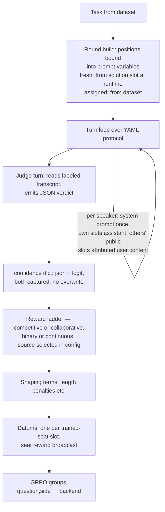

# Debate environment — design (post-feedback)

Protocol is YAML data, not code. Rewards are judge-only. Hard token limits are
controls. Each remaining item: **core** (build now) / **defer**.

## Rollout flow



## 1. Turn protocol (YAML)

**Semantics (the whole model, five rules):**

1. A protocol is an ordered list of **turns**. Each turn maps speakers to an
   ordered list of **slots** they generate that turn.
2. Three visibility classes:
   * `public` — released to every other speaker at the next turn boundary.
   * `private` — stays in the author's own context permanently; never enters
     anyone else's.
   * `ephemeral` — in the author's context only for the REST OF THE SAME TURN,
     then dropped entirely (not even the author sees it in later turns).
3. **Context for generating slot k of speaker S in turn t** = all `public`
   slots from turns strictly before t (any speaker, turn order) + S's own
   public/private slots from any earlier position + S's own ephemeral slots
   from earlier in turn t.
4. **Rendering is per-speaker.** Each speaker gets ONE system prompt stating
   its identity/instructions once; its own slots render as assistant messages;
   others' public slots render as attributed user-side content
   ("Debater_A said: ..."). The judge reads a labeled transcript — it is never
   prompted "you are debater X".
5. Nothing else. "Final speeches blind" isn't enforced — it's visible:
   co-occupants of a turn can't see each other (rule 3). Sequential debate =
   alternating single-speaker turns.

**Slot schema** (folds the old `graded` bool and `speech_structure` into one
`kind`):

```yaml
{name: <prompt template key + transcript label>,
 kind: speech | solution | decision,     # default speech
 visibility: public | private | ephemeral,  # default public
 max_think_tokens: int,     # optional hard cap on <think> section
 max_visible_tokens: int,   # optional hard cap on post-think text
 max_total_tokens: int}     # optional hard cap on think+visible
```

- `speech` — free text, enters transcript per visibility.
- `solution` — an answer is EXTRACTED (boxed parse) and graded against ground
  truth; in fresh-answer mode it also binds the seat's position variable for
  all later prompts.
- `decision` — extracted (JSON verdict) and compared to the solution(s); the
  judge's verdict slot.

Standard protocols ship as `_protocols` YAML resolved by the existing
`_extends`/includes machinery — experiments inherit and override turn
structure like everything else.

```yaml
_protocols:
  simultaneous_2round:
    turns:
      - alice: [{name: proposal, kind: solution}, {name: opening_defense}]
        bob:   [{name: proposal, kind: solution}, {name: opening_defense}]
      - alice: [{name: scratchpad, visibility: private}, {name: speech}]
        bob:   [{name: speech}]            # bob's 1st argument responds to
                                           # alice's turn-1 opening
      - alice: [{name: speech}]
        bob:   [{name: speech}]            # same turn -> mutually blind, visibly
      - judge: [{name: scratchpad, visibility: private},
                {name: verdict, kind: decision}]

  proposer_critic_2round:
    turns:
      - alice: [{name: proposal, kind: solution}]
      - bob:   [{name: critique}]          # sees alice's proposal (earlier turn)
      - alice: [{name: defense}]
      - bob:   [{name: rebuttal}]
      - alice: [{name: closing}]
        bob:   [{name: closing}]           # final exchange blind
      - judge: [{name: verdict, kind: decision}]

  direct_qa:
    turns:
      - alice: [{name: proposal, kind: solution}]
      - judge: [{name: verdict, kind: decision}]

  empty: {turns: []}
```

| aspect | rec |
|---|---|
| protocol schema + compiler to flat slots (speaker, turn, name, kind, visibility, limits) | **core** |
| standard protocols as YAML data | **core** |

## 2. Positions: fresh vs assigned

Both modes work by **prompt variable substitution**, as in the old repo.
Prompt templates carry `<TOPIC>`, `<NAME>`, `<POSITION>`, `<OPPONENT_POSITION>`
placeholders; the round build binds them.

- `assigned`: dataset supplies both positions (QuALITY gold vs
  untimed-best-distractor); bound at round build, before any generation.
- `fresh_answer`: the seat's `solution` slot generates first; its extracted
  answer binds that seat's `<POSITION>` for every later slot. The opponent's
  stance is protocol-derived: in proposer-critic the critic's prompt is
  "argue <POSITION> is wrong" (forced disagreement — this is why fresh-answer
  PC works). Fresh-answer dual-proposer has the known agreement-degeneracy
  problem (both propose the same answer → constant-reward group, dropped by
  grpo_pack); acceptable, it self-prunes, but don't burn compute on it by
  default.

| knob | rec |
|---|---|
| `positions: fresh | assigned` | **core** (both) |
| `flip` — mirrored round, sides swapped. **Side = answer; models stay fixed to seats.** The env asserts the trained seat harvests the same seat's slots in both arms (the old silently-trained-the-wrong-seat bug class gets a test, not just a comment) | **core** |

## 3. Token limits (controls — all HARD, all optional, per-slot)

No soft/instruction-based limits from the old repo. Exceeding = truncation at
the sampler level with stop_reason="length" semantics, never post-hoc trimming.

| limit | mechanism | rec |
|---|---|---|
| `max_think_tokens` | budget-forced two-phase sampling: sample with stop `</think>` capped at budget; if cap hit, force-inject `</think>`; continue phase 2. (The one piece of the old 1,476-line tinker_model worth reviving, now in the Policy/backend sampling path so it works on both backends.) | **core** |
| `max_visible_tokens` | phase-2 (post-think) max_tokens | **core** |
| `max_total_tokens` | overall max_tokens for the slot | **core** |
| soft limits (prompt-injected instructions) | — | dropped |

Note: injected `</think>` tokens are unsampled — they carry no logprob and get
mask=0 in the datum (the token-region insight from the old repo).

`strip_thinking_from_transcripts` stays: `<think>` content never crosses a
slot boundary regardless of visibility class. **core**

## 4. Judge

| knob | what | rec |
|---|---|---|
| judge model | any `ModelSettings` seat; reads labeled transcript (rule 4) | **core** |
| verdict format | ALWAYS JSON. Two schemas: `competitive` (single winner + confidence) and `collaborative` (up to 2 independent winner/loser judgments + confidences) | **core** (both schemas) |
| confidence capture | `confidence: {json: <elicited value>, logit: <decision-token logprob P>}` — BOTH captured when available, kept separate, NO overwrite. Logit capture needs judge temp=1.0 (validate when reward reads the logit source) + BPE surface normalization. Reward config picks the source; experiments can compare them. | **core** |
| verdict retries | resample on unparseable JSON (old default 4) | **core** |
| judge answer generation | — | defer (expressible later as a private judge slot) |

## 5. Reward (judge-only)

The debate env's reward source is the judge, full stop — no `reward_source`
knob, no gt fast-path inside this env (RLVR arms are MathEnv's job; `solution`
slots still record gt correctness in `info` for metrics).

| knob | what | rec |
|---|---|---|
| ladder | ONE module, competitive + collaborative semantics (unifying the two diverged old copies) | **core** |
| `scoring: binary | continuous` | binary: ±1 ladder. continuous: 2·confidence−1 using the configured confidence source (`json` or `logit`); falls back to binary when that source wasn't captured (provenance-gated) | **core** |
| shaping | composable post-ladder terms, YAML list. First term: length penalty — `{kind: length_penalty, coeff, counts: think|visible|total, per_slot: ...}` applied to trained-seat token counts. Infra generic so more terms slot in. | **core** |

## 6. Self-play / training wiring

| knob | what | rec |
|---|---|---|
| trained seats: `both` \| named subset \| `none` | both = shared-adapter self-play, harvest both; subset = trained vs frozen; none = pure eval (same rollout path) | **core** |
| opponent source | frozen base model (any ModelSettings seat) | **core**; snapshot opponents defer |
| datum granularity | one Datum per trained-seat slot (context-so-far as prompt; includes private/ephemeral slots), seat reward broadcast | **core** |
| GRPO grouping | group = (question, side); flip arms are separate groups | **core** |
| fidelity asserts | reject + count trajectories failing Sample.fidelity_ok | **core** |

## 7. Dataset / prompts

| knob | rec |
|---|---|
| MATH (reuse MathEnv rows/parser; `numeric_only`, difficulty filter, deterministic split) | **core** |
| QuALITY (assigned positions, hidden-story/blind-judge plumbing) | defer (next dataset) |
| prompt library YAML (`_extends`-resolved, per-slot templates keyed by slot `name`, placeholder substitution) | **core** |
| `override_prompt` per seat | cut |

## 8. Deliberately out

Tool loops, transcript codec, generation ledger, replay modes, RM reward,
soft token limits, verdict-dialect plurality (JSON only), judge-logit
overwrite (both confidences kept instead), gt-reward-inside-debate-env,
`override_prompt`, Protocol enum / TurnPlan / `sequential_turns` /
scratchpad + judge-question toggles / per-reader view projection (all
superseded by the protocol).

## Build order

1. `envs/debate/protocol.py` — schema, validation, flat-slot compiler
2. `envs/debate/prompts.py` — template library load + per-slot rendering (rule 4)
3. budget-forced sampling in `envs/base.Policy` (+ `Model.predict` passthrough)
   for the three hard limits
4. `envs/debate/judge.py` — JSON schemas, parse + retries, confidence dict
   (json + logit scan)
5. `envs/debate/rewards.py` — ladder (competitive/collaborative) + scoring +
   shaping terms
6. `envs/debate/round.py` — turn loop, context assembly (rules 2-3), batched
   generation
7. `envs/debate/env.py` — tasks/rollout, fresh/assigned binding, flip, datums,
   groups
8. Smoke with RANDOM models, then live tinker-seat MATH proposer-critic
