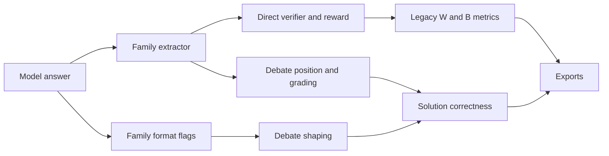
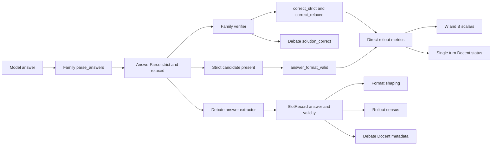
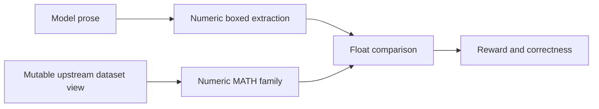
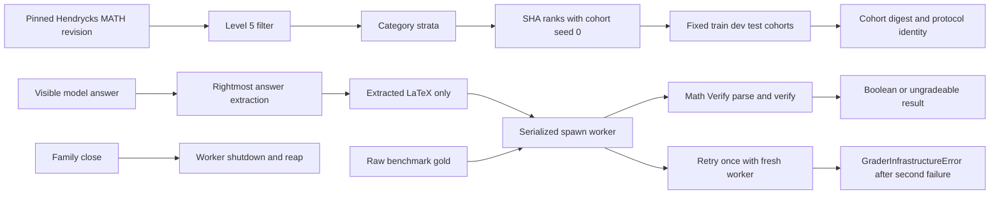
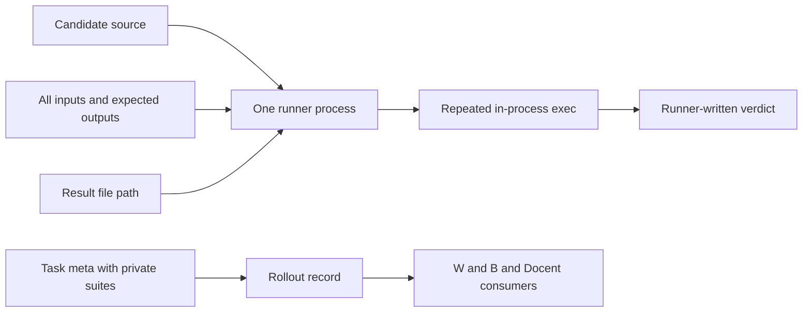
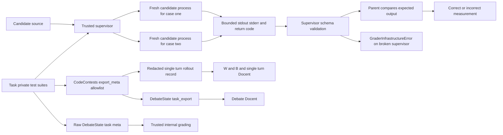
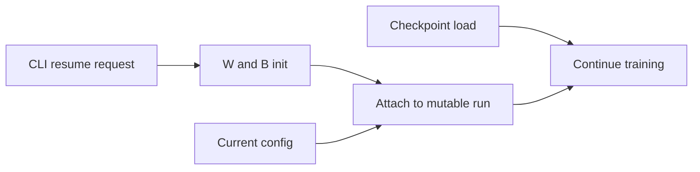
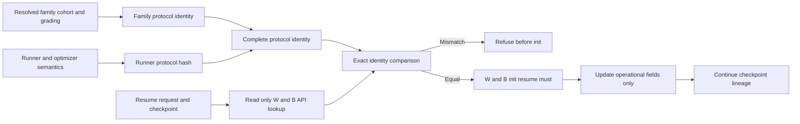

# Answer grading architecture decision and implementation record

Status: approved and implemented, 2026-08-12 to 2026-08-13.

This record covers the answer-parsing and metric cleanup, the separate
symbolic MATH protocol, CodeContests verifier hardening, and immutable run
identity. The diagrams are deliberately schematic: “before” describes the
replaced design, while “after” names the current ownership boundaries.

## Recorded decisions

The following user decisions are preserved verbatim:

> wandb strict-correct, relaxed-correct, incorrect seems fine, relaxed-only-correct also seems fine

> i dont care about legacy compatibility so you can just rename in wandb if needed and then eradicate the old names

The other approved decision records, using their recorded wording, are:

- `fixed cohort seed 0`
- `rightmost visible boxed rule and fallback`
- `fresh subprocess is not hostile sandbox`
- `three approved exact symmetric canonicalizations and malformed_operators=true`

The implemented metric spelling uses Python/W&B-safe underscores:
`correct_strict`, `correct_relaxed`, and `answer_format_valid`. Docent derives
the mutually exclusive human status `strict-correct`,
`relaxed-only-correct`, or `incorrect`. There is no compatibility alias for
the removed generic names (`correct`, `has_boxed`, `has_code`, `answer_tag`,
`strict_boxed`, or `code_fence`). Suite-specific measurements such as
`gdm_correct` and `cco_correct` remain suite-specific.

## 1. Family parsing, metrics, debate shaping/census, W&B, and Docent

### Before

Parsing and format semantics were exposed through two family APIs. Each
family could invent format-flag names, while direct reward metrics and debate
shaping did not share one generic result.

### After

`TaskFamily.parse_answers` returns one immutable `AnswerParse(strict,
relaxed)`. `answer_format_valid` is derived only from presence of the strict
candidate. Families still own parsing and verification; infrastructure owns
the generic shape. Direct task environments emit all three generic scalars on
every kept sample. Debate selects the configured candidate once, stores both
the selected answer and strict-validity on the `SlotRecord`, and reuses that
stored bit for shaping, census, and transcript metadata. Debate correctness
remains the conditional `solution_correct` measurement rather than creating
a second direct-reward metric protocol.

The direct metric meanings are:

- `correct_strict`: the strict candidate exists and the source verifier marks
  it correct.
- `correct_relaxed`: the relaxed candidate exists and the source verifier
  marks it correct. A strict answer can therefore set both correctness
  scalars to one.
- `answer_format_valid`: the strict candidate exists, independent of whether
  it is correct.
- `relaxed-only-correct`: a Docent classification, not a fourth W&B scalar;
  it means relaxed correctness is true while strict correctness is false.

The generic contract and fatal-grader boundary are implemented in
[`infra/envs/tasks/base.py`](../infra/envs/tasks/base.py). Direct rollout
records and the source-owned metadata export seam are in
[`infra/envs/base.py`](../infra/envs/base.py). Debate reuse of the stored parse
result and its explicit denominators are in
[`infra/envs/debate/round.py`](../infra/envs/debate/round.py) and
[`infra/envs/debate/env.py`](../infra/envs/debate/env.py). The two Docent paths
are [`infra/envs/singleturn_docent.py`](../infra/envs/singleturn_docent.py) and
[`infra/envs/debate/docent_export.py`](../infra/envs/debate/docent_export.py).

Contract and regression coverage lives in
[`tests/test_task_family_contract.py`](../tests/test_task_family_contract.py),
[`tests/test_debate_env.py`](../tests/test_debate_env.py),
[`tests/test_debate_plumbing_fixes.py`](../tests/test_debate_plumbing_fixes.py),
[`tests/test_singleturn_docent.py`](../tests/test_singleturn_docent.py), and the
family-specific task tests.

## 2. Symbolic MATH cohort and process-isolated Math-Verify

Symbolic equivalence is a new dataset family, `math_symbolic`; it does not
change the legacy numeric MATH or AIME protocols.

### Before

The numeric MATH path extracted floating-point answers. It could not grade
general symbolic equivalence, and a generic in-process symbolic parser would
have mixed parser state, dependency failures, and verifier objects into the
training process.

### After

The family pins `the-jb/hendrycks-math` at revision
`af6b99a181a909b1aec1424451f10e875fd97377`, filters Level 5, and constructs
fixed category-stratified cohorts using SHA-256 ranks and Hamilton quotas. The
cohort seed is always 0; `dataset.seed` controls only training sampling. The
fixed counts are 2,074 train, 230 dev, and 512 test, with membership pinned by
digest `27208772ebb9743ecf1ffd6fa544118a1206c1d8d2b148220837766bb4b9df08`.
Construction asserts that each raw dataset `answer` agrees with the final
balanced box in its worked solution, then drops the worked solution from the
runtime row.

The approved `rightmost visible boxed rule and fallback` is implemented as
follows:

1. Remove complete `<think>...</think>` blocks. An unclosed opening think tag
   hides everything after it.
2. Inspect the rightmost visible `\boxed` command. A balanced box is
   authoritative: if its content is parseable it supplies both strict and
   relaxed candidates; if it is empty, oversized, or unparsable, it blocks all
   fallback.
3. If the rightmost box is absent or unbalanced, try the rightmost complete
   marked-up LaTeX span (`$$...$$`, `$...$`, `\(...\)`, or `\[...\]`).
4. If that span is unavailable or unparsable, try the sanitized last scalar
   number. Earlier marked spans do not rescue a later unparsable marked span;
   only the numeric fallback remains.

Only the extractor-owned LaTeX expression crosses the worker pipe; free-form
model prose and SymPy objects do not. The child wraps the expression in one
synthetic math delimiter, uses Math-Verify with fallback disabled, and owns
all parsed objects and its bounded gold cache. Requests are serialized, the
worker is created with multiprocessing `spawn`, owner-PID changes discard
inherited handles, and family cleanup is idempotent. Timeout, pipe, crash,
handshake, and malformed-response failures restart the worker once; a second
failure raises `GraderInfrastructureError` and invalidates the run rather
than becoming an incorrect answer.

The approved `three approved exact symmetric canonicalizations and
malformed_operators=true` is exactly:

| Raw expression | Canonical expression |
| --- | --- |
| `\approx 8.24 \text{ mph}` | `8.24` |
| `a + b + c` | `a+b+c` |
| `\sin^2 t` | `\sin^2{t}` |

These are full-string, whitespace-trimmed matches, applied symmetrically to
gold and candidate inside the worker. Near-matches are unchanged. The
Math-Verify `NormalizationConfig` sets `malformed_operators=true`; the rest
of the normalization, equivalence, dependency versions, timeouts, exact
canonicalization table, reward coefficients, prompt digest, and cohort digest
are included in protocol identity.

The cohort/extraction/family implementation is
[`infra/envs/tasks/math_symbolic.py`](../infra/envs/tasks/math_symbolic.py), and
the isolated adapter is
[`infra/envs/tasks/math_verify_worker.py`](../infra/envs/tasks/math_verify_worker.py).
Behavioral coverage is in
[`tests/test_math_symbolic.py`](../tests/test_math_symbolic.py) and
[`tests/test_math_verify_worker.py`](../tests/test_math_verify_worker.py);
dependency and pod-install checks are in
[`tests/test_symbolic_dependencies.py`](../tests/test_symbolic_dependencies.py).

Current limitation: the symbolic full-cohort launch preflight is a CI or
integration audit, not a runtime scan at every launch. The expensive assertion
that every selected raw gold parses in the real pinned worker is the
cache-aware integration test in
`tests/test_math_symbolic.py`; it may skip only when the pinned dataset is not
cached.

## 3. CodeContests trusted supervisor and export redaction

### Before

One child runner received the candidate, all test inputs, all expected
outputs, and a result-file path. It compiled once and executed every case
inside the same interpreter process. Candidate state and descendants could
therefore persist across cases, and verifier infrastructure failures were
often represented as ordinary wrong-answer results. Raw task metadata also
flowed into retained single-turn records.

### After

`run_stdin_tests` is the trusted supervisor. It retains expected outputs and
comparison logic in the parent. For each case it launches a fresh candidate
subprocess with only candidate source and that case's stdin, captures bounded
stdout/stderr in supervisor-owned files, kills and reaps the candidate process
group, validates the returned case schema, and compares output in the parent.
Candidate syntax/runtime/timeout/output-limit outcomes grade false or
ungradeable according to the established result semantics. Failures of the
trusted supervisor itself raise `GraderInfrastructureError` and cannot be
silently scored as wrong.

The implementation is in
[`infra/envs/tasks/codecontests.py`](../infra/envs/tasks/codecontests.py),
including the minimal candidate environment, resource-limit bootstrap,
per-case process launch, process-group reaping, trusted case-result validator,
and explicit `export_meta` allowlist. The generic rule that transcript
consumers receive only already-redacted single-turn records is in
[`infra/envs/base.py`](../infra/envs/base.py). Debate constructs both private
`task` and source-redacted `task_export` projections in
[`infra/envs/debate/env.py`](../infra/envs/debate/env.py), and its Docent
exporter consumes only the latter in
[`infra/envs/debate/docent_export.py`](../infra/envs/debate/docent_export.py).
Tests for fresh globals, hard-exit recovery, supervisor-failure propagation,
suite redaction, and protocol identity are in
[`tests/test_codecontests.py`](../tests/test_codecontests.py); the debate
private/export projection and fail-closed behavior are exercised in
[`tests/test_judge_accuracy.py`](../tests/test_judge_accuracy.py).

Security limitation: `fresh subprocess is not hostile sandbox`. Each case is
fresh, isolated from the verifier's expected outputs and control channel, and
given a reduced environment and resource backstops, but it is still a
same-UID candidate process. A same-UID candidate is not a hostile sandbox:
there is no container, separate OS user, seccomp policy, or equivalent strong
host boundary. Only run code whose host-level trust is compatible with that
constraint.

Export boundary and limitation: `CodeContestsEnv.export_meta` now protects
both transcript paths. It produces already-redacted single-turn records and a
separate `DebateState.meta["task_export"]`; debate Docent reads only that
source-owned projection and fails closed to an empty task projection when it
is absent. Raw `DebateState.meta["task"]` remains trusted internal grader
state so debate grading can use private suites. Consequently,
`DebateEnv.last_states` is not an export-safe object and must never be
serialized directly; only the dedicated exporter establishes the redaction
boundary.

## 4. Immutable protocol identity and W&B resume preflight

### Before

Continuation identity was primarily operational: a checkpoint could be
loaded and W&B resume could attach before the system proved that dataset,
grading, prompt, protocol, and optimizer semantics matched the stored run.

### After

Each family resolves an immutable `dict[str, str]` after source/cohort
construction. The runner adds its authoritative registry dataset type and a
hash of reward-affecting training/debate semantics. Resume requires both a
checkpoint and W&B. Before `wandb.init`, a read-only W&B API lookup compares
the complete stored and current identities. Missing or unequal identity
refuses the continuation without attaching to or mutating the run. Only after
equality may W&B resume and operational fields such as requested steps or
learning rate be updated; the identity key itself is omitted from that
mutable update.

The shared identity validator and read-only resume preflight are in
[`infra/train.py`](../infra/train.py). Runner-specific identity construction
is in [`infra/run_rlvr.py`](../infra/run_rlvr.py) and
[`infra/run_debate.py`](../infra/run_debate.py). Family-specific identity is
implemented beside each family, notably
[`infra/envs/tasks/math_symbolic.py`](../infra/envs/tasks/math_symbolic.py) and
[`infra/envs/tasks/codecontests.py`](../infra/envs/tasks/codecontests.py).
Coverage for exact comparison, reserved keys, resume argument requirements,
learning-algorithm sensitivity, and secret/operational-field redaction is in
[`tests/test_protocol_identity.py`](../tests/test_protocol_identity.py), with
family-specific sensitivity tests in `tests/test_math_symbolic.py` and
`tests/test_codecontests.py`.

Protocol identity prevents silent semantic continuation across a known
boundary. It does not make an unpinned external dependency reproducible by
itself, recover a missing checkpoint, or permit `--wandb-resume` without
`--load`.
