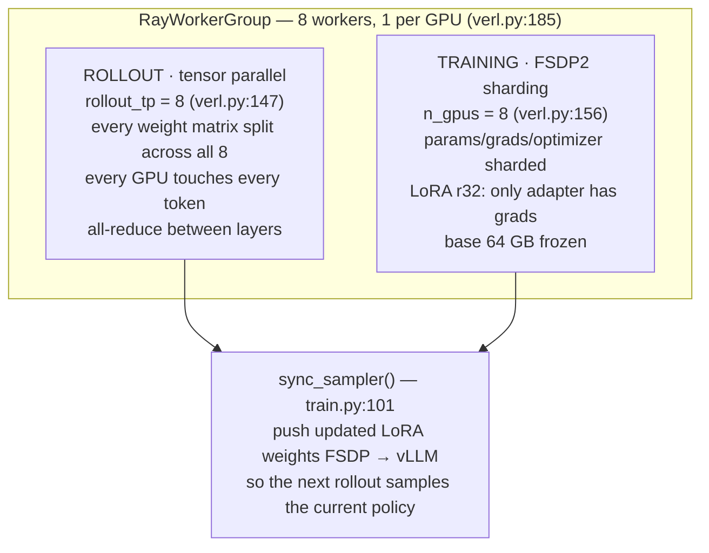

# How the 8 GPUs are used

Verified against `infra/backend/verl.py` and measured on
`codecontests_rlvr_olmo31_32b_smoke10` (Olmo-3.1-32B, 8xH200 143 GB,
`gpu_memory_utilization: 0.45`, `rollout_tp: 8`).

## One process group, two parallelism schemes, colocated

`RayResourcePool(process_on_nodes=[8])` (**verl.py:185**) creates 8 Ray workers,
one per GPU. Each worker is **both** a training shard and part of the rollout
engine. There is no separate inference cluster — generation and training share
the same cards, which is why the memory budget must be split statically.

## Per-card memory (H200, 143 GB)

| region | size | set by |
|---|---|---|
| vLLM: weights/8 + KV cache | **64.4 GB** | `gpu_memory_utilization: 0.45` |
| FSDP training budget | 78.7 GB | the remainder |
| *observed* torch reserved | **28–39 GB** | `loss/perf/max_memory_reserved_gb` |

32B bf16 is **64 GB of weights**, so **8 GB per card** once sharded 8 ways.
Training sits far under its budget because LoRA freezes the base — memory is
dominated by activations, not optimizer state.

## Why batch size costs time, not memory

`use_dynamic_bsz=True` with `ppo_max_token_len_per_gpu=16384` (**verl.py:136-137**)
packs sequences into micro-batches up to 16384 tokens per GPU rather than a fixed
count. Raising `batch_size` makes MORE micro-batches at the same peak memory.

`use_remove_padding=True` (**verl.py:135**) concatenates sequences without padding
so no FLOPs go to pad tokens — this requires flash-attn's varlen kernels, which is
why provisioning builds flash-attn from source at all.

## The constraint we hit

The first 32B launch died with `ValueError: No available memory for the cache
blocks`. `rollout_tp` defaults to **1** (`verl.py:50`); with tp=1 each vLLM worker
tries to hold the whole 64 GB model inside a `0.45 x 143 = 64.4 GB` budget,
leaving ~nothing for KV cache.

**Rule:** `weights_bytes / rollout_tp` must leave room for a KV cache sized for
`max_model_len x concurrent sequences`, inside `gpu_memory_utilization x card`.
Here `max_model_len = prompt_length + response_length = 4096 + 8192 = 12288`
(**verl.py:151**).

## Constraints for future experiments

1. **Colocation forces a static split.** `gpu_memory_utilization` is the only
   dial and cannot adapt at runtime: too high starves training, too low starves
   the KV cache.
2. **TP=8 means the rollout is not data-parallel.** All 8 cards serve one engine,
   so rollouts cannot overlap. Overlapping would need smaller TP and multiple
   engines — but TP must stay large enough for the weights to fit.
3. **CPU RAM is a real constraint**: 275 GB resident
   (`loss/perf/cpu_memory_used_gb`). Note `free`/`nproc` report the HOST, not the
   container cgroup — the earlier 1-GPU pod showed 2 TB/208 cores while its
   cgroup allowed 234 GB/22 CPUs.
4. **`loss/mfu` reads 0.00** — model-FLOPs-utilisation is not being computed, so
   we have no direct measure of GPU efficiency. Worth wiring before optimising
   the training half.
