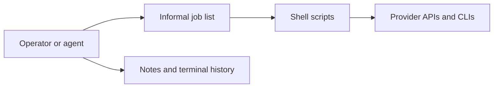
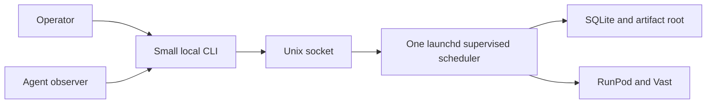
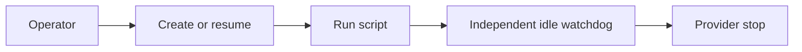
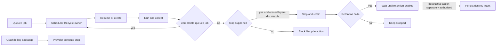
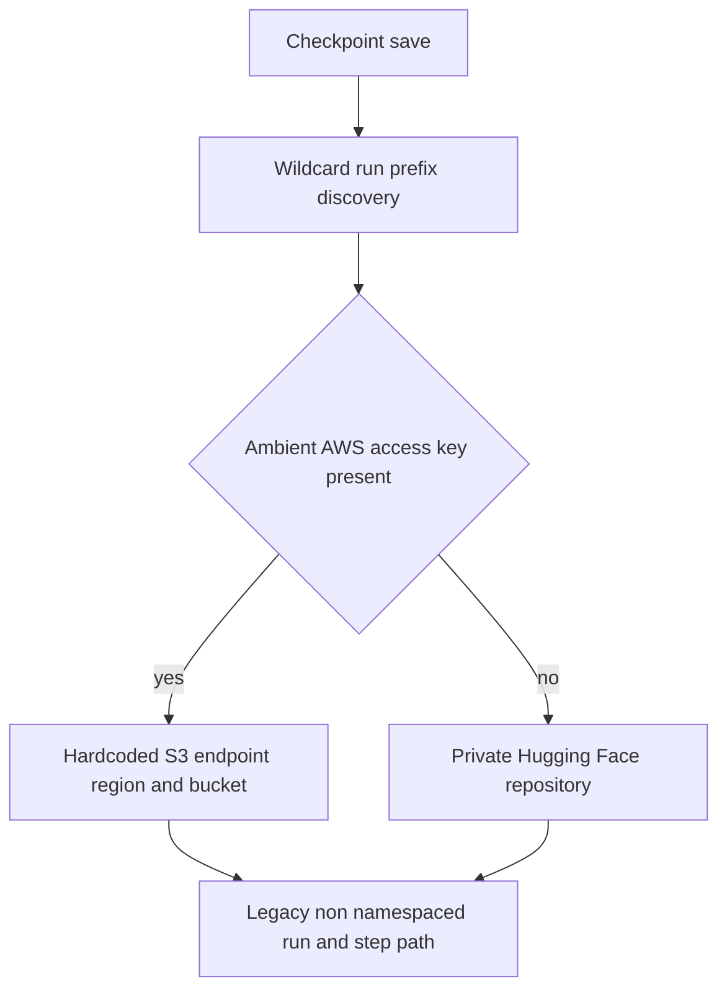
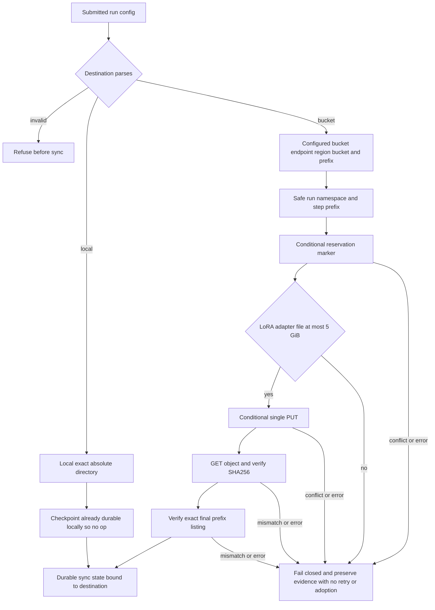
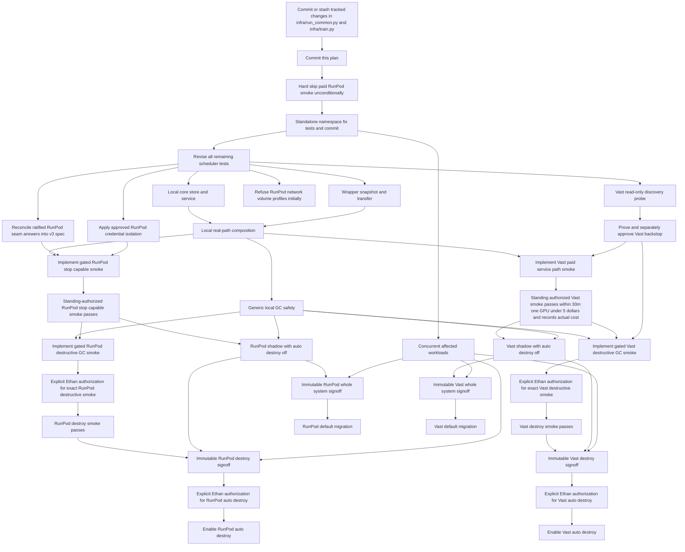

# Boring job scheduler plan

## Status

**PARTIALLY APPROVED WITH OPEN GATES — not implementation-ready.**

This records the agreed product and the approval amendments dated 2026-08-14 below. Current tests are red sketches,
not authority; revise them against this plan and satisfy the recorded gates before implementation.

## One-screen proposal

V0 is one persistently running application on the developer Mac:

```text
small CLI -> local Unix socket -> one scheduler process
                                -> one SQLite database
                                -> one artifact root
                                -> RunPod and Vast adapters
```

It is not an agent, workflow engine, or service collection. Operators submit; agents use the read-only status, log,
and artifact views. That split is an operating policy, not a multi-user security boundary on the same Mac. The
scheduler alone owns queue state, provider routing, retries, transfer, and worker lifecycle. Bootstrap preparation
stays outside.

A minimal job looks approximately like this; exact config syntax is a later implementation detail:

```yaml
profile: runpod:h200x1
argv: ["bash", "scripts/train_one.sh", "configs/smoke.yaml"]
inputs: ["scripts/train_one.sh", "configs/smoke.yaml"]
outputs: ["outputs/result.json", "checkpoints/final"]
checkpoint_destination:
  kind: bucket
  endpoint: https://s3api-example.runpod.io
  region: example-region
  bucket: example-bucket
  prefix: checkpoints
max_attempts: 3
max_runtime: 6h
```

```text
$ scheduler submit job.yaml
job_018  queued
$ scheduler status job_018
attempt 1/3  running  runpod:pod-456
$ scheduler logs job_018 --follow
...read-only stdout/stderr tail...
$ scheduler artifacts job_018
attempt-001/stdout  attempt-001/stderr  attempt-001/outputs/...
```

Inputs freeze at submission. The command is an argv array, not a shell string. Views are read-only. One worker runs
one job at a time; many workers can run in parallel.

## Approval checklist

Items are approved except where explicitly marked **AMENDED/OPEN**; the dated approval record is normative and governs
the original recommendation text where they conflict.

1. **Host:** launchd-supervised service on the developer Mac. Recommended for boring operation; when the Mac is off,
   dispatch and GC do not run.
2. **Boundary:** CLI over an owner-only local Unix socket with same-UID peer checking; service-only SQLite writer; one
   owner-only artifact root. Recommended for one clear owner, at the cost of being single-host.
3. **Runtime timeout:** require positive finite `max_runtime` on paid jobs; kill the remote process tree at the
   deadline, prove it stopped, then collect. Recommended for a cost bound; alternatively use `operator_blocked` with
   potentially unbounded spend.
4. **Input boundary:** freeze only explicitly allowlisted repository paths and explicit external inputs. Recommended
   to exclude secrets and unrelated dirty files, at the cost of declaring new source paths.
5. **Artifact boundary:** every durable output must be declared; collect and checksum all obtainable stdout, stderr,
   terminal state, and present declared failure partials, while durably recording unavailable evidence. Undeclared
   worker-local files are not promised durable. Recommended for a finite, verifiable collection contract.
6. **Disposal boundary:** worker-local storage disposability is immutable profile/worker-lifetime policy established
   before first admission, never a later job override. An ephemeral run uses an explicit ephemeral profile.
   Approval explicitly authorizes irreversible loss of **all** undeclared worker-local files from every job in that
   worker lifetime after declared evidence is checksum-evacuated. Every automated provider action must be known not to
   erase a nondisposable storage layer. Recommended so one later job cannot grant it.
7. **Manual workers:** require exclusive dedication, no unmanaged workload, storage evacuation/disposability
   attestation, legacy-watchdog disarm, and the approved provider crash backstop; then allow auto-stop but never
   auto-destroy. Otherwise observe only.
8. **Idle:** `idle_stop_after: 0` for paid/ephemeral stop-capable profiles and `never` for explicitly free profiles.
   Recommended to avoid paid running-compute waste while retaining free capacity. Stopping clears RunPod container
   disk, restart capacity is not guaranteed, and stopped storage may still bill.
9. **AMENDED — RunPod network-volume lifecycle:** current official pages are inconsistent about stop support, and the
   ratified replacement seam grants neither `terminateAfter` nor resume. Initial RunPod support therefore refuses all
   network-volume profiles. Read-only capability discovery may continue, but enabling any such profile requires a
   later explicit decision; never guess or silently substitute termination.
10. **AMENDED — RunPod launch seam:** the missing `runpod-safe` implementation cannot be preserved or inferred from
    guarantee-only documentation. The six ratified replacement-seam answers in the dated record govern the proposed
    v3 seam. Its draft specification must be reconciled with those answers and independently reviewed before
    implementation; clauses beyond those exact answers remain unapproved.
11. **AMENDED — RunPod crash backstop:** a live-certified provider `stopAfter` on create is the accepted
    compute-stopping backstop for an initially supported, stop-capable non-network-volume profile. There is no
    `terminateAfter` carveout, and resume remains blocked because no inspected start/update surface can install or
    read back a fresh deadline. All RunPod creates remain blocked except the one exact ratified bootstrap proof until
    certification and the reconciled v3 seam exist. Even that bootstrap may run only through the reconciled,
    independently reviewed minimal v3 seam after installing and digest-pinning a verified upstream driver—never via
    ad hoc GraphQL or direct `runpodctl`. The dated record supplies the complete limits.
12. **Vast crash backstop:** implement read-only discovery now; keep paid Vast blocked until an independent bounded
    mechanism is proven and brought back for a second approval. A worker-local watchdog with a provider key is not
    equivalent and adds credential/liveness risk.
13. **APPROVED — Unknown-work outcome semantics only:** if a separately authorized provider backstop ends compute when
    start intent has no terminal record, uncollected local data may be lost and the job permanently fails without retry
    even after provider absence is confirmed. The unbounded-spend outcome alternative is rejected. This item grants no
    STOP, TERMINATE, or DESTROY verb authority; the RunPod `stopAfter` mechanism remains gated by item 11's
    reconciliation and live-certification requirements.
14. **Secrets:** v0 never transports job secret values. Prepared images/volumes or provider-managed injection supply
   them; jobs declare names only. Recommended for isolation, at the cost of worker preparation.
15. **Capacity caps:** global and per-profile `max_workers`; every scheduler-enrolled/controlled worker and unresolved
    create intent counts until authoritative absence. Observation-only foreign inventory does not. Recommended as the
    smallest hard resource bound.
16. **Cost admission:** cap running compute price and storage size/rate per paid profile using fresh provider data.
    Use the worst applicable running/stopped storage rate. Display bandwidth or other uncapped provider charges
    explicitly. This is not a cumulative per-job/day/account spend cap: independent volumes and nondisposable stopped
    storage can bill indefinitely.
17. **OPEN — proposed normal-GC auto-destroy eligibility, not authority:** if Ethan later authorizes auto-destroy for a
    provider, only workers created and durably receipted by this scheduler, with lifetime-disposable local storage and
    verified evacuation, could qualify; manual/foreign workers never qualify. A separately authorized destructive
    smoke and immutable signoff are prerequisites, not authorization. Auto-destroy remains disabled until Ethan gives
    a further explicit provider-specific authorization after that signoff. Item 13 governs only the recorded outcome
    if an independently authorized crash backstop ends compute; it grants no STOP, TERMINATE, or DESTROY verb authority.
18. **APPROVED — Provider credentials:** load only adapter-declared provider credentials service-side, never source a
    credential file wholesale; use dedicated least-privilege keys where the provider supports them and acknowledge
    unavoidable residual account authority. For RunPod, the adapter/wrapper parses only the `apikey` field from
    `~/.runpod/config.toml`, uses an isolated `HOME`, scrubs the inherited environment, and pins provider endpoints.
19. **Provisioning authority:** within approved profile caps, the scheduler may automatically create and resume workers;
    provider selection and environment/bootstrap preparation remain explicit profile/operator inputs. Recommended to
    remove the agent/script sequencing loop; alternative manual-only capacity gives up unattended routing.
20. **Execution environment:** clear inherited env; construct a fixed minimal PATH/HOME/TMPDIR/locale baseline; then
    add only explicit nonsecret values and declared remote credential names. Recommended to prevent local/provider
    secrets crossing into jobs.
21. **Break-glass:** use the service-mediated durable pause/drain, external-call fence, exclusive-lock handoff, and
    observation-only reconciliation described below. Recommended so recovery cannot race the scheduler.

Approved stopped retention is 24 hours ordinary paid, 6 hours explicit ephemeral, and `never` explicit free. It
applies only to stop-capable profiles.

## Approved product boundary

- **APPROVED:** a persistent, non-agentic application manages durable jobs; operators submit, while agents may watch
  but not control lifecycle.
- **APPROVED:** FIFO independent jobs only. No DAGs, priorities, preemption, duplicates, cancellation, multi-user
  control plane, or cloud optimizer.
- **APPROVED:** provider-qualified profiles such as `runpod:h200x1`; routing selects the named adapter, not best price.
- **APPROVED:** prefer compatible running, then stopped, then create. One active job/worker; workers may fan out.
- **APPROVED:** `max_attempts` defaults to 3 total command executions.
- **APPROVED:** submission freezes declared input bytes; stage and collection verify content.
- **APPROVED:** success needs exit zero, declared outputs, and both logs verified; failures preserve all obtainable
  logs/partials and record unavailable evidence.
- **APPROVED:** verified terminal nonzero may retry on the same healthy worker. Lost acknowledgement is ambiguous.
  Only confirmed worker loss resolves ordinary ambiguous worker loss and allows retry elsewhere; suspicion allows no
  duplicate. Approval item 13 is the outcome exception: unknown work ended by a separately authorized backstop
  permanently fails.
- **APPROVED:** stopped reuse for stop-capable workers with 24-hour paid, 6-hour ephemeral, and `never` explicit-free
  retention.
- **APPROVED:** RunPod and Vast are completion scope. Paid live integration execution is governed by the standing
  authorization and provider-specific blockers in the dated approval record; destructive live tests remain separately
  gated.
- **APPROVED SAFETY CONSTRAINT:** GC never targets independently managed persistent/network-volume resources, history,
  snapshots, or SQLite.

Item 17 records a proposed irreversible normal-GC eligibility boundary, not approved authority. Auto-destroy remains
disabled even after a separately authorized destructive smoke passes and receives immutable signoff; enabling it
requires a subsequent explicit provider-specific authorization from Ethan.

The user-facing specification ends here except that the dated approval record below is normative and amends both the
checklist and appendix where they conflict. Everything else below is the implementation, safety, test, and migration
appendix; it does not add product features beyond the proposal, checklist, and approval record.

## Why this helps—and where shell still wins

The scheduler improves unattended queues, restart recovery, retries, standard evidence, reuse, fan-out, routing, and
cost cleanup. State stops living in terminal history or agent memory.

It does not choose scientific parameters, interpret outputs, fix commands, remove cold starts, or improve one
attended command. Shell still belongs inside argv and diagnostics, but cannot safely replace an ambiguous attempt.

## Before and after

### Control plane





### Execution and transfer


### Worker lifecycle





The initial RunPod backstop is certified `stopAfter`, which stops compute. Any TERMINATE mechanism or action remains
separately gated. Item 13 defines the attempt outcome if an authorized backstop fires; it grants no provider verb.

## Internal responsibilities

The single process owns seven responsibilities, not seven services or a required class hierarchy:

1. Durable FIFO queue, admission, and attempt budget.
2. SQLite state, ownership receipts, intents, and collection status.
3. A main reconciliation loop making one bounded transition at a time.
4. Provider adapters for inventory, offer/create, resume, stop, destroy, readiness, and qualified IDs.
5. Snapshot, stage, collect, hash, and immutable attempt artifacts.
6. Remote wrapper for exact argv/cwd/env, logs, terminal result, and attempt-identity duplicate refusal.
7. Secret-free profile policy for resources, caps, storage, lifecycle, and credential names.

Launchd runs while the Mac is available. Machine off means no dispatch/reconciliation/GC; provider emergency handling
is the only backstop. Provider authentication is available only service/adapter-side and never enters a cleared job
environment, argv, SQLite, artifacts, or logs. Under approval item 18, the RunPod adapter/wrapper reads only `apikey`
from `~/.runpod/config.toml`; it does not source that file or expose its contents to a job process.

## State and reconciliation

Jobs are `queued`, `running`, `collecting`, `succeeded`, `failed`, `unknown`, or `operator_blocked`. Workers are
observed, enrolled/owned, ready, assigned, idle, stopping, stopped, deleting, or quarantined. Status explains blocks.

Rules:

- At most one nonterminal job/worker and one nonterminal attempt/job.
- Persist intent before `CREATE`, `RESUME`, `ATTEMPT START`, `STOP`, or `DESTROY`; call once per durable intent.
- Confirmed rejection may use bounded backoff under a new transition, then `operator_blocked`; infrastructure retries
  do not consume command attempts.
- Lost acknowledgement plus unchanged fresh state is ambiguous: quarantine. No repeat or resume-to-create fallback;
  only authoritative evidence resolves it.
- Readiness/staging failure before proven start consumes no attempt. Proven start does. Collection never reruns compute.
- Exit zero needs verified collection. Collected terminal nonzero may retry; `max_attempts` exhaustion fails.
- If a separately authorized provider backstop resolves unknown work by ending compute, that outcome is not ordinary
  confirmed loss: the job permanently fails, its missing evidence is recorded, and it never retries. This state rule
  grants no provider verb authority.
- V0 has no cancel. Break-glass uses fenced recovery, not a hidden cancellation state.

Before create, store fresh inventory, a cryptographic nonce, and the full requested spec. After lost acknowledgement,
accept only a receipt or exact single delta matching nonce/full spec; a name grants no authority. Every unresolved
owned resource counts against caps until authoritative absence.

## Execution, snapshots, artifacts, and secrets

Submission accepts allowlisted repository paths plus explicit external inputs. Symlinks/path escapes fail. `cwd` is
relative inside the staged root; reject absolute/escaping paths. `scripts/pod_sync.sh` is not the transfer path.

**APPROVAL ITEM 20:** the wrapper clears inherited environment and constructs exactly this baseline:

```text
PATH=/usr/local/sbin:/usr/local/bin:/usr/sbin:/usr/bin:/sbin:/bin
HOME=<attempt-private-home>
TMPDIR=<attempt-private-tmp>
LANG=C.UTF-8
LC_ALL=C.UTF-8
```

Then add explicit nonsecret job/profile env and allow only declared remote credential **names** from provider-managed
injection; inherit no local/other provider secrets. Profiles may add required nonsecret CUDA/toolchain values.

V0 never transports job secret values. Prepared images/volumes or provider-managed injection supply them. Readiness
checks names without echoing values. Service provider auth follows approval item 18, never argv.

Every attempt has one immutable `DEBATE_LAUNCH_NAMESPACE`, resolved before any sink is constructed. A scheduler attempt
uses its durable attempt namespace; a manual launch generates one UUID and exports/reuses that same value throughout
the process. The value is validated as one strict path-safe component of 1–128 characters. It flows unchanged through
checkpoint, eval, Docent/local transcript, W&B metadata and artifact paths, output declarations, and checkpoint sync.

The approved sink contracts are:

1. `run_eval --artifact-root ROOT` atomically reserves `<root>/<namespace>/` before work and refuses an existing target.
   Its fixed local outputs are `results.jsonl`, `summary.json`, and `docent.jsonl` in that directory.
2. Checkpoint sync receives an exact checkpoint directory, the namespace, and an explicit destination frozen with the
   run submission; it performs no wildcard/prefix discovery and never infers a destination from ambient credentials.
   The destination is either `local`, with one exact absolute directory, or `bucket`, with endpoint, region, bucket,
   and key prefix all supplied by the submitted config. Credentials remain ambient and service-side rather than part
   of the destination. An absent, unknown, incomplete, or unparseable destination fails closed. A local destination
   that is the volume already containing the exact checkpoint directory is a legitimate no-op. Bucket objects use
   `<configured-prefix>/{run}/{namespace}/{step}/{relative-path}`. The namespace layout, reservation marker,
   conditional `IfNoneMatch: "*"` no-overwrite boundary, final prefix-listing verification, and no-retry/no-adoption
   semantics remain unchanged. Only LoRA adapters are synced: the backend forces `save_lora_only=True` whenever
   `lora_rank > 0`, so conditional single PUT is the supported bucket path. Files over 5 GiB are refused and multipart
   upload is not implemented.
3. W&B display `run_name`, `run_identity_suffix`, and protocol/scientific identity remain unchanged. W&B config keeps
   append-only `launch_namespaces` history, and transcript artifacts carry the scalar namespace and namespaced internal
   path. The namespace is launch provenance, not protocol identity. The direct resume-rejection mechanism and its
   residual race are governed outside these Ethan-approved sink contracts by the separately recorded decision below,
   with its decision-specific provenance.
4. Every namespaced sink refuses an existing/conflicting destination rather than overwriting. Because a manual launch
   normally generates a fresh UUID, this refusal is essentially future-facing protection for scheduler-supplied
   attempt namespaces rather than protection the current manual path is likely to exercise.

### Checkpoint destination before and after

The retired checkpoint path selected its destination from ambient credentials and mixed that choice with legacy
source discovery and layout:



The approved destination architecture freezes the choice with the submission and binds successful sync state to that
exact destination:



Hugging Face has no branch in the approved architecture. Its existing repositories remain untouched and unread. The
diagram begins only after a checkpoint is eligible for sync: the writer-ready and live-source stabilization boundary
remains a pending adjacent decision and is not approved by this destination contract.

Checkpoint synchronization's process/coordination redesign, PID/lock publication semantics, and partial-prefix
continuation or quarantine policy remain pending recommendations, not approved decisions. The writer-ready and
live-source stabilization boundary likewise remains pending and unapproved.

The standalone Debate commit records, without deleting or migrating old data, that changing Docent launch paths leaves
existing `docent/<run>/pid-N/` directories orphaned but readable and untouched. Likewise, existing bucket
`checkpoints/{run}/{step}/` keys become unreachable through the new namespaced layout; they remain orphaned and
untouched. Hugging Face is retired as a checkpoint destination: existing `ethanelasky/ckpt-{run}` repositories are
left in place, untouched and unread. The commit preserves `run_identity_suffix` exactly.

Attempt evidence is immutable after verification:

```text
<artifact-root>/<job-id>/attempt-<n>/
  manifest.json
  stdout
  stderr
  terminal.json
  outputs/...
  provider/...
```

Terminal state, stdout, stderr, and every declared output are always required attempt evidence. Debate declares eval
results and a checkpoint manifest by default. LoRA adapter checkpoint bytes remain at the submitted exact local
directory or S3-compatible bucket destination; the Mac receives a verified manifest with hashes and the qualified
destination identity. Missing declared outputs prevent success; failure partials remain evidence. For analyzed
workloads, local transcript/Docent output is declared and success-gating. Docent and W&B uploads are best-effort
external provenance, carry the immutable per-attempt namespace, and record confirmed receipts; an ambiguous upload is
not automatically repeated. External Docent collection identity is governed by the separately recorded namespace
decision below: Claude made the original decision under delegated authority, and Ethan subsequently reviewed its
worked example and approved the described behavior. The scheduler never deletes stale namespaces or checkpoint
content at configured destinations: retention there is operator-owned. Approval items 5–6 govern other undeclared
files and worker-lifetime disposal authority.

## Enrollment, handoff, and provider authority

Account inventory grants observation, not authority. Normal agents/operators **must not** provider-mutate; this is
policy until the approved credential isolation is implemented and verified, not a claim that they cannot.

A manual worker needs exact-ID/profile registration, exclusive dedication, no unmanaged workload, storage attestation,
and watchdog handoff. Otherwise it is observe-only/no auto-stop. Enrollment never grants auto-destroy.

`POD_IDLE_STOP=0` prevents a new legacy watchdog but does not disarm an old process/accepted stop. Before admission,
durably take lifecycle ownership and disarm it. A manual worker must already have the provider-specific backstop
approved in items 11–12; without one it is observe-only. Never layer lifecycle owners.

## Idle stop, retention, and GC

`idle_stop_after` measures empty running time; `stopped_delete_after` measures confirmed-stopped time. Item 8 recommends
immediate stop for paid/ephemeral stop-capable profiles and no automatic idle stop for explicitly free profiles.
Explicit free means stopped retention `never`, not a claim about provider price.

Paid stopped retention is 24 hours; ephemeral is 6. Finite retention does not authorize deletion. Before any normal
scheduler STOP, TERMINATE, or DESTROY, the adapter states which storage layers the action erases; each erased layer
must be lifetime-disposable and its obtainable declared evidence evacuated. Otherwise the action is blocked and
billing may continue until operator resolution. Item 13 defines outcome semantics only: if a separately authorized
provider backstop ends compute without evacuation, the job permanently fails and records missing evidence. It does not
authorize STOP, TERMINATE, or DESTROY.

GC order:

1. Give a compatible queued job the worker before stop/delete begins.
2. Require no active, unknown, or collecting attempt and verified evacuation.
3. Persist stop intent, call once, and require provider confirmation.
4. At expiry require durable scheduler-created ownership, fresh exact inventory, disposable local storage, verified
   evidence, and no ambiguity.
5. Persist destroy intent, fence assignment, call once, and require authoritative absence; lost ack quarantines.

For a worker never ready, retain the bounded readiness timeline/errors and all obtainable logs. Record unavailable
logs as evidence so cleanup cannot deadlock. Destroy still needs ownership, no started attempt, and disposable storage.

GC never targets independently managed volumes/evidence or foreign/manual workers. An auto-GC profile needs every
destroy-erased worker-local layer marked disposable plus finite retention; otherwise use `never`.

## Provider/storage facts and network-volume decision

RunPod documents: container disk is wiped on stop; volume disk persists on stop and is deleted with the Pod; network
volumes persist independently. Its live and cached official pages currently disagree about stopping a Pod with a
network volume. Read-only capability discovery may record facts for a later decision, but initial RunPod support
refuses every network-volume profile. It neither resumes one nor falls back to `terminateAfter` or terminate/recreate.
See [RunPod storage types](https://docs.runpod.io/pods/storage/types) and
[Pod lifecycle](https://docs.runpod.io/pods/manage-pods).

Vast documents that stop preserves instance data while storage may bill; destroy removes instance container storage,
while separately managed persistent Vast Volumes may survive. Stopped reuse can fail without capacity. See Vast [storage](https://docs.vast.ai/guides/instances/storage/types),
[`stop instance`](https://docs.vast.ai/cli/reference/stop-instance), and
[`destroy instance`](https://docs.vast.ai/cli/reference/destroy-instance).

Provider facts are observations. Unknown storage/lifecycle capability blocks mutation; never infer it from “pod.”

## Cost and capacity

The proposed minimal cap model is:

- one global `max_workers`;
- per-profile `max_workers`;
- per-profile running-compute cap and storage-size/rate cap.

Every scheduler-enrolled/controlled worker and unresolved create intent counts until authoritative absence. Refresh
and validate applicable price/storage/resources/capacity before every paid create, resume, and job admission/hot reuse;
independently validate the actual allocation afterward and whenever provider state can change it.
V0 displays but does not aggregate bandwidth or other provider-specific uncapped charges, and has no account-wide
dollar-budget engine. These exclusions are explicit rather than described as an “all-in” cap.

A profile displays one resolved policy before mutation. Missing caps, ambiguous storage, or incompatible lifecycle
fails closed. Exact file format is not an approval decision.

The original RunPod paid smoke was only environment-gated and is now hard-skipped. It **must not be enabled** until it
is rewritten with price/storage checks, a live-certified provider `stopAfter` compute-stopping deadline on the create
call itself, and the actual service path. After those requirements are implemented and the reconciled v3
`runpod-safe` seam is proven, the rewritten nondestructive smoke may run under the dated standing paid-integration
authorization and its ceiling; this does not authorize any improvised create path around that seam or RunPod resume.

## Worked workflows

### Paid worker reuse

Two FIFO jobs request a stop-capable provider/profile whose resume route can install and prove the required
compute-stopping deadline. A stopped worker resumes for A; after collection B takes it immediately. When no match
remains, zero idle delay stops it. Confirmed stop begins 24-hour retention; all GC gates still apply. This workflow is
generic scheduler behavior, not a currently executable RunPod resume path.

RunPod initially admits only stop-capable non-network-volume profiles and does not resume them. RunPod network-volume
profiles are refused; there is no fallback to `terminateAfter` or terminate/recreate under the ratified seam answers.

### Failure versus ambiguity

Attempt 1 exits 23; logs/partials collect, then attempt 2 may reuse the worker. Three starts exhaust the default.
Ordinary confirmed loss retries elsewhere; suspected loss stays unknown with no replacement. If a separately
authorized provider backstop ends compute for that unknown attempt, item 13 makes the job permanently fail rather than
retrying without its evidence; item 13 does not authorize the provider action.

### Manual worker

After exact-ID exclusive enrollment and watchdog handoff, a Pod may run/auto-stop but never auto-destroy. Without the
attestation, it is observe-only.

### Mixed providers

A/C request `runpod:h200x1`; B requests `vast:b300x1`. B can run concurrently
on Vast while A runs on RunPod; C waits for RunPod capacity. No substitution
occurs. Paid Vast create/run/stop and safe destroy remain completion criteria
after approval—not a permanently read-only feature.

## Break-glass and rollback

**APPROVAL ITEM 21:**

Break-glass is service-mediated:

1. Request a durable pause/drain. The service stops intake and automatic
   lifecycle transitions, finishes its current local transaction, waits for or
   fences any already-issued provider call, and records the fence state.
2. The service releases its exclusive lock. A one-shot recovery tool acquires
   the same lock; it refuses to run otherwise.
3. Audit exact provider-qualified inventory and every in-flight intent. Already
   sent create/resume/start/stop/destroy intents remain ambiguous until
   authoritative evidence resolves them.
4. Evacuate/checksum before stopping known work. A break-glass operator may
   provider-mutate only after the fence and exact-ID audit.

Rollback never promises to undo an accepted provider deadline or destroy, and
never recreates undeclared local data. Scripts cannot take over an ambiguous
job. Database and artifact views remain readable while paused.

## Test revision gate before implementation

Current positive destroy tests are not implementation authority. Before any
production scheduler work, revise the tests to require:

- provider-qualified profiles/worker identities at every seam;
- explicit enrollment and rejection of foreign/account-wide inventory;
- per-profile resolved idle/retention/storage/cost policy;
- frozen snapshot identity, explicit input allowlist, declared artifacts, and
  worker-local disposability gates;
- one immutable per-attempt launch namespace across checkpoint, eval, Docent/local transcript, W&B metadata/artifact
  paths, declarations, and checkpoint sync; manual UUID fallback, collision refusal/no overwrite, and unchanged
  `run_identity_suffix` behavior;
- under the separately recorded namespace decisions, a resume validates its W&B run ID, takes a same-machine
  non-blocking lock before every W&B API operation, then fetches the remote run and refuses a `running`, missing-state,
  or unknown-state target before the config read-modify-write;
  finished, crashed, failed, and killed targets are resumable; the ordinary override interface is one literal CLI flag,
  absent from Config/YAML/environment, and its runner-issued capability is bound to the exact run ID; arbitrary CLI
  automation could pass the flag, but automation and future scheduler use are forbidden by policy and always
  visible/audited; it bypasses only `running` and remains subject to the local lock; tests require the exact
  `wandb==0.28.1` pin and runtime guard, reject an invalid run ID before any API call, cover exact exclusion between
  cooperating same-effective-UID processes, prove resumed `wandb.init` forces online mode, preserve `KeyboardInterrupt`
  and `SystemExit` through state access and atomic lock-ownership transfer while releasing the lock, and preserve the
  residual two-host terminal-state/read-to-`wandb.init` race without presenting the CLI policy boundary as cryptographic
  human proof; every install surface pins `docent-python==0.1.77` and a runtime guard refuses before constructing the
  client on a version mismatch; empty run lists refuse before collection creation; external Docent collection names
  contain the launch namespace, exactly one collection is selected per attempt, and adding collection identity leaves
  the scientific `AgentRun` payload bytes unchanged; SDK automatic POST retry is disabled and HTTP redirects are refused
  for collection creation and agent batches, so each POST is sent once, every mutation must return 2xx, and an ambiguous
  failure is neither repeated nor adopted; a confirmed collection ID is validated as one bounded URL-safe path component
  before the first batch POST;
  every nonempty batch must return its own unique nonempty `job_id` and be awaited to confirmed success; each polling
  POST is also one-send/no-redirect/2xx-only, polls at most 100 IDs per request, and its response must cover exactly the
  requested slice of pending IDs once each;
  only `pending` and `running` remain pending, while `completed` confirms and removes an ID; canceled, failed, unknown,
  malformed, missing, extra, or duplicate rows are immediate partial failures rather than loops; every Docent HTTP call,
  including authentication, uses a 10-second connect and 120-second read timeout, within one five-minute upload budget
  measured from before authentication through the final poll; tests require a true preemptive wall-clock guard that
  refuses before client construction when `SIGALRM` is masked or pending, another live Python thread could race the
  process-wide timer, or an active timer conflicts; interrupts trickling and never-returning calls rather than checking
  elapsed time only after return; consumes its own pending alarm and restores prior signal state on teardown; and makes
  collection-ID validation/retention interrupt-safe; injected `KeyboardInterrupt` and `SystemExit` after a possible
  mutation must emit the sanitized ambiguous receipt, with the confirmed collection ID when available, before being
  re-raised; the future scheduler uses `min(5 minutes, remaining attempt deadline - separate 5-minute
  evidence/shutdown reserve)`, proves the reserve remains intact, and skips upload when insufficient time remains;
  confirmed, ambiguous, timed-out, and skipped outcomes emit sanitized structured stderr receipts retained as durable
  attempt evidence, and any later failure includes the confirmed `collection_id` when creation succeeded while a
  pre-create failure explicitly has no collection ID; timeout remains no-retry/no-adoption and never fails the local run,
  and fake legitimately slow and multi-GB uploads demonstrate the accepted permanently-ambiguous tradeoff; test comments
  may record the pinned SDK's roughly 100 MiB pre-gzip batch threshold as implementation context, but no oracle treats it
  as a size or timing promise;
- an explicit checkpoint destination frozen with each submission, never inferred from ambient credentials: either an
  exact absolute local directory or an S3-compatible bucket endpoint/region/bucket/prefix; bucket reservation,
  conditional single-PUT no-overwrite, final listing verification, no retry/adoption, and over-5-GiB refusal; absent,
  unknown, incomplete, and unparseable destinations fail closed;
- always-required terminal/stdout/stderr/declared outputs; Debate's eval-result and checkpoint-manifest defaults;
  verified checkpoint hashes plus qualified configured-destination identity; analyzed-workload transcript/Docent
  success gating; namespaced best-effort upload receipts and ambiguous-upload no-repeat; operator-owned checkpoint
  destination retention;
- exact cwd and cleared/allowlisted environment, including secret-name-only
  readiness;
- fresh-process service restart, single-owner lock, durable pause/drain, and
  one-shot fence behavior;
- crash injection before call, after provider acceptance/lost acknowledgement, and after acknowledgement for CREATE,
  RESUME, ATTEMPT START, STOP, and DESTROY; generic transport errors never count as confirmed rejection;
- positive-finite paid runtime validation and a real child/grandchild process-tree timeout with stop proof, evidence
  collection, and restart during timeout handling;
- attempt identity bound to snapshot, argv, cwd, and cleared environment; changed identity inputs fail closed;
- real SQLite, transfer, wrapper, provider, and artifact composition through
  the actual CLI/service, not a provider-specific harness;
- pre/post independent worker **and volume** inventories, exact create delta,
  stop acknowledgement, destroy authoritative absence, and foreign stability;
- explicit unready-worker evidence and emergency-deadline behavior;
- global/profile caps and fresh price/storage checks under pending and ambiguous create, independently compared with
  the actual allocation;
- for the initial RunPod path, a verified upstream `runpodctl` binary with pinned digest, a fresh v3 journal with no v2
  import, live-certified `stopAfter` on every create, per-profile disk-GB cap and worst-case monthly leaked-stopped-Pod
  cost, and hard refusal of resume and `terminateAfter`; the one bootstrap proof is at most 30 minutes and one GPU,
  estimates strictly below $5, records actual cost against that estimate, and is callable only through the reconciled,
  independently reviewed minimal v3 seam after the verified upstream driver is installed and digest-pinned—never via
  ad hoc GraphQL or direct `runpodctl`;
- refusal of RunPod network-volume profiles in the initial implementation, with no fallback to `terminateAfter` or
  terminate/recreate; independently managed volume resources remain outside every authorized target set.

Before all other scheduler test revision, make the RunPod paid test unconditionally skip; no environment variable may
enable it. Its future implementation remains behind reconciliation and proof of the ratified RunPod seam/backstop
answers. Apart from the exact one-off bootstrap, execution is allowed only after a live provider `stopAfter`
compute-stopping deadline is certified on create and only within the dated standing paid-integration authorization.
It does not require another per-run approval when those conditions and the standing ceiling are satisfied. Resume and
all terminate/destroy paths remain blocked. The bootstrap itself may run only through the reconciled, independently
reviewed minimal v3 seam after a verified upstream driver is installed and digest-pinned, never through ad hoc GraphQL
or direct `runpodctl`.
Provider audits must traverse the actual service path and use independent
provider and volume inventory; the current harness is insufficient.

## Migration dependency graph



Phase 0 follows the mandatory dependency chain exactly: commit or stash the tracked dirty changes in
`infra/run_common.py` and `infra/train.py`; commit this plan; make the paid RunPod smoke unconditionally skipped; then
land the standalone Debate namespace fix and its focused tests as its own commit. Only after that commit may remaining
scheduler test revision or implementation begin. Confirmed namespace hazards are checkpoint launch IDs in
`infra/run_common.py` and the divergent Docent behavior in `infra/run_debate.py` and `infra/run_rlvr.py`. Audit
`run_eval`, local transcript, artifact, checkpoint, Docent, W&B, declarations, and checkpoint-sync sinks against the
approved namespace contract without changing scientific semantics. Concurrent onboarding of an affected workload
stays blocked until its sinks are safe.

Implementation arc:

1. Commit or stash the exact tracked dirty changes in `infra/run_common.py` and `infra/train.py`.
2. Commit this plan as the immutable review authority.
3. Hard-skip the paid RunPod smoke unconditionally, so no environment variable can enable it.
4. Land the approved namespace contract and focused tests in Debate as a standalone commit.
5. Revise all remaining scheduler tests. Read-only Vast discovery may run in this phase as a non-conformance probe.
   Reconcile the draft replacement specification with all six ratified seam answers before implementing any RunPod
   lifecycle smoke. The exact authorized bootstrap may run only through the reconciled, independently reviewed minimal
   v3 seam after the verified upstream driver is installed and digest-pinned—never through ad hoc GraphQL or direct
   `runpodctl`. All other paid creates remain blocked until that path live-certifies a provider `stopAfter`
   compute-stopping deadline on create. No RunPod adapter or lifecycle-smoke implementation begins until the spec is
   reconciled and the remaining proposed contracts receive their required review. Item 18's credential source is
   approved: the adapter/wrapper parses only `apikey` from `~/.runpod/config.toml` under the isolation rules above.
6. Implement parallel local core/service and wrapper/transfer tracks, then real local composition and restart/fence
   smoke.
7. After reconciliation and live certification, implement the RunPod service-path smoke only for stop-capable,
   non-network-volume profiles. Its paid `CREATE`, `RUN`, `STOP`, and `COLLECT` path may run under the dated standing
   authorization and ceiling. RunPod `RESUME`, network-volume profiles, `terminateAfter`, terminate, and destroy remain
   blocked.
8. After a second approval of a proven independent backstop, implement the Vast paid service-path smoke. Before that
   proof and approval, paid Vast execution stays blocked despite the available credential; read-only discovery remains
   allowed. Afterward, its nondestructive CREATE/RESUME/RUN/STOP/COLLECT path may run under the standing ceiling of a
   provider-side TTL no longer than 30 minutes, one GPU, and estimated cost strictly below $5, and must record actual
   cost against the estimate. Only the passing service-path result feeds Vast shadow; terminate/destroy remain
   separately gated.
9. Implement generic local GC gates, then separately implement gated RunPod and Vast exact-worker destructive smokes.
   Keep each destructive smoke disabled until Ethan explicitly authorizes that exact provider execution; RD/RDP and
   VD/VDP are not currently authorized. Auto-destroy remains disabled per provider after an authorized smoke passes
   and receives immutable signoff. That signoff still grants no enablement authority: return to Ethan for a subsequent
   explicit provider-specific auto-destroy authorization before enabling it.
10. Run shadow jobs with auto-destroy off, clear concurrent namespaces, review the immutable candidate, then migrate
    each provider/profile family by its own gated path.

Every phase gets a smoke and fresh correctness, safety, test-oracle, and intent review against this document. After the
last step, a fresh whole-system wave—including intent—reviews the immutable candidate commit against this document.
Vast paid lifecycle remains completion scope, but cannot proceed until its provider-specific backstop is proven and
approved.

## Acceptance criteria

- A fresh service process recovers every intent without duplicate execution or
  mutation; a second service and unfenced one-shot are refused.
- Durable pause/drain releases the lock only after fencing transitions; sent
  intents remain ambiguous across break-glass.
- Real execution proves exact argv, cwd, baseline/allowlisted env, process-tree
  timeout behavior, terminal code, attempt identity, and that the entire process tree is gone before worker reuse,
  stop, or GC.
- FIFO, one job/worker, exact profiles, fan-out, stopped reuse, and three total
  attempts behave as approved.
- Verified nonzero can retry; confirmed loss can retry elsewhere; unchanged
  state after lost acknowledgement cannot trigger mutation fallback/repeat.
- Independent hashes prove immutable logs/partials/outputs; collection restart
  never reruns compute.
- One immutable namespace identifies an attempt at every sink; manual launches use a UUID; conflicts refuse rather than
  overwrite; `run_identity_suffix` remains unchanged.
- Every submission freezes an explicit checkpoint destination: one exact absolute local directory or one fully
  configured S3-compatible bucket destination. Ambient credentials never select the destination, and an absent,
  unknown, incomplete, or unparseable destination fails closed. Bucket sync uses the namespaced key, reservation
  marker, conditional single PUT, final prefix-listing verification, and no retry/adoption; it refuses files over
  5 GiB and implements no multipart upload.
- Terminal state, stdout, stderr, and every declared output are present and verified. Debate's default eval-result and
  checkpoint-manifest declarations work; independently stored LoRA adapters have verified hashes and qualified
  destination identity; analyzed workloads cannot succeed without local transcript/Docent evidence.
- Best-effort Docent/W&B uploads carry immutable per-attempt namespace provenance, confirmed receipts are recorded,
  ambiguous uploads are not automatically repeated, and scheduler GC leaves configured-destination content untouched.
- Under the separately recorded namespace decisions, a resume validates its W&B run ID, acquires a non-blocking local
  lock keyed by that ID before every W&B API operation, and holds it for the whole run. Only then does it fetch one W&B
  public-run object and reuse that object's state and config. It refuses `running`, missing, and unknown states; permits
  finished, crashed, failed, and killed states; and provides an explicit human override that bypasses
  only exact `running` and never bypasses the local lock or another refusal. The override is accepted only from the
  literal CLI flag on the human-facing command; the runner issues a private process-local capability bound to the exact
  target run ID, and the capability is absent from the Config constructor, YAML, and environment paths. Software cannot
  prove that a human typed the flag, and arbitrary CLI automation could pass it; scheduler and other automation use is
  forbidden by policy and always produces the same visible/audited record. This is a process-interface/policy boundary,
  not cryptographic human proof. It always emits an operator-visible notice, and its audit entry is tied to the same
  namespace and config mutation as the `launch_namespaces` append. The dependency is pinned exactly to
  `wandb==0.28.1`; a runtime version guard and W&B run-ID validation both refuse before any API operation. Resumed
  `wandb.init` forces online mode so ambient settings or an
  offline mode cannot ignore the resume or its provenance update. Tests inject `KeyboardInterrupt` and `SystemExit`
  during remote state/config access and at lock-ownership transfer, require the original control flow to be re-raised
  after lock release, and prove a later process can acquire the lock. A test proves exact lock exclusion between
  cooperating processes under one effective Unix user without claiming a security boundary against malicious same-UID
  coordination-path replacement. A synchronized two-host test preserves the honest residual: both hosts can observe a
  terminal state in the milliseconds before either calls `wandb.init`, so the append-only history is strongly protected
  but not absolutely serialized. Each external Docent collection name contains the launch namespace, exactly one
  collection is selected per attempt, and the scientific `AgentRun` payload bytes are unchanged by collection
  selection. Every install surface pins exactly `docent-python==0.1.77`, and its runtime guard refuses before client
  construction unless that exact version is loaded. An empty run list refuses before collection creation. SDK automatic
  POST retry is disabled and HTTP redirects are refused for both collection creation and agent-batch POSTs: every POST
  gets one send, every mutation response must be 2xx, and an ambiguous failure is never repeated or adopted. A confirmed
  collection ID must validate as one bounded URL-safe path component before the first batch POST. Every nonempty batch
  must return a unique nonempty `job_id`, distinct from every other batch in the upload, and be awaited to confirmed
  success. Every polling POST follows the same one-send/no-redirect rule, requires 2xx, and requests at most 100 pending
  IDs, the installed API limit; each sliced response contains exactly one row for every requested ID and no missing,
  extra, or duplicate rows, preserving an exact census across all slices. Only `pending` and `running` keep an ID pending;
  `completed` confirms and removes it. Canceled, failed, unknown, or malformed statuses or rows, a polling error, and
  missing/extra/duplicate rows are immediate partial failures rather than loops. Every Docent HTTP call, authentication
  included, has a 10-second connect and 120-second read timeout. One five-minute total budget runs from before
  authentication through the final poll. A true preemptive wall-clock guard interrupts a trickling or never-returning
  HTTP call at the budget boundary; a post-hoc elapsed-time check is insufficient. Before client construction it refuses
  if `SIGALRM` is masked or pending, an active process timer conflicts, or another live Python thread could race the
  process-wide timer. Teardown consumes any guard-owned pending alarm and restores the prior signal handler, mask, and
  timer state. Tests prove those refusals happen before construction, restoration leaves no latent guard alarm, and
  collection-ID validation and retention cannot be interrupted into losing a known ID. They inject `KeyboardInterrupt`
  and `SystemExit` after possible remote mutation and require a sanitized ambiguous receipt with the confirmed
  collection ID when available before the original control flow is re-raised. The future scheduler sets the preemptive
  guard to `min(5 minutes, remaining attempt deadline - separate 5-minute evidence/shutdown reserve)` and proves the
  reserve is still available; if insufficient budget remains, it does not start the upload and emits a sanitized
  unconfirmed receipt. Confirmed, ambiguous, timeout, and skipped
  receipts are retained on stderr as durable evidence. A timeout after collection creation includes the confirmed
  `collection_id`; a pre-create timeout has none. Timeout is never
  retried or adopted and cannot fail the locally evidenced run; a legitimately slow or multi-GB upload may therefore
  remain permanently ambiguous even if the service eventually completes it. Acceptance does not rely on the pinned
  SDK's roughly 100 MiB pre-gzip batch threshold; it is factual implementation context, not a promise about upload size,
  duration, or completion.
- Pre-create inventory/nonce/full-spec and receipts prevent duplicate create;
  every unresolved resource binds global and profile caps.
- Fresh price/storage/cap checks happen before every paid create, resume, and job admission/hot reuse; actual-allocation
  checks follow every provider state change that can affect them.
- The initial RunPod path refuses resume and network-volume profiles, accepts neither `terminateAfter` nor a
  terminate/recreate fallback, and creates only with a live-certified `stopAfter`. Each profile proves its disk-GB cap
  and worst-case monthly leaked-stopped-Pod cost. The seam uses a verified upstream `runpodctl` release whose binary
  digest is pinned, and starts with an empty fresh v3 journal rather than importing nonexistent v2 records. The single
  bootstrap proof stays at or below 30 minutes and one GPU, estimates strictly below $5, and records actual cost against
  that estimate. It runs only through the reconciled, independently reviewed minimal v3 seam after that driver is
  installed and pinned, never through ad hoc GraphQL or direct `runpodctl`.
- Stop requires acknowledgement/observation; destroy requires write-ahead
  intent and authoritative absence. Unready cleanup preserves obtainable
  evidence without deadlocking on unavailable logs.
- RD/RDP and VD/VDP destructive provider smokes do not execute without Ethan's separate explicit authorization for the
  exact smoke and target; no current plan approval supplies it.
- Auto-destroy remains disabled after destructive-smoke passage and immutable signoff unless Ethan then gives an
  explicit provider-specific authorization. Item 17's proposed eligibility conditions and a passing smoke never grant
  that authority by themselves.
- Config resolution proves 24-hour, 6-hour, and `never` policies; immediate
  idle stop; storage disposal; and stop-capability compatibility.
- Independent before/after worker and volume audits prove manual/foreign
  workers are unchanged; persistent-volume resource identity, existence, and
  configuration are not deleted, resized, or detached. Expected content
  changes are separately path-scoped and hash-audited.
- Actual RunPod and Vast smokes traverse CLI, socket, service, SQLite, adapter,
  transfer, wrapper, and artifact root—not a parallel integration harness.
- Machine-off behavior, separately authorized backstop outcome, watchdog exclusive handoff, and
  accepted irreversible actions are documented in the operator runbook.

## Approval record

### 2026-08-14 approval and amendments

This dated record is normative and governs the checklist and appendix where they conflict. Decision provenance is
part of the record and attaches to the individual decisions rather than to the document as a whole:

- The original namespace contracts 1–4 were authored by Codex and approved by Ethan.
- Item 18 Option B, replacement-seam decisions 1–6, the two amendments to namespace contract 3, and the contract-4
  vacuity note were recommended by Claude, then reviewed and ratified by Ethan.
- The checkpoint-destination decision—retire Hugging Face, store only LoRA adapters locally or in an S3-compatible
  bucket, and freeze the selected destination in submitted run config—was Ethan's own direct, unprompted instruction.

Subject to that decision-specific provenance, Ethan approved checklist items 1–21 except for the following amendments
and open decisions:

- **Items 10 and 11 are amended.** `runpod-safe` is absent from this machine: the expected Homebrew binary and its
  local share/state directories do not exist. The old seam was not reconstructed from `docs/runpod_launch.md`; a
  standalone v3 replacement specification was drafted instead. Ethan later ratified exactly the six decision answers
  recorded below. Those answers supersede the earlier claim that all replacement decisions remain open, but they do
  not approve the draft's other proposed contracts. The draft must be reconciled and independently reviewed before
  implementation.
- **Item 17 is OPEN and not approved.** It records eligibility conditions only and grants no destructive or
  auto-destroy authority. Running a destructive provider smoke requires Ethan's separate explicit authorization for
  that exact smoke and target. Even after an authorized smoke passes and receives immutable signoff, enabling
  auto-destroy requires a later, separate provider-specific authorization from Ethan.
- **Item 18 is amended and approved as Option B.** **Provenance:** Claude recommended Option B; Ethan reviewed and
  ratified it. The RunPod adapter/wrapper parses only the `apikey` field from
  `~/.runpod/config.toml`; it never sources or copies the config wholesale. It scrubs inherited environment, operates
  with an isolated `HOME`, pins provider endpoints, and keeps the parsed credential service/adapter-side so item 20's
  cleared job environment cannot inherit it. Option A referred only to `/Users/ethanelasky/code/.env`, never the
  repository-local `/Users/ethanelasky/code/debate/.env`, which existing scripts load wholesale into `os.environ`.
  Before implementation, `/Users/ethanelasky/.runpod/config.toml` and `/Users/ethanelasky/code/.env` were both changed
  from mode `0644` to `0600`; this records file-mode metadata only, not secret values.
- **Approved evidence policy (amended bundle item 7):** terminal state, stdout, stderr, and every declared output are
  always required. Debate defaults to declaring eval results and a checkpoint manifest. LoRA adapter checkpoint bytes
  stay at the submission's configured exact local directory or S3-compatible bucket while the Mac receives verified
  hashes and qualified destination identity. Local transcript/Docent output is declared and success-gating for
  analyzed workloads. Docent/W&B uploads remain best-effort external provenance; they carry the immutable per-attempt
  namespace, confirmed receipts are recorded, and ambiguous uploads are not automatically repeated. External Docent
  collection identity is governed outside this original approval by the separately recorded decision: Claude made the
  decision under delegated authority, then Ethan reviewed its worked example and approved the described behavior.
  Scheduler GC never deletes stale namespaces or checkpoint content at configured destinations; their retention is
  operator-owned.

#### Ratified RunPod replacement-seam answers

**Provenance:** Claude recommended these six answers; Ethan reviewed and ratified them. This is a record of those
answers only, not approval of broader clauses in the draft replacement specification.

1. A live-certified provider `stopAfter` is accepted as the create-time compute-stopping deadline. There is no
   `terminateAfter` carveout. Every eligible profile has a finite disk-GB cap and records the worst-case monthly cost
   if its stopped Pod leaks indefinitely. RunPod initially supports only stop-capable, non-network-volume profiles;
   the stop-unsupported network-volume row is refused.
2. Exactly one otherwise-blocked paid `stopAfter` proof create is authorized to bootstrap live certification. It is
   limited to one GPU, a provider-side deadline no more than 30 minutes after create, and an estimated cost strictly
   below $5; actual cost must be recorded against the estimate. It may run only through the reconciled, independently
   reviewed minimal v3 seam after a verified upstream driver is installed and digest-pinned, never through ad hoc
   GraphQL or direct `runpodctl`. No `terminateAfter` bootstrap is authorized.
3. RunPod resume remains blocked. The inspected upstream v2.9.0 start and update surfaces cannot install a fresh
   deadline, so standing nondestructive authorization does not make resume executable.
4. Binding the safety property to GraphQL create is accepted only after replacing the installed vendor-tap
   `runpodctl` 2.3.0 binary, which reports `vcs.modified=true`, with a verified upstream release and pinning that
   replacement binary's digest. The unverified installed bytes are not an acceptable driver dependency.
5. The replacement starts a fresh v3 journal. No v2 import exists or is needed because the expected v2 share/state
   records are absent; retained historical digests are not treated as journal records.
6. Source, schemas, tests, and packaging live in the independent `ethanelasky/job-scheduler` repository. The accepted
   user-level versioned install is
   `~/.local/lib/boring-job-scheduler/<release>/bin/runpod-safe`, exposed through
   `~/.local/bin/runpod-safe`, with fresh state under `~/.local/state/runpod-safe-v3/`.

These answers do not authorize any broader still-unapproved replacement-spec clause, RunPod resume, `terminateAfter`,
terminate, destroy, auto-destroy, or paid create beyond the exact bootstrap in answer 2. The current untracked
`docs/runpod_safe_replacement_spec.md` still labels these questions open and contains superseded blocker language; it
must be reconciled with this record before implementation. The checkpoint coordination recommendations and the
writer-ready/live-source boundary remain pending and are not affected by these RunPod decisions.

The following associated decisions are approved:

- The scheduler will live in the independent private `ethanelasky/job-scheduler` repository and communicate with
  Debate across a process/CLI boundary, not as a Python dependency or submodule. It initially has no public license.
  Distribution name is `boring-job-scheduler`, Python package is `job_scheduler`, and installed CLI is `scheduler`.
  That repository owns the authoritative scheduler specification, tests, service, SQLite state, transfer/wrapper,
  provider adapters, profiles, launchd files, and operator runbook. Debate retains scientific code, job specifications,
  workload/provisioning scripts, and sink changes, and pins the exact scheduler release, commit, and protocol version.
  Copy the currently untracked scheduler plan and tests first, without a history-rewriting migration; delete nothing
  from Debate without later approval. Publish only after the test-revision gate; the first pushed commit must not be a
  broken red-test sketch. Repository creation and collaborator invitations for `fnakasako` (Frank) and `CanKucukkurt`
  (Can) are authorized on that ordering.
- Item 9's earlier terminate/recreate route is superseded for initial RunPod support: network-volume profiles are
  refused, and no `terminateAfter` or termination fallback is authorized. One nonterminal job per worker permits
  multiple workers to run in parallel.
- **Namespace contracts 1–4. Provenance:** Codex authored the original four contracts and Ethan approved them. Claude
  recommended the two contract-3 amendments and the contract-4 vacuity note; Ethan reviewed and ratified those
  recommendations. The later checkpoint-destination instruction came directly and unprompted from Ethan and
  supersedes the earlier Hugging Face checkpoint-destination discussion. The immutable launch-namespace fix lands first
  as a standalone Debate change before any scheduler implementation.
  One immutable, strictly path-safe 1–128 character `DEBATE_LAUNCH_NAMESPACE`, with one generated UUID fallback for a
  manual launch, crosses checkpoint, eval, Docent/local transcript, W&B metadata and artifact paths, declarations, and
  checkpoint sync. `run_eval --artifact-root ROOT` reserves `<root>/<namespace>/` before work and writes only its fixed
  `results.jsonl`, `summary.json`, and `docent.jsonl` outputs there. Checkpoint sync receives an exact checkpoint
  directory plus namespace, performs no wildcard discovery, and requires an explicit destination frozen with the run
  submission rather than inferred from ambient credentials. A `local` destination is one exact absolute directory; a
  `bucket` destination supplies its S3-compatible endpoint, region, bucket, and key prefix, and uses
  `<configured-prefix>/{run}/{namespace}/{step}/...`. Credentials remain ambient and service-side. A volume-backed
  local destination may no-op. An absent, unknown, incomplete, or unparseable destination fails closed. Bucket sync
  retains its reservation marker, conditional `IfNoneMatch: "*"`
  single-PUT no-overwrite boundary, final prefix-listing verification, and no-retry/no-adoption behavior. Because the
  backend produces only LoRA adapters (`save_lora_only=True` whenever `lora_rank > 0`), multipart is not implemented
  and files over 5 GiB are refused. W&B retains unchanged display `run_name`, `run_identity_suffix`, and
  protocol/scientific identity while adding append-only `launch_namespaces` provenance and scalar
  namespace/namespaced internal transcript artifact metadata. The strongly protective but non-absolute enforcement
  mechanism for concurrent resumes is governed outside this Ethan-approved section by the separately recorded
  decision and its split provenance. Every sink
  preserves the namespace and refuses conflicts/overwrites; because manual UUIDs almost never
  collide, this guard is primarily future-facing protection for scheduler attempts. The standalone commit must record
  that existing
  `docent/<run>/pid-N/` directories and bucket `checkpoints/{run}/{step}/` keys become orphaned/unreachable under the
  new layouts while remaining readable and untouched. Hugging Face is retired as a checkpoint destination; existing
  `ethanelasky/ckpt-{run}` repositories remain in place, untouched and unread. Preserve `run_identity_suffix` exactly.
- The recommended item-13 outcome branch is approved: if a separately authorized backstop ends unknown work, the job
  permanently fails without retry and records missing evidence. Item 13 grants no provider verb authority. The RunPod
  `stopAfter` mechanism remains gated by item 11's reconciliation and live-certification requirements; every TERMINATE
  mechanism or action remains separately gated.

The prerequisite order is mandatory:

1. Commit or stash the exact tracked dirty changes in `infra/run_common.py` and `infra/train.py`; do not layer the
   namespace fix over them.
2. Commit this plan so final review can cite an immutable specification.
3. Hard-skip the paid RunPod smoke so `RUNPOD_PAID_INTEGRATION=1` cannot enable it.
4. Land the standalone Debate launch-namespace fix, with its focused tests, as its own commit.
5. Only then revise all remaining scheduler tests or begin other scheduler work.

### 2026-08-14 separately recorded namespace decisions

These decisions are recorded separately from Ethan's approval-and-amendments section because their authority and
review history are different.

#### W&B resumed-run rejection

**Provenance:** Ethan directly chose immediate rejection rather than Claude's earlier scheduler-lease recommendation.
Claude decided the remaining detailed mechanism under authority Ethan delegated for the W&B question; Ethan has not
reviewed that remaining substance. The Claude-decided portion is reversible when Ethan reviews it, without the usual
re-approval ceremony. This split applies to this decision only.

The runtime dependency is pinned exactly to `wandb==0.28.1`. Every resume validates the supplied W&B run ID before
constructing an API path, taking a run-ID-keyed lock, or making any W&B API call; invalid input refuses without remote
contact. After import, a runtime guard likewise refuses before any API operation unless the client reports exactly
version `0.28.1`.

Every resume then performs two independent checks that work without the scheduler, in this order. First, the process
takes a non-blocking local `flock` on a file keyed by the validated W&B run ID, matching the existing
launcher/checkpoint-sync flock pattern. It acquires that lock before every W&B API operation and holds it for the whole
training run. If another process on the same host holds the lock, the new resume fails immediately without contacting
W&B. Second, while holding the lock, `infra/train.py` fetches one public W&B run object, reads both stored config and
`state` from that same object, and makes no additional state API call. It refuses the resume when the state is `running`.
It permits only the settled states `finished`, `crashed`, `failed`, and `killed`; a missing or unknown state refuses
mutation. These checks protect the link between metrics stored in W&B and the launch that produced them; they do not
change the run's scientific or protocol identity.

Lock ownership remains with the acquiring scope until it transfers atomically to the live run logger. A
`KeyboardInterrupt` or `SystemExit` during public-run state/config access, initialization, or that ownership handoff is
never converted to an ordinary best-effort W&B error and never swallowed: the original control flow is preserved and
re-raised after the current owner releases the lock.

The local flock gives exact mutual exclusion to cooperating processes running under the same effective Unix user. It
is not a security boundary against a malicious same-UID process replacing or manipulating the coordination path. The
remote state check is the guard for other Unix users and other machines: once one launch has made the W&B run
`running`, those other launchers refuse it, subject to the residual timing window described below.

For example, W&B run `xyz789` starts with `launch_namespaces` equal to `["run-A"]`. Two resumes start one second apart
and, without these checks, both can read `["run-A"]`. The first writes `["run-A", "run-B"]`; the second then writes
`["run-A", "run-C"]`. The final stored history has silently lost `run-B`, even though `run-B` wrote training metrics
into that same W&B run. With the checks, a second same-host resume fails immediately on the local lock. A realistic
cross-machine second resume sees `xyz789` as `running` after the first calls `wandb.init` and is refused before it can
perform the config read-modify-write.

W&B can leave a hard-crashed run in `running` until its heartbeat expires. For that exact stale-heartbeat case, the
manual resume command has an explicit human-facing, CLI-only override flag. This literal flag is the ordinary interface:
the CLI runner converts it into a private process-local capability bound to the exact target W&B run ID. The capability
is not a Config constructor field and cannot be supplied through YAML or environment. Software cannot prove that a
human typed a CLI flag, and arbitrary CLI automation could pass it. The future scheduler and other automation are
forbidden by policy from doing so, and any use still produces the same unconditional visible/audited record. This is a
process-interface and policy boundary, not cryptographic proof of a human action.
The capability bypasses only the exact remote `running` refusal: it cannot bypass the same-host lock or turn a missing,
unknown, or otherwise refused state into permission. Its operator-visible notice is unconditional. The target W&B run
records an override audit entry tied to the same launch namespace and written in the same config mutation as the
`launch_namespaces` append; the resume refuses to proceed unless both records can be made consistently. The command
refuses any combination that would suppress the notice or prevent that provenance record.

Every resumed `wandb.init` explicitly forces online mode. Ambient W&B settings, an inherited offline environment, or a
local offline default therefore cannot silently ignore the requested remote resume or its namespace and override
provenance updates.

This is a real mechanism now, not a convention waiting for the scheduler. It catches realistic duplicate manual
launches and scheduler retries and shrinks the cross-machine race window from the potentially hours-long duration of a
training run to the milliseconds between reading a terminal remote state and calling `wandb.init`. It is not a remote
lock: W&B exposes no compare-and-swap and deliberately permits multiple distributed-training writers. Two processes on
different machines can still read a settled state at the same instant and both proceed. The append-only
`launch_namespaces` history is therefore strongly protected, not absolute. When the scheduler exists, its own
exclusion layers on as defense in depth; these direct checks remain.

#### External Docent collection identity

**Provenance:** Claude originally decided this external-Docent item under authority Ethan delegated for exactly this
question. Ethan subsequently reviewed the worked example below and approved the described after behavior as written.

**Timeout provenance:** Ethan directly approved the 10-second connect/120-second read timeouts, total budget,
future-scheduler clamp and separate five-minute evidence/shutdown reserve, timeout/skip receipt behavior, local-success
and no-retry/no-adoption semantics, and slow-upload ambiguity tradeoff below on 2026-08-14 after they were recommended
to him. He then directly amended the total budget from 15 minutes to five minutes because a 15-minute hang is too costly.
He expected typical uploads likely would not be multi-GB while explicitly leaving open that they may be; that uncertain
expectation motivated the choice but is not an artifact-size or transfer-duration guarantee. The five-minute contract
below supersedes both the earlier 15-minute value and the still-earlier statement that no separate Docent timeout was
approved.

**Hard-deadline mechanism provenance (2026-08-16):** Ethan directly approved retaining the alarm-based Docent
hard-deadline mechanism only on the main Python thread, with no other live Python thread, no active `ITIMER_REAL`, and
`SIGALRM` neither blocked nor pending. If any precondition fails, external upload is skipped with a sanitized receipt and
local evidence remains authoritative.

**Polling-slice provenance:** The 100-ID maximum is an implementation constraint of the pinned Docent 0.1.77 status
API, not substance Ethan directly approved in the timeout decision.

Each launch attempt uploads to a separate external Docent collection whose name includes that attempt's launch
namespace. The launch namespace selects and names the collection only. The scientific `AgentRun` payload is
byte-for-byte unchanged, so the namespace remains launch provenance and never becomes part of protocol identity.
Every install surface pins the client dependency exactly to `docent-python==0.1.77`. A runtime version guard executes
before constructing the Docent client and refuses unless the installed package reports that exact version. An empty
`AgentRun` list refuses before collection creation, so an empty attempt cannot leave a remote collection.

Every Docent HTTP call, including authentication, uses a 10-second connect timeout and a 120-second read timeout. A
single fixed five-minute total upload budget begins before authentication and covers authentication, collection
creation, all agent-batch sends, and every status poll through final confirmation. A manual upload receives that fixed
budget. When the scheduler exists, its effective upload budget is
`min(5 minutes, remaining attempt deadline - separate 5-minute evidence/shutdown reserve)`. If insufficient budget
remains after preserving that reserve, it does not begin external upload and emits a sanitized unconfirmed receipt
instead.
The total budget is enforced by a true preemptive wall-clock guard independent of socket progress: it interrupts a
trickling or never-returning HTTP call at the budget boundary rather than discovering the overrun after the call returns.
The scheduler clamp applies to that same preemptive guard, so external upload cannot consume the five-minute reserve.
Because this guard uses the process-wide `SIGALRM`/real-time timer, it fails closed before constructing the Docent client
when `SIGALRM` is masked or already pending, another live Python thread could race that timer, or an active timer would
conflict. On teardown it consumes any pending alarm owned by this guard and restores the prior signal handler, signal
mask, and timer state rather than leaving a latent alarm for later code.

Automatic SDK retry is disabled for both collection-creation and agent-batch POSTs. Collection creation and each agent
batch each receive exactly one POST send; an ambiguous failure is recorded and is never repeated or adopted as a
successful upload. HTTP redirects are refused for both kinds of POST, so a redirect cannot turn the one-send boundary
into a second request at another location. Every mutation response must be 2xx. The confirmed collection ID is
validated as one bounded URL-safe path component before it is used in an agent-batch POST. Every nonempty agent batch
must return a unique nonempty `job_id`, distinct from all earlier batches in that upload, and the uploader awaits each
job to confirmed success.

The handoff from a successful collection-creation response to validation and retention of its collection ID is
interrupt-safe: once a valid ID is knowable, an interrupt cannot create a receipt that loses it. If `KeyboardInterrupt`
or `SystemExit` arrives after any possible remote mutation, the uploader first emits a sanitized ambiguous receipt with
the confirmed collection ID when available, then re-raises the original exception. Operator control flow is preserved;
these exceptions are not swallowed as ordinary best-effort upload failures.

The pending acknowledgement set begins with those unique job IDs. Status polling slices that set into requests of at
most 100 IDs, the installed API limit. Each sliced response contains exactly one status row for every ID requested in
that slice, with no missing, extra, or duplicate row, so the complete set still receives an exact census. `pending` and
`running` are the only nonterminal statuses and leave the ID pending; `completed` confirms the job and removes its ID.
A canceled, failed, unknown, or malformed status or row, a missing/extra/duplicate row, or any polling error is an
immediate partial upload failure rather than a loop. Automatic retry remains disabled for each polling POST, redirects
are refused, each polling POST gets exactly one transport send, and every polling response must be 2xx.

Both confirmed and ambiguous outcomes emit a sanitized structured receipt on stderr; collected stderr makes that
receipt durable attempt evidence without exposing credentials or response bodies. When collection creation has
succeeded, every later failed or ambiguous agent-batch receipt includes that confirmed `collection_id`, so the partial
remote mutation remains identifiable. A failure before confirmed collection creation has no collection ID and says so
explicitly. A per-call or total-budget timeout produces a sanitized ambiguous/unconfirmed receipt, including the
confirmed `collection_id` when creation already succeeded. A pre-create timeout has no collection ID. Timeout, skipped
upload, and every other ambiguous outcome remain no-retry/no-adoption, and external-upload failure does not prevent the
locally evidenced run from succeeding. The explicit tradeoff is that a legitimately slow or multi-GB upload can become
permanently ambiguous even if the service eventually completes it; local evidence remains authoritative.

The pinned SDK's roughly 100 MiB pre-gzip batch threshold is the only factual size context recorded here. Ethan expected
typical uploads likely would not be multi-GB while explicitly leaving open that they may be. That expectation is budget
rationale, not a promise about artifact size, wire size, transfer duration, or successful completion within five
minutes.

For example, suppose experiment `math-pc-rl` is launched three times. Today all three uploads can land in one collection
named `math-pc-rl`, so a relaunch after a mid-run crash silently mixes a partial attempt's transcripts with a complete
attempt and Docent does not reliably separate them. Under this decision, each attempt has its own collection, with its
namespace in the collection name, and that collection holds exactly that attempt's transcripts. Ten launches of one
experiment therefore produce ten collections instead of one; the higher collection count is the explicit tradeoff.

### 2026-08-14 paid-integration authorization correction

This correction is normative and supersedes earlier blanket statements that paid provider execution is unauthorized
or requires a new per-run opt-in. It does not amend the preceding design decisions, blockers, prerequisite order, or
destructive-action gates.

- **Standing paid-only authorization:** real paid integration `CREATE`, `RESUME`, `RUN`, `STOP`, and `COLLECT` are
  authorized without returning for per-run approval when every condition below is satisfied. `TERMINATE`, `DESTROY`,
  auto-destroy enablement, the RunPod destructive GC smokes RD/RDP, and the Vast destructive GC smokes VD/VDP remain
  separately gated. This standing category does not override provider-specific blockers: RunPod resume remains
  blocked, as do initial RunPod network-volume profiles. Item 17 grants no auto-destroy authority, and this correction
  does not supply it.
- **Absolute non-targeting constraint:** no authorized execution may target independently managed persistent or
  network-volume resources, history, snapshots, or SQLite. The missing volume-identity audits are an additional reason
  destructive execution remains closed.
- **Hard per-run ceiling:** every paid run must use at most one GPU, a provider-side TTL of no more than 30 minutes,
  and an estimated cost strictly below $5. Record actual cost against the estimate for every run. A smoke needing a
  longer deadline, more GPUs, or a higher estimate requires a new explicit approval with those numbers before it runs.
- **No create without a provider-enforced compute-stopping deadline:** a paid create is authorized only when the create
  call itself carries the applicable provider-enforced compute-stopping deadline. A scheduler, Mac, or worker-local
  timer is insufficient. For RunPod this means a live-certified `stopAfter`. Exactly one otherwise-blocked proof create
  is authorized to bootstrap that certificate under the six ratified answers; all other paid RunPod creates remain
  blocked until the reconciled v3 seam and certificate exist. The bootstrap may run only through the reconciled,
  independently reviewed minimal v3 seam after a verified upstream driver is installed and digest-pinned, never via ad
  hoc GraphQL or direct `runpodctl`. Do not bypass or improvise around the missing seam.
- **Current RunPod smoke remains hard-skipped:** `RUNPOD_PAID_INTEGRATION=1` must remain inert until the test is
  rewritten with price and storage checks, a live-certified provider `stopAfter`, and traversal through the actual
  scheduler service path. Once those requirements and the reconciled RunPod v3 seam are satisfied, its nondestructive
  paid create/run/stop/collect path may run within the standing ceiling without another per-run approval. Resume,
  network-volume profiles, `terminateAfter`, terminate, and destroy remain blocked.
- **Paid Vast remains technically blocked:** `VAST_API_KEY` exists in `~/code/.env`, but paid Vast execution is not
  authorized until approval item 12's independent bounded mechanism is proven and separately approved. Read-only Vast
  discovery proceeds. The presence of an executable credential does not lift this blocker.

Destructive execution continues to require a separate explicit opt-in from Ethan with the exact owned target or unique
creation nonce, provider/profile, price and storage ceilings, runtime/deadline, evacuation proof, independent
volume-identity audit, and confirmation that no independent volume is deleted. Auto-destroy remains disabled until the
applicable destructive smoke is separately authorized, passes, receives immutable signoff, and Ethan then gives a
separate explicit provider-specific auto-destroy authorization.
