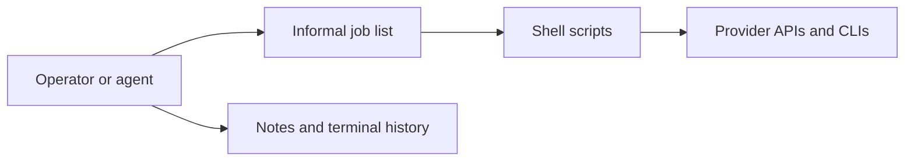
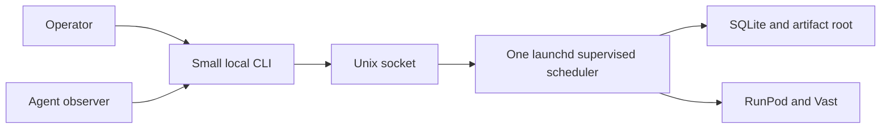
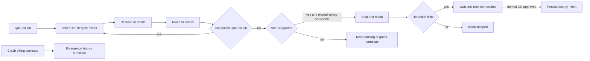
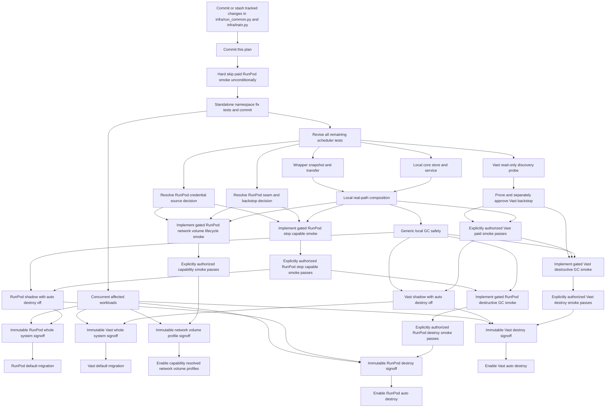

# Boring job scheduler plan

## Status

**PARTIALLY APPROVED WITH OPEN GATES — not implementation-ready.**

This records the agreed product and the approval amendments dated 2026-08-14 below. Current tests are red sketches,
not authority; revise them against this plan and satisfy the recorded gates before implementation.

## One-screen proposal

V0 is one persistently running application on the developer Mac:

```text
small CLI -> local Unix socket -> one scheduler process
                                -> one SQLite database
                                -> one artifact root
                                -> RunPod and Vast adapters
```

It is not an agent, workflow engine, or service collection. Operators submit; agents use the read-only status, log,
and artifact views. That split is an operating policy, not a multi-user security boundary on the same Mac. The
scheduler alone owns queue state, provider routing, retries, transfer, and worker lifecycle. Bootstrap preparation
stays outside.

A minimal job looks approximately like this; exact config syntax is a later implementation detail:

```yaml
profile: runpod:h200x1
argv: ["bash", "scripts/train_one.sh", "configs/smoke.yaml"]
inputs: ["scripts/train_one.sh", "configs/smoke.yaml"]
outputs: ["outputs/result.json", "checkpoints/final"]
max_attempts: 3
max_runtime: 6h
```

```text
$ scheduler submit job.yaml
job_018  queued
$ scheduler status job_018
attempt 1/3  running  runpod:pod-456
$ scheduler logs job_018 --follow
...read-only stdout/stderr tail...
$ scheduler artifacts job_018
attempt-001/stdout  attempt-001/stderr  attempt-001/outputs/...
```

Inputs freeze at submission. The command is an argv array, not a shell string. Views are read-only. One worker runs
one job at a time; many workers can run in parallel.

## Approval checklist

Items are approved except where explicitly marked **AMENDED/OPEN**; the dated approval record is normative and governs
the original recommendation text where they conflict.

1. **Host:** launchd-supervised service on the developer Mac. Recommended for boring operation; when the Mac is off,
   dispatch and GC do not run.
2. **Boundary:** CLI over an owner-only local Unix socket with same-UID peer checking; service-only SQLite writer; one
   owner-only artifact root. Recommended for one clear owner, at the cost of being single-host.
3. **Runtime timeout:** require positive finite `max_runtime` on paid jobs; kill the remote process tree at the
   deadline, prove it stopped, then collect. Recommended for a cost bound; alternatively use `operator_blocked` with
   potentially unbounded spend.
4. **Input boundary:** freeze only explicitly allowlisted repository paths and explicit external inputs. Recommended
   to exclude secrets and unrelated dirty files, at the cost of declaring new source paths.
5. **Artifact boundary:** every durable output must be declared; collect and checksum all obtainable stdout, stderr,
   terminal state, and present declared failure partials, while durably recording unavailable evidence. Undeclared
   worker-local files are not promised durable. Recommended for a finite, verifiable collection contract.
6. **Disposal boundary:** worker-local storage disposability is immutable profile/worker-lifetime policy established
   before first admission, never a later job override. An ephemeral run uses an explicit ephemeral profile.
   Approval explicitly authorizes irreversible loss of **all** undeclared worker-local files from every job in that
   worker lifetime after declared evidence is checksum-evacuated. Every automated provider action must be known not to
   erase a nondisposable storage layer. Recommended so one later job cannot grant it.
7. **Manual workers:** require exclusive dedication, no unmanaged workload, storage evacuation/disposability
   attestation, legacy-watchdog disarm, and the approved provider crash backstop; then allow auto-stop but never
   auto-destroy. Otherwise observe only.
8. **Idle:** `idle_stop_after: 0` for paid/ephemeral stop-capable profiles and `never` for explicitly free profiles.
   Recommended to avoid paid running-compute waste while retaining free capacity. Stopping clears RunPod container
   disk, restart capacity is not guaranteed, and stopped storage may still bill.
9. **RunPod network-volume lifecycle:** current official pages are inconsistent about stop support, so resolve it from
   a read-only capability probe plus an integration smoke for the exact profile. If stop is supported, use normal
   stop/reuse and retention. If not, run any compatible queued job first, then after verified evacuation terminate the
   scheduler-owned Pod only when its Pod-local storage is lifetime-disposable, and later create another against the
   same independent volume. Never guess or silently substitute termination.
10. **AMENDED/OPEN — RunPod launch seam:** preserve the repository's `pod_create.sh`/`runpod-safe` ownership receipt,
    readiness, and deadline boundary; extend that seam rather than bypassing it. This original recommendation is not
    operative until the dated approval record's provenance/replacement decision is resolved.
11. **AMENDED/OPEN — RunPod crash backstop:** use `--stop-after` for stop-capable profiles; use irreversible
    `--terminate-after` only for scheduler-owned profiles whose worker-local storage is disposable or independently
    persistent. Deadline-aware admission—including every hot or stopped reuse—must prove a live deadline with runtime
    plus evacuation margin; otherwise create fresh capacity or block. This original mechanism is not approved; the
    dated approval record governs and blocks it pending the RunPod seam/backstop decision.
12. **Vast crash backstop:** implement read-only discovery now; keep paid Vast blocked until an independent bounded
    mechanism is proven and brought back for a second approval. A worker-local watchdog with a provider key is not
    equivalent and adds credential/liveness risk.
13. **APPROVED — Unknown-work emergency behavior:** let the hard deadline fire even when start intent has no terminal
    record. Uncollected local data may be lost and the job permanently fails without retry even after provider absence
    is confirmed. The unbounded-spend alternative is rejected. This semantic branch is approved; its RunPod mechanism
    remains blocked with item 11.
14. **Secrets:** v0 never transports job secret values. Prepared images/volumes or provider-managed injection supply
   them; jobs declare names only. Recommended for isolation, at the cost of worker preparation.
15. **Capacity caps:** global and per-profile `max_workers`; every scheduler-enrolled/controlled worker and unresolved
    create intent counts until authoritative absence. Observation-only foreign inventory does not. Recommended as the
    smallest hard resource bound.
16. **Cost admission:** cap running compute price and storage size/rate per paid profile using fresh provider data.
    Use the worst applicable running/stopped storage rate. Display bandwidth or other uncapped provider charges
    explicitly. This is not a cumulative per-job/day/account spend cap: independent volumes and nondisposable stopped
    storage can bill indefinitely.
17. **Normal GC auto-destroy authority:** only workers created and durably receipted by this scheduler, with
    lifetime-disposable local storage and verified evacuation, may be auto-destroyed. Recommended; manual/foreign
    workers never qualify. Approval items 11 and 13 separately govern a crash deadline that may terminate before
    evacuation and permanently fail the attempt.
18. **AMENDED/OPEN — Provider credentials:** load only adapter-declared provider credentials service-side, never source
    a credential file wholesale; use dedicated least-privilege keys where the provider supports them and acknowledge
    unavoidable residual account authority. The exact RunPod source awaits Ethan's choice in the dated approval record.
19. **Provisioning authority:** within approved profile caps, the scheduler may automatically create and resume workers;
    provider selection and environment/bootstrap preparation remain explicit profile/operator inputs. Recommended to
    remove the agent/script sequencing loop; alternative manual-only capacity gives up unattended routing.
20. **Execution environment:** clear inherited env; construct a fixed minimal PATH/HOME/TMPDIR/locale baseline; then
    add only explicit nonsecret values and declared remote credential names. Recommended to prevent local/provider
    secrets crossing into jobs.
21. **Break-glass:** use the service-mediated durable pause/drain, external-call fence, exclusive-lock handoff, and
    observation-only reconciliation described below. Recommended so recovery cannot race the scheduler.

Approved stopped retention is 24 hours ordinary paid, 6 hours explicit ephemeral, and `never` explicit free. It
applies only to stop-capable profiles.

## Approved product boundary

- **APPROVED:** a persistent, non-agentic application manages durable jobs; operators submit, while agents may watch
  but not control lifecycle.
- **APPROVED:** FIFO independent jobs only. No DAGs, priorities, preemption, duplicates, cancellation, multi-user
  control plane, or cloud optimizer.
- **APPROVED:** provider-qualified profiles such as `runpod:h200x1`; routing selects the named adapter, not best price.
- **APPROVED:** prefer compatible running, then stopped, then create. One active job/worker; workers may fan out.
- **APPROVED:** `max_attempts` defaults to 3 total command executions.
- **APPROVED:** submission freezes declared input bytes; stage and collection verify content.
- **APPROVED:** success needs exit zero, declared outputs, and both logs verified; failures preserve all obtainable
  logs/partials and record unavailable evidence.
- **APPROVED:** verified terminal nonzero may retry on the same healthy worker. Lost acknowledgement is ambiguous.
  Only confirmed worker loss resolves ordinary ambiguous worker loss and allows retry elsewhere; suspicion allows no
  duplicate. Approval item 13 is the explicit exception: emergency-killed unknown work permanently fails.
- **APPROVED:** stopped reuse for stop-capable workers with 24-hour paid, 6-hour ephemeral, and `never` explicit-free
  retention.
- **APPROVED:** RunPod and Vast are completion scope. Live tests require explicit opt-in.
- **APPROVED SAFETY CONSTRAINT:** GC never targets independently managed persistent/network-volume resources, history,
  snapshots, or SQLite.

Approval item 17 is the approved irreversible normal-GC authority boundary. Auto-destroy remains disabled per provider
until its separately authorized smoke passes and receives immutable signoff.

The user-facing specification ends here except that the dated approval record below is normative and amends both the
checklist and appendix where they conflict. Everything else below is the implementation, safety, test, and migration
appendix; it does not add product features beyond the proposal, checklist, and approval record.

## Why this helps—and where shell still wins

The scheduler improves unattended queues, restart recovery, retries, standard evidence, reuse, fan-out, routing, and
cost cleanup. State stops living in terminal history or agent memory.

It does not choose scientific parameters, interpret outputs, fix commands, remove cold starts, or improve one
attended command. Shell still belongs inside argv and diagnostics, but cannot safely replace an ambiguous attempt.

## Before and after

### Control plane





### Execution and transfer


### Worker lifecycle




The backstop is an emergency cost path, not a create/normal-GC path. Its artifact tradeoff is approval items 11–13.

## Internal responsibilities

The single process owns seven responsibilities, not seven services or a required class hierarchy:

1. Durable FIFO queue, admission, and attempt budget.
2. SQLite state, ownership receipts, intents, and collection status.
3. A main reconciliation loop making one bounded transition at a time.
4. Provider adapters for inventory, offer/create, resume, stop, destroy, readiness, and qualified IDs.
5. Snapshot, stage, collect, hash, and immutable attempt artifacts.
6. Remote wrapper for exact argv/cwd/env, logs, terminal result, and attempt-identity duplicate refusal.
7. Secret-free profile policy for resources, caps, storage, lifecycle, and credential names.

Launchd runs while the Mac is available. Machine off means no dispatch/reconciliation/GC; provider emergency handling
is the only backstop. Provider authentication is available only service/adapter-side and never enters a cleared job
environment, argv, SQLite, artifacts, or logs. The exact RunPod credential source remains open under approval item 18.

## State and reconciliation

Jobs are `queued`, `running`, `collecting`, `succeeded`, `failed`, `unknown`, or `operator_blocked`. Workers are
observed, enrolled/owned, ready, assigned, idle, stopping, stopped, deleting, or quarantined. Status explains blocks.

Rules:

- At most one nonterminal job/worker and one nonterminal attempt/job.
- Persist intent before `CREATE`, `RESUME`, `ATTEMPT START`, `STOP`, or `DESTROY`; call once per durable intent.
- Confirmed rejection may use bounded backoff under a new transition, then `operator_blocked`; infrastructure retries
  do not consume command attempts.
- Lost acknowledgement plus unchanged fresh state is ambiguous: quarantine. No repeat or resume-to-create fallback;
  only authoritative evidence resolves it.
- Readiness/staging failure before proven start consumes no attempt. Proven start does. Collection never reruns compute.
- Exit zero needs verified collection. Collected terminal nonzero may retry; `max_attempts` exhaustion fails.
- A hard provider deadline that resolves unknown work is not ordinary confirmed loss: the job permanently fails and
  its missing evidence is recorded. It never retries.
- V0 has no cancel. Break-glass uses fenced recovery, not a hidden cancellation state.

Before create, store fresh inventory, a cryptographic nonce, and the full requested spec. After lost acknowledgement,
accept only a receipt or exact single delta matching nonce/full spec; a name grants no authority. Every unresolved
owned resource counts against caps until authoritative absence.

## Execution, snapshots, artifacts, and secrets

Submission accepts allowlisted repository paths plus explicit external inputs. Symlinks/path escapes fail. `cwd` is
relative inside the staged root; reject absolute/escaping paths. `scripts/pod_sync.sh` is not the transfer path.

**APPROVAL ITEM 20:** the wrapper clears inherited environment and constructs exactly this baseline:

```text
PATH=/usr/local/sbin:/usr/local/bin:/usr/sbin:/usr/bin:/sbin:/bin
HOME=<attempt-private-home>
TMPDIR=<attempt-private-tmp>
LANG=C.UTF-8
LC_ALL=C.UTF-8
```

Then add explicit nonsecret job/profile env and allow only declared remote credential **names** from provider-managed
injection; inherit no local/other provider secrets. Profiles may add required nonsecret CUDA/toolchain values.

V0 never transports job secret values. Prepared images/volumes or provider-managed injection supply them. Readiness
checks names without echoing values. Service provider auth follows approval item 18, never argv.

Every attempt has one immutable launch namespace assigned before any sink is constructed. A scheduler attempt uses its
durable attempt namespace; a manual launch falls back to a newly generated UUID. The identical namespace flows through
checkpoint, eval, Docent/local transcript, W&B metadata and artifact paths, output declarations, and checkpoint sync.
Every sink preserves it and refuses an existing/conflicting destination rather than overwriting. The standalone Debate
change must preserve `run_identity_suffix` exactly. Moving `_docent_launch_id` away from `pid-N` orphans existing
`docent/<run>/pid-N/` directories; its commit records that compatibility consequence.

Attempt evidence is immutable after verification:

```text
<artifact-root>/<job-id>/attempt-<n>/
  manifest.json
  stdout
  stderr
  terminal.json
  outputs/...
  provider/...
```

Terminal state, stdout, stderr, and every declared output are always required attempt evidence. Debate declares eval
results and a checkpoint manifest by default. Large checkpoint bytes remain on independently managed volumes; the Mac
receives a verified manifest with hashes and the provider-qualified volume identity. Missing declared outputs prevent
success; failure partials remain evidence. For analyzed workloads, local transcript/Docent output is declared and
success-gating. Docent and W&B uploads are best-effort external provenance, use the immutable per-attempt namespace,
and record confirmed receipts; an ambiguous upload is not automatically repeated. The scheduler never deletes stale
namespaces or content on independent volumes: retention there is operator-owned. Approval items 5–6 govern other
undeclared files and worker-lifetime disposal authority.

## Enrollment, handoff, and provider authority

Account inventory grants observation, not authority. Normal agents/operators **must not** provider-mutate; this is
policy until credential isolation is approved, not a claim that they cannot.

A manual worker needs exact-ID/profile registration, exclusive dedication, no unmanaged workload, storage attestation,
and watchdog handoff. Otherwise it is observe-only/no auto-stop. Enrollment never grants auto-destroy.

`POD_IDLE_STOP=0` prevents a new legacy watchdog but does not disarm an old process/accepted stop. Before admission,
durably take lifecycle ownership and disarm it. A manual worker must already have the provider-specific backstop
approved in items 11–12; without one it is observe-only. Never layer lifecycle owners.

## Idle stop, retention, and GC

`idle_stop_after` measures empty running time; `stopped_delete_after` measures confirmed-stopped time. Item 8 recommends
immediate stop for paid/ephemeral stop-capable profiles and no automatic idle stop for explicitly free profiles.
Explicit free means stopped retention `never`, not a claim about provider price.

Paid stopped retention is 24 hours; ephemeral is 6. Finite retention does not authorize deletion. Before any normal
scheduler STOP, TERMINATE, or DESTROY, the adapter states which storage layers the action erases; each erased layer
must be lifetime-disposable and its obtainable declared evidence evacuated. Otherwise the action is blocked and
billing may continue until operator resolution. Approval item 13 is the explicit emergency exception: its hard
deadline may fire without evacuation, permanently fail the job, and record missing evidence.

GC order:

1. Give a compatible queued job the worker before stop/delete begins.
2. Require no active, unknown, or collecting attempt and verified evacuation.
3. Persist stop intent, call once, and require provider confirmation.
4. At expiry require durable scheduler-created ownership, fresh exact inventory, disposable local storage, verified
   evidence, and no ambiguity.
5. Persist destroy intent, fence assignment, call once, and require authoritative absence; lost ack quarantines.

For a worker never ready, retain the bounded readiness timeline/errors and all obtainable logs. Record unavailable
logs as evidence so cleanup cannot deadlock. Destroy still needs ownership, no started attempt, and disposable storage.

GC never targets independently managed volumes/evidence or foreign/manual workers. An auto-GC profile needs every
destroy-erased worker-local layer marked disposable plus finite retention; otherwise use `never`.

## Provider/storage facts and network-volume decision

RunPod documents: container disk is wiped on stop; volume disk persists on stop and is deleted with the Pod; network
volumes persist independently. Its live and cached official pages currently disagree about stopping a Pod with a
network volume. Under approval item 9, the adapter therefore proves the exact profile capability. Supported profiles
use stop/reuse and normal retention; unsupported profiles evacuate and terminate the owned Pod while leaving the
independent network-volume resource intact, then later create a new Pod attached to it. The latter is storage reuse,
not stopped-worker reuse, and has no stopped-retention state.
See [RunPod storage types](https://docs.runpod.io/pods/storage/types) and
[Pod lifecycle](https://docs.runpod.io/pods/manage-pods).

Vast documents that stop preserves instance data while storage may bill; destroy removes instance container storage,
while separately managed persistent Vast Volumes may survive. Stopped reuse can fail without capacity. See Vast [storage](https://docs.vast.ai/guides/instances/storage/types),
[`stop instance`](https://docs.vast.ai/cli/reference/stop-instance), and
[`destroy instance`](https://docs.vast.ai/cli/reference/destroy-instance).

Provider facts are observations. Unknown storage/lifecycle capability blocks mutation; never infer it from “pod.”

## Cost and capacity

The proposed minimal cap model is:

- one global `max_workers`;
- per-profile `max_workers`;
- per-profile running-compute cap and storage-size/rate cap.

Every scheduler-enrolled/controlled worker and unresolved create intent counts until authoritative absence. Refresh
and validate applicable price/storage/resources/capacity before every paid create, resume, and job admission/hot reuse;
independently validate the actual allocation afterward and whenever provider state can change it.
V0 displays but does not aggregate bandwidth or other provider-specific uncapped charges, and has no account-wide
dollar-budget engine. These exclusions are explicit rather than described as an “all-in” cap.

A profile displays one resolved policy before mutation. Missing caps, ambiguous storage, or incompatible lifecycle
fails closed. Exact file format is not an approval decision.

The current RunPod paid smoke is only environment-gated and **must not be enabled**. The first test-revision action is
to hard-skip it until it is rewritten with price/storage checks, coherent emergency deadline, and actual service path.

## Worked workflows

### Paid worker reuse

Two FIFO jobs request a stop-capable `runpod:h200x1` profile. A stopped worker resumes for A; after collection B takes it immediately. When
no match remains, zero idle delay stops it. Confirmed stop begins 24-hour retention; all GC gates still apply.

A RunPod network-volume profile first follows its proven capability. If stopping is supported, it follows the normal
reuse path. Otherwise it runs queued work first, verifies evacuation, terminates the owned Pod, and later creates
another against the unchanged independent network volume.

### Failure versus ambiguity

Attempt 1 exits 23; logs/partials collect, then attempt 2 may reuse the worker. Three starts exhaust the default.
Ordinary confirmed loss retries elsewhere; suspected loss stays unknown with no replacement. If the approved hard
deadline finally kills that unknown attempt, the job permanently fails rather than retrying without its evidence.

### Manual worker

After exact-ID exclusive enrollment and watchdog handoff, a Pod may run/auto-stop but never auto-destroy. Without the
attestation, it is observe-only.

### Mixed providers

A/C request `runpod:h200x1`; B requests `vast:b300x1`. B can run concurrently
on Vast while A runs on RunPod; C waits for RunPod capacity. No substitution
occurs. Paid Vast create/run/stop and safe destroy remain completion criteria
after approval—not a permanently read-only feature.

## Break-glass and rollback

**APPROVAL ITEM 21:**

Break-glass is service-mediated:

1. Request a durable pause/drain. The service stops intake and automatic
   lifecycle transitions, finishes its current local transaction, waits for or
   fences any already-issued provider call, and records the fence state.
2. The service releases its exclusive lock. A one-shot recovery tool acquires
   the same lock; it refuses to run otherwise.
3. Audit exact provider-qualified inventory and every in-flight intent. Already
   sent create/resume/start/stop/destroy intents remain ambiguous until
   authoritative evidence resolves them.
4. Evacuate/checksum before stopping known work. A break-glass operator may
   provider-mutate only after the fence and exact-ID audit.

Rollback never promises to undo an accepted provider deadline or destroy, and
never recreates undeclared local data. Scripts cannot take over an ambiguous
job. Database and artifact views remain readable while paused.

## Test revision gate before implementation

Current positive destroy tests are not implementation authority. Before any
production scheduler work, revise the tests to require:

- provider-qualified profiles/worker identities at every seam;
- explicit enrollment and rejection of foreign/account-wide inventory;
- per-profile resolved idle/retention/storage/cost policy;
- frozen snapshot identity, explicit input allowlist, declared artifacts, and
  worker-local disposability gates;
- one immutable per-attempt launch namespace across checkpoint, eval, Docent/local transcript, W&B metadata/artifact
  paths, declarations, and checkpoint sync; manual UUID fallback, collision refusal/no overwrite, and unchanged
  `run_identity_suffix` behavior;
- always-required terminal/stdout/stderr/declared outputs; Debate's eval-result and checkpoint-manifest defaults;
  verified checkpoint hashes plus qualified independent-volume identity; analyzed-workload transcript/Docent success
  gating; namespaced best-effort upload receipts and ambiguous-upload no-repeat; operator-owned independent-volume
  retention;
- exact cwd and cleared/allowlisted environment, including secret-name-only
  readiness;
- fresh-process service restart, single-owner lock, durable pause/drain, and
  one-shot fence behavior;
- crash injection before call, after provider acceptance/lost acknowledgement, and after acknowledgement for CREATE,
  RESUME, ATTEMPT START, STOP, and DESTROY; generic transport errors never count as confirmed rejection;
- positive-finite paid runtime validation and a real child/grandchild process-tree timeout with stop proof, evidence
  collection, and restart during timeout handling;
- attempt identity bound to snapshot, argv, cwd, and cleared environment; changed identity inputs fail closed;
- real SQLite, transfer, wrapper, provider, and artifact composition through
  the actual CLI/service, not a provider-specific harness;
- pre/post independent worker **and volume** inventories, exact create delta,
  stop acknowledgement, destroy authoritative absence, and foreign stability;
- explicit unready-worker evidence and emergency-deadline behavior;
- global/profile caps and fresh price/storage checks under pending and ambiguous create, independently compared with
  the actual allocation;
- separate RunPod network-volume capability outcomes—stop/reuse when proven, terminate/recreate when stop is
  unsupported—with exact Pod ownership and independent volume-resource identity/configuration audits.

Before all other scheduler test revision, make the RunPod paid test unconditionally skip; no environment variable may
enable it. Its future implementation remains behind the unresolved RunPod seam/backstop decision, and its execution
requires a later separate authorization.
Provider audits must traverse the actual service path and use independent
provider and volume inventory; the current harness is insufficient.

## Migration dependency graph



Phase 0 follows the mandatory dependency chain exactly: commit or stash the tracked dirty changes in
`infra/run_common.py` and `infra/train.py`; commit this plan; make the paid RunPod smoke unconditionally skipped; then
land the standalone Debate namespace fix and its focused tests as its own commit. Only after that commit may remaining
scheduler test revision or implementation begin. Confirmed namespace hazards are checkpoint launch IDs in
`infra/run_common.py` and the divergent Docent behavior in `infra/run_debate.py` and `infra/run_rlvr.py`. Audit
`run_eval`, local transcript, artifact, checkpoint, Docent, W&B, declarations, and checkpoint-sync sinks against the
approved namespace contract without changing scientific semantics. Concurrent onboarding of an affected workload
stays blocked until its sinks are safe.

Implementation arc:

1. Commit or stash the exact tracked dirty changes in `infra/run_common.py` and `infra/train.py`.
2. Commit this plan as the immutable review authority.
3. Hard-skip the paid RunPod smoke unconditionally, so no environment variable can enable it.
4. Land the approved namespace contract and focused tests in Debate as a standalone commit.
5. Revise all remaining scheduler tests. Read-only Vast discovery may run in this phase as a non-conformance probe.
   Resolve the RunPod seam provenance and item-11 backstop decision before implementing any RunPod lifecycle smoke; if
   a replacement is needed, its explicit specification requires separate approval. Execution authorization is a
   later, distinct gate. No RunPod adapter or lifecycle-smoke implementation begins until both that decision and the
   item-18 credential-source decision are approved; neither credential option is selected by this plan.
6. Implement parallel local core/service and wrapper/transfer tracks, then real local composition and restart/fence
   smoke.
7. After the seam/backstop decision, implement the RunPod service-path stop-capable and network-volume capability
   smokes; run each only with separate authorization.
8. After a second approval of a proven independent backstop, implement the Vast paid smoke; run it only with separate
   authorization.
9. Implement generic local GC gates, then separately implement gated RunPod and Vast exact-worker destructive smokes.
   Auto-destroy remains disabled per provider until its smoke is explicitly authorized, passes, and receives immutable
   signoff.
10. Run shadow jobs with auto-destroy off, clear concurrent namespaces, review the immutable candidate, then migrate
    each provider/profile family by its own gated path.

Every phase gets a smoke and fresh correctness, safety, test-oracle, and intent review against this document. After the
last step, a fresh whole-system wave—including intent—reviews the immutable candidate commit against this document.
Vast paid lifecycle remains completion scope, but cannot proceed until its provider-specific backstop is proven and
approved.

## Acceptance criteria

- A fresh service process recovers every intent without duplicate execution or
  mutation; a second service and unfenced one-shot are refused.
- Durable pause/drain releases the lock only after fencing transitions; sent
  intents remain ambiguous across break-glass.
- Real execution proves exact argv, cwd, baseline/allowlisted env, process-tree
  timeout behavior, terminal code, attempt identity, and that the entire process tree is gone before worker reuse,
  stop, or GC.
- FIFO, one job/worker, exact profiles, fan-out, stopped reuse, and three total
  attempts behave as approved.
- Verified nonzero can retry; confirmed loss can retry elsewhere; unchanged
  state after lost acknowledgement cannot trigger mutation fallback/repeat.
- Independent hashes prove immutable logs/partials/outputs; collection restart
  never reruns compute.
- One immutable namespace identifies an attempt at every sink; manual launches use a UUID; conflicts refuse rather than
  overwrite; `run_identity_suffix` remains unchanged.
- Terminal state, stdout, stderr, and every declared output are present and verified. Debate's default eval-result and
  checkpoint-manifest declarations work; independently stored large checkpoints have verified hashes and qualified
  volume identity; analyzed workloads cannot succeed without local transcript/Docent evidence.
- Best-effort Docent/W&B uploads are per-attempt namespaced, confirmed receipts are recorded, ambiguous uploads are not
  automatically repeated, and scheduler GC leaves independent-volume namespaces/content untouched.
- Pre-create inventory/nonce/full-spec and receipts prevent duplicate create;
  every unresolved resource binds global and profile caps.
- Fresh price/storage/cap checks happen before every paid create, resume, and job admission/hot reuse; actual-allocation
  checks follow every provider state change that can affect them.
- Stop requires acknowledgement/observation; destroy requires write-ahead
  intent and authoritative absence. Unready cleanup preserves obtainable
  evidence without deadlocking on unavailable logs.
- Config resolution proves 24-hour, 6-hour, and `never` policies; immediate
  idle stop; storage disposal; and stop-capability compatibility.
- Independent before/after worker and volume audits prove manual/foreign
  workers are unchanged; persistent-volume resource identity, existence, and
  configuration are not deleted, resized, or detached. Expected content
  changes are separately path-scoped and hash-audited.
- Actual RunPod and Vast smokes traverse CLI, socket, service, SQLite, adapter,
  transfer, wrapper, and artifact root—not a parallel integration harness.
- Machine-off behavior, emergency deadline, watchdog exclusive handoff, and
  accepted irreversible actions are documented in the operator runbook.

## Approval record

### 2026-08-14 approval and amendments

This dated record is normative and governs the checklist and appendix where they conflict. Ethan approved checklist
items 1–21 except for the following amendments and open decisions:

- **Items 10 and 11 are amended and blocked.** `runpod-safe` is absent from this machine: the expected Homebrew
  binary and its local share/state directories do not exist. The repository documents `--ttl-minutes`, not the
  proposed `--stop-after` or `--terminate-after` verbs. Before scheduler work depends on this seam, determine whether
  the original tool still exists on another machine, in a private repository, or as a lost installation. If it does,
  reinstall and verify it before preserving or extending it. If it is genuinely gone, do not reconstruct it from
  `docs/runpod_launch.md`: a replacement requires a separate explicit proposal and approval covering its receipt
  schema, deadline-to-verb mapping, delete-authorization rule, and audit contract. The bundled replacement proposal
  is rejected pending that decision.
- **Item 18 is amended and blocked pending Ethan's choice.** `~/code/.env` currently contains `VAST_API_KEY` but no
  `RUNPOD_API_KEY`; this machine's RunPod authentication is in `~/.runpod/config.toml`. Present, without choosing,
  the two options: add `RUNPOD_API_KEY` to `~/code/.env`, or have the adapter read the runpodctl config. For each
  option, explain how item 20's cleared execution environment prevents provider credentials from entering job
  processes while still making the credential available only to the adapter.
- **Approved evidence policy (amended bundle item 7):** terminal state, stdout, stderr, and every declared output are
  always required. Debate defaults to declaring eval results and a checkpoint manifest. Large checkpoint bytes stay
  on independently managed volumes while the Mac receives verified hashes and qualified volume identity. Local
  transcript/Docent output is declared and success-gating for analyzed workloads. Docent/W&B uploads remain
  best-effort external provenance; they are per-attempt namespaced, confirmed receipts are recorded, and ambiguous
  uploads are not automatically repeated. Scheduler GC never deletes stale namespaces or content on independent
  volumes; their retention is operator-owned.

The following associated decisions are approved:

- The scheduler will live in the independent private `ethanelasky/job-scheduler` repository and communicate with
  Debate across a process/CLI boundary, not as a Python dependency or submodule. It initially has no public license.
  Distribution name is `boring-job-scheduler`, Python package is `job_scheduler`, and installed CLI is `scheduler`.
  That repository owns the authoritative scheduler specification, tests, service, SQLite state, transfer/wrapper,
  provider adapters, profiles, launchd files, and operator runbook. Debate retains scientific code, job specifications,
  workload/provisioning scripts, and sink changes, and pins the exact scheduler release, commit, and protocol version.
  Copy the currently untracked scheduler plan and tests first, without a history-rewriting migration; delete nothing
  from Debate without later approval. Publish only after the test-revision gate; the first pushed commit must not be a
  broken red-test sketch. Repository creation and collaborator invitations for `fnakasako` (Frank) and `CanKucukkurt`
  (Can) are authorized on that ordering.
- Item 9 means: run any compatible queued job first, require exact scheduler ownership and durable intent, verify
  evacuation and storage disposability, and leave independent volumes untouched before termination. One nonterminal
  job per worker permits multiple workers to run in parallel.
- The immutable launch-namespace fix lands first as a standalone Debate change before any scheduler implementation.
  One immutable per-attempt namespace, with a UUID fallback for manual launches, crosses checkpoint, eval, Docent/local
  transcript, W&B metadata and artifact paths, declarations, and checkpoint sync. Every sink preserves it and refuses
  conflicts/overwrites. Preserve `run_identity_suffix` exactly. Moving `_docent_launch_id` away from `pid-N` will
  orphan existing `docent/<run>/pid-N/` directories; record that compatibility consequence in the standalone commit.
- The recommended item-13 hard-deadline branch is approved: unknown work killed by the hard deadline permanently fails
  without retry and records missing evidence. The RunPod mechanism remains blocked with item 11.

The prerequisite order is mandatory:

1. Commit or stash the exact tracked dirty changes in `infra/run_common.py` and `infra/train.py`; do not layer the
   namespace fix over them.
2. Commit this plan so final review can cite an immutable specification.
3. Hard-skip the paid RunPod smoke so `RUNPOD_PAID_INTEGRATION=1` cannot enable it.
4. Land the standalone Debate launch-namespace fix, with its focused tests, as its own commit.
5. Only then revise all remaining scheduler tests or begin other scheduler work.

Paid or destructive provider execution remains unauthorized. The Vast backstop remains unauthorized and requires a
separate approval. No approval here authorizes a paid/destructive smoke.

Approving the design permits implementation of gated paid/destructive smokes, but **does not authorize running one**.
Each execution needs a separate explicit opt-in with the exact owned target or unique creation nonce, provider/profile,
price and storage ceilings, runtime/deadline, evacuation proof, and confirmation that no independent volume is deleted.
