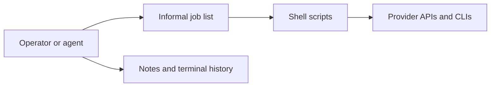
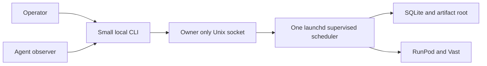
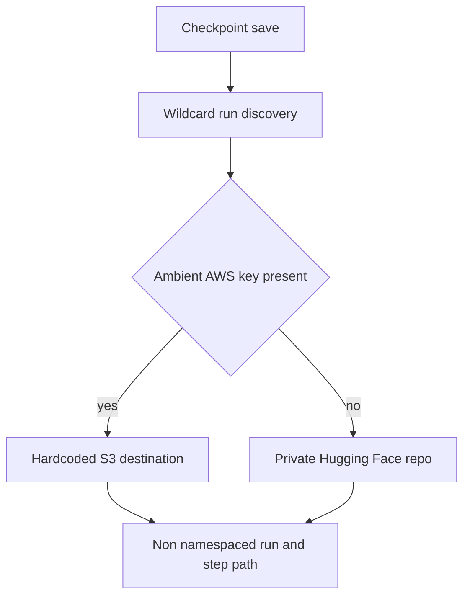
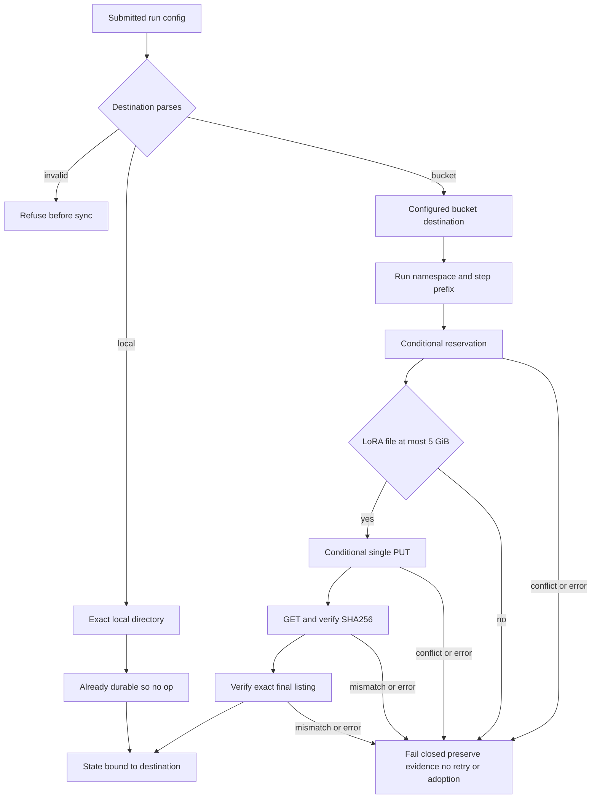
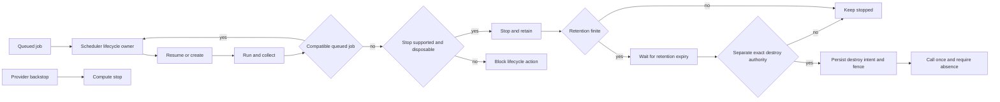

# Boring job scheduler operative contract

## Status and authority

**PARTIALLY APPROVED WITH OPEN GATES — not implementation-ready.**

This is the sole operative behavior contract. Stable clause IDs are normative. The companion documents do not add
behavior:

- [Conformance and migration](job_scheduler_conformance.md) maps each clause to independent proof and acceptance.
- [Decision and provenance ledger](job_scheduler_decisions.md) records authority, amendments, superseded history, and
  the complete mapping from immutable source commit `8b95cd7`.

Where an implementation constraint is labeled as such, it is not a user-approved design choice. An open gate grants no
authority. Current test sketches are not authority; the conformance gate must be satisfied before implementation moves
past its approved frontier.

## One-screen proposal

V0 is one persistent, non-agentic application on the developer Mac:

```text
small CLI -> owner-only Unix socket -> one launchd-supervised scheduler
                                      -> one SQLite database
                                      -> one artifact root
                                      -> RunPod and Vast adapters
```

Operators submit and control jobs. Agents may use read-only status, log, and artifact views. The scheduler alone owns
queue state, provider routing, retries, transfer, and worker lifecycle; bootstrap preparation remains outside it. This
is an operating boundary, not a multi-user security boundary against another process running as the same Mac user.

A minimal job has this shape; exact config syntax remains an implementation detail:

```yaml
profile: runpod:h200x1
argv: ["bash", "scripts/train_one.sh", "configs/smoke.yaml"]
inputs: ["scripts/train_one.sh", "configs/smoke.yaml"]
outputs: ["outputs/result.json", "checkpoints/final"]
checkpoint_destination:
  kind: bucket
  endpoint: https://s3api-example.runpod.io
  region: example-region
  bucket: example-bucket
  prefix: checkpoints
max_attempts: 3
max_runtime: 6h
```

Inputs freeze at submission. Commands are argv arrays, not shell strings. One worker runs one job at a time; multiple
workers may run concurrently.

## Approval checklist index

This table is only an index. The linked clauses contain the behavior.

| Item | Status | Operative clauses |
|---|---|---|
| 1 Host | Approved | [SCHED-001](#sched-001) |
| 2 Local boundary | Approved | [SCHED-001](#sched-001), [BREAK-001](#break-001) |
| 3 Runtime timeout | Approved | [EXEC-001](#exec-001), [AUTH-001](#auth-001) |
| 4 Input boundary | Approved | [EXEC-001](#exec-001) |
| 5 Artifact boundary | Approved | [EVID-001](#evid-001) |
| 6 Disposal boundary | Approved | [EVID-001](#evid-001), [LIFE-001](#life-001) |
| 7 Manual workers | Approved | [WORK-001](#work-001) |
| 8 Idle and retention | Approved | [LIFE-001](#life-001) |
| 9 RunPod network volumes | Amended; initially refused | [RUNPOD-001](#runpod-001) |
| 10 RunPod launch seam | Amended; reconciliation gate open | [RUNPOD-001](#runpod-001) |
| 11 RunPod crash backstop | Amended; bootstrap-only gate | [RUNPOD-001](#runpod-001) |
| 12 Vast crash backstop | Read-only approved; paid path blocked | [VAST-001](#vast-001) |
| 13 Unknown-work outcome | Approved outcome only; no provider verb | [STATE-001](#state-001), [AUTH-001](#auth-001) |
| 14 Job secrets | Approved | [EXEC-001](#exec-001), [CRED-001](#cred-001) |
| 15 Capacity caps | Approved | [COST-001](#cost-001) |
| 16 Cost admission | Approved | [COST-001](#cost-001) |
| 17 Auto-destroy | **OPEN; not approved** | [AUTH-001](#auth-001), [OPEN-001](#open-001) |
| 18 Provider credentials | Amended and approved as Option B | [CRED-001](#cred-001) |
| 19 Provisioning authority | Approved within provider-specific gates | [SCHED-001](#sched-001), [AUTH-001](#auth-001) |
| 20 Execution environment | Approved | [EXEC-001](#exec-001) |
| 21 Break-glass | Approved | [BREAK-001](#break-001) |

## Operative clauses

### SCHED-001

**Product, topology, and scope.** The scheduler is a launchd-supervised single process with one exclusive service lock,
one service-writer SQLite database, one owner-only artifact root, and an owner-only Unix socket with same-UID peer
checking. Its internal responsibilities are durable FIFO admission, state and intent reconciliation, provider adapters,
snapshot/stage/collect, the exact remote wrapper, artifact verification, and secret-free profile policy. These are
responsibilities, not required services or class boundaries. The main reconciliation loop makes one bounded transition
at a time. Operators submit and control jobs through the scheduler. Agents may use only read-only status, log, and
artifact views; agent lifecycle control is policy-forbidden.

Jobs are independent FIFO work: no DAGs, priorities, preemption, duplicate execution, cancellation, multi-user control
plane, or cloud optimizer. Routing uses an exact provider-qualified profile, prefers a compatible running worker, then a
compatible stopped worker, then an authorized create, and never substitutes another provider/profile. Within approved
profile caps and provider gates it may create or resume automatically; provider selection and bootstrap preparation
remain explicit profile/operator inputs. There is at most one nonterminal job per worker and one nonterminal attempt per
job. `max_attempts` defaults to three command executions.

The scheduler chooses neither scientific parameters nor output interpretation, fixes no command, and removes no cold
start. Shell remains valid inside argv and diagnostics but cannot replace an ambiguous attempt. When the Mac is off,
dispatch, reconciliation, and GC do not run; only an approved provider-side compute-stopping deadline can bound spend.
V0 service-path completion requires successful paid RunPod and paid Vast nondestructive smokes through the actual
service path after their gates are satisfied; today's provider blocks are migration gates, not a reduction of that
scope. The later destructive-GC migration arc also remains completion scope: after Ethan separately authorizes each
exact destructive smoke, both provider smokes and their immutable safe-destroy signoffs must succeed. That future proof
requirement grants neither current destructive execution nor auto-destroy enablement.

#### Control-plane before and after





#### CLI contract and worked workflows

The installed CLI supports these user-visible operations; status, logs, and artifacts are read-only:

```text
scheduler submit job.yaml
job_018  queued
scheduler status job_018
attempt 1/3  running  runpod:pod-456
scheduler logs job_018 --follow
...read-only stdout/stderr tail...
scheduler artifacts job_018
attempt-001/stdout  attempt-001/stderr  attempt-001/outputs/...
```

- **Paid reuse:** two FIFO jobs request a stop-capable provider/profile whose resume and hot-reuse routes install and
  prove a fresh deadline. A stopped worker resumes for A, B takes it immediately after verified collection, and zero
  idle delay then stops it for 24-hour retention. This is generic behavior; RunPod resume is still blocked by
  [RUNPOD-001](#runpod-001).
- **Failure versus ambiguity:** verified exit 23 may consume another of the default three command executions; confirmed
  ordinary worker loss may retry elsewhere; suspected loss stays quarantined with no replacement. If a separately
  authorized backstop ends unknown compute, [STATE-001](#state-001) permanently fails the job without retry.
- **Manual worker:** after exact-ID exclusive enrollment, storage evacuation/disposability attestation, watchdog handoff,
  and approved backstop, a worker may run and auto-stop but never auto-destroy; otherwise it is observe-only.
- **Mixed providers:** A and C requesting `runpod:h200x1` never substitute Vast, while B requesting `vast:b300x1` may run
  concurrently after its gate. C waits for RunPod capacity. Both paid provider service paths remain completion scope.

### STATE-001

**Durable state, identity, and ambiguity.** Jobs are `queued`, `running`, `collecting`, `succeeded`, `failed`, `unknown`,
or `operator_blocked`. Workers are observed, enrolled/owned, ready, assigned, idle, stopping, stopped, deleting, or
quarantined. Status explains why progress is blocked.

- Persist intent before `CREATE`, `RESUME`, `ATTEMPT START`, `STOP`, or `DESTROY`; make at most one call per durable
  intent. A confirmed rejection may receive bounded backoff under a new transition and then becomes
  `operator_blocked`; infrastructure retries do not consume command attempts.
- Lost acknowledgement plus unchanged fresh state is ambiguous. Quarantine it: do not repeat the mutation, substitute
  resume with create, or launch replacement compute until authoritative evidence resolves it.
- Before create, persist fresh inventory, a cryptographic nonce, and the full requested spec. After lost acknowledgement,
  accept only a receipt or one exact inventory delta matching nonce and full spec; a name is not ownership. Every
  unresolved owned resource counts against capacity caps until authoritative absence.
- Bind attempt identity to frozen snapshot, exact argv, cwd, and cleared environment. A changed identity input refuses.
  The remote wrapper also refuses duplicate execution of the same attempt identity.
- Readiness/staging failure before proven start consumes no command attempt; proven start does. Verified terminal
  nonzero may retry on the same healthy worker. Ordinary confirmed worker loss may retry elsewhere. Collection never
  reruns compute. Exhausting `max_attempts` fails the job.
- If a separately authorized provider backstop ends compute for an unknown attempt without a terminal record, the job
  permanently fails, records unavailable evidence, and never retries even after provider absence is confirmed. This is
  an outcome rule, not authority for any provider verb.
- V0 has no cancel. Recovery uses [BREAK-001](#break-001), not a hidden cancellation path.

### EXEC-001

**Frozen execution and secrets.** Submission accepts only allowlisted repository paths and explicit external inputs.
Symlinks and path escapes refuse. `cwd` is relative to the staged root; absolute or escaping values refuse.
`scripts/pod_sync.sh` is not the transfer path. Submission freezes the declared bytes and their manifest; staging
verifies those bytes before execution. The wrapper executes exact argv and clears inherited environment before building
exactly this baseline:

```text
PATH=/usr/local/sbin:/usr/local/bin:/usr/sbin:/usr/bin:/sbin:/bin
HOME=<attempt-private-home>
TMPDIR=<attempt-private-tmp>
LANG=C.UTF-8
LC_ALL=C.UTF-8
```

It then adds only explicit nonsecret job/profile values and declared remote credential names supplied by
provider-managed injection. V0 never transports job secret values. Prepared images/volumes or provider injection supply
them; readiness checks names without printing values. Service provider credentials never enter a job environment, argv,
SQLite, artifacts, or logs.

Paid jobs require a positive finite `max_runtime`. At expiry the wrapper kills the complete remote process tree, proves
it is gone, and then collects. A worker cannot be reused, stopped, or considered idle while descendants survive.

#### Execution and transfer before and after


### EVID-001

**Evidence, success, and disposal.** Attempt evidence is immutable after verification:

```text
<artifact-root>/<job-id>/attempt-<n>/
  manifest.json
  stdout
  stderr
  terminal.json
  outputs/...
  provider/...
```

Terminal state, stdout, stderr, and every declared output are always required. Exit zero is insufficient without all
required evidence verified. Collection checksums all obtainable terminal state, stdout, stderr, and present declared
failure partials, and durably records unavailable evidence. Independent hashes establish immutability after collection.
Debate declares eval results and a checkpoint manifest by default. For workloads that will be analyzed, local
transcript/Docent output is declared and success-gating; scientific conclusions never rely on an aggregated result in
place of the transcript.

Checkpoint bytes remain at the submitted local/bucket destination while the Mac retains verified hashes and qualified
destination identity. W&B and external Docent remain best-effort provenance after their own fail-closed handshake
boundaries; confirmed and ambiguous receipts become attempt evidence, and ambiguous mutations are not automatically
repeated. Scheduler GC never deletes checkpoint-destination content or stale namespaces; retention there is operator
owned.

Every durable output must be declared. Undeclared worker-local files are not promised durable. Worker-local storage
disposability is immutable profile/worker-lifetime policy set before first admission, never a later job override. An
ephemeral profile authorizes irreversible loss of all undeclared worker-local files from every job in that worker
lifetime only after obtainable declared evidence is checksum-evacuated. No automated action may erase a nondisposable
layer.

### NS-001

**One immutable launch namespace.** Resolve `DEBATE_LAUNCH_NAMESPACE` before any sink is built. A scheduler attempt uses
its durable attempt namespace; a manual launch generates one UUID and reuses it throughout. The namespace is one strict
path-safe component of 1–128 characters and flows unchanged through checkpoints, eval, local transcript/Docent, W&B
metadata and artifact paths, declarations, and checkpoint sync. It is launch provenance, never protocol or scientific
identity.

`run_eval --artifact-root ROOT` atomically reserves `<root>/<namespace>/` before work and writes only
`results.jsonl`, `summary.json`, and `docent.jsonl` there. Every sink refuses an existing/conflicting destination instead
of overwriting. Manual UUID collision is practically unlikely; this refusal is primarily future-facing protection for
scheduler attempt namespaces. W&B display `run_name`, `run_identity_suffix`, and protocol identity remain unchanged;
`run_identity_suffix` must be preserved exactly.

The namespace migration does not delete or migrate old data. Existing `docent/<run>/pid-N/` directories and
`checkpoints/{run}/{step}/` bucket keys become unreachable from the new layouts but remain readable and untouched.
Existing `ethanelasky/ckpt-{run}` Hugging Face repositories remain untouched and unread.

Phase 0 must first correct the checkpoint launch-ID hazard in `infra/run_common.py` and reconcile the divergent Docent
sink behavior in `infra/run_debate.py` and `infra/run_rlvr.py`. It audits `run_eval`, local transcript, artifact,
checkpoint, Docent, W&B, declaration, and checkpoint-sync sinks against this clause without changing scientific
semantics. An affected workload cannot be onboarded concurrently until every one of its sinks is safe.

### CKPT-001

**Explicit LoRA checkpoint destination.** Every run submission freezes one destination; ambient credentials never
select it. Missing, unknown, incomplete, or unparseable destination config refuses before sync.

- `local` supplies one exact absolute durable directory. If that directory already contains the exact checkpoint, sync
  is a legitimate no-op.
- `bucket` supplies S3-compatible endpoint, region, bucket, and key prefix. Credentials remain ambient and service-side,
  not part of destination config. Objects use
  `<configured-prefix>/{run}/{namespace}/{step}/{relative-path}`.

Sync receives the exact checkpoint directory and namespace and performs no wildcard discovery. Bucket sync retains the
reservation marker, conditional `IfNoneMatch: "*"` no-overwrite boundary, full object GET/hash verification, exact final
prefix listing, and no-retry/no-adoption semantics. The backend produces only LoRA adapters by setting
`save_lora_only=True` whenever `lora_rank > 0`; conditional single PUT is the supported path. Files over 5 GiB refuse;
multipart upload is absent. Every conflict, mismatch, or error after sync begins fails closed and durably preserves
sync-failure evidence. Hugging Face has no destination branch.

#### Checkpoint destination before and after





### CKPT-OPEN-001

**Checkpoint gates still undecided.** The approved destination clause starts only after a checkpoint is eligible for
sync. These adjacent recommendations are pending and unapproved: the writer-ready/live-source stabilization boundary;
the synchronizer process/coordination redesign and PID/lock publication semantics; and whether an ambiguous partial
remote prefix is quarantined while newer steps continue. No implementation may silently choose among them.

### WAND-001

**W&B resumed-run provenance guard.** Pin the dependency exactly to `wandb==0.28.1`. Validate the supplied run ID before
constructing an API path, taking its lock, or making any W&B API operation, and validate the runtime version before any
W&B API operation. Acquire a non-blocking local `flock` keyed by the validated ID before the first W&B API call and hold
it for the full training run. Same-host contention fails without remote contact. While
holding the lock, fetch one public W&B run object and read both config and `.state` from it.

Permit only `finished`, `crashed`, `failed`, and `killed`. Refuse `running`, missing, unreadable, or unknown state before
config mutation. `wandb.init` resumes the exact validated target and forces online mode. The `launch_namespaces` history is
append-only and the current namespace and any override audit entry are written in the same config mutation. Lock
ownership remains with the acquiring scope until it transfers atomically to the live logger. `KeyboardInterrupt` and
`SystemExit` during state/config access, initialization, or transfer are re-raised after the current owner releases the
lock; they are not swallowed as best-effort telemetry failures.

A stale `running` heartbeat has one escape hatch: a literal human-facing CLI flag. The runner converts it to a private
process-local capability bound to that exact run ID. It is absent from the public Config constructor, YAML, and
environment. Software cannot prove a human typed it and arbitrary CLI automation could pass it; scheduler and other
automation use is forbidden by policy. Every use emits an unconditional operator-visible notice and a run audit record.
It bypasses only exact `running`, never the local lock or another refusal. This is a process-interface/policy boundary,
not cryptographic human authentication. Any combination that could suppress the notice or prevent the namespace and
override audit records from being written together refuses.

The mechanism strongly protects but does not absolutely serialize cross-machine resumes: W&B has no compare-and-swap
and intentionally supports distributed writers. Two machines can read the same settled state in the milliseconds before
either calls `wandb.init`. Future scheduler exclusion is defense in depth; this direct guard remains. The local flock is
exact for cooperating processes under one effective Unix user, not a security boundary against malicious same-UID
coordination-path replacement.

**Worked example.** Run `xyz789` stores `launch_namespaces: ["run-A"]`. Without these guards, resumes B and C can both
read that list; B writes `["run-A", "run-B"]`, then C writes `["run-A", "run-C"]`, silently erasing B's provenance even
though B wrote metrics into the run. With the local lock, a same-host C fails immediately. A realistic cross-machine C
sees the run as `running` after B initializes and refuses, leaving only the stated millisecond residual race.

### DOC-001

**One external Docent collection per launch.** Pin every install surface to `docent-python==0.1.77` and refuse before
client construction unless the runtime package matches. An empty `AgentRun` list refuses before collection creation.
The collection name includes the launch namespace and holds exactly that attempt's transcripts. The scientific
`AgentRun` payload remains byte-for-byte unchanged.

Every Docent HTTP call, including authentication, uses a 10-second connect and 120-second read timeout. A fixed
five-minute wall-clock budget begins before authentication and ends only after final confirmation. Manual upload uses
the full budget. The future scheduler uses
`min(5 minutes, remaining attempt deadline - separate 5-minute evidence/shutdown reserve)` and skips external upload
with a sanitized unconfirmed receipt when insufficient time remains.

The hard wall uses the process-wide `SIGALRM`/`ITIMER_REAL` mechanism. It runs only on the main Python thread, with no
other live Python thread, no active `ITIMER_REAL`, and `SIGALRM` neither blocked nor pending. If any precondition fails,
skip external upload before constructing the client and emit a sanitized receipt; local evidence remains authoritative.
The guard must interrupt trickling or never-returning calls, consume a pending alarm it owns, and restore the prior
signal handler, mask, and timer state.

Collection creation, every nonempty agent batch, and every status-poll POST each receive one transport send: SDK and
adapter retries are disabled, redirects refuse, and every response must be 2xx. A confirmed collection ID validates as
one bounded URL-safe path component before any batch POST. Each batch returns a unique nonempty `job_id` and is awaited
to confirmation. Polls request at most 100 pending IDs, an implementation constraint of the pinned SDK, and each response
contains exactly one row for every requested ID with no missing, extra, or duplicate rows. `pending` and `running` are
the only nonterminal states; `completed` confirms and removes the ID. Canceled, failed, unknown, malformed, missing,
extra, duplicate, transport, or acknowledgement failures are immediate partial failures.

Collection-ID validation and retention are interrupt-safe. If `KeyboardInterrupt` or `SystemExit` arrives after a
possible remote mutation, emit a sanitized ambiguous receipt first, including the confirmed collection ID when known,
then re-raise the original exception. Confirmed, ambiguous, timeout, and skipped outcomes emit sanitized structured
stderr receipts retained as attempt evidence. Every failure before confirmed collection creation—including an ambiguous
collection-create POST—records `collection_id: null` explicitly. No ambiguous or timed-out mutation is retried or
adopted. Every failed, ambiguous, or timed-out outcome after confirmed collection creation includes that confirmed
collection ID. External failure never invalidates authoritative local transcript evidence or prevents a locally
evidenced run from succeeding. A legitimately slow or multi-GB upload can therefore remain permanently ambiguous even
if the service later completes it.

The pinned SDK's roughly 100 MiB pre-gzip batch threshold is factual implementation context only. Ethan expected typical
uploads likely would not be multi-GB while explicitly leaving open that they may be. Neither statement promises artifact
size, wire size, duration, or completion within five minutes.

**Worked example.** Experiment `math-pc-rl` is launched three times. A single collection named `math-pc-rl` would mix a
partial crashed attempt with a complete relaunch. Under this clause, each attempt receives a collection whose name
includes its namespace and that collection contains exactly that attempt's transcripts. Ten launches produce ten
collections. The namespace selects the collection only; it never changes `AgentRun` bytes.

### WORK-001

**Observation, enrollment, and manual workers.** Account inventory grants observation, not mutation authority. Until
credential isolation is implemented and verified, ordinary agents/operators must not mutate providers directly as
policy; this is not a claim that same-user code is technically incapable.

A manual worker needs exact provider-qualified ID/profile registration, exclusive dedication, no unmanaged workload,
storage evacuation/disposability attestation, legacy-watchdog disarm, and an approved provider crash backstop. Otherwise
it is observe-only and cannot auto-stop. Enrollment never grants auto-destroy. `POD_IDLE_STOP=0` prevents a new watchdog
but does not disarm an old process or an already accepted stop; lifecycle ownership and watchdog handoff must be durable
before admission. Never layer lifecycle owners.

### LIFE-001

**Stop, retention, and GC.** `idle_stop_after` is empty running time; `stopped_delete_after` is confirmed-stopped time.
Paid and explicit-ephemeral stop-capable profiles use immediate idle stop; explicit free uses `never`. Approved stopped
retention for stop-capable profiles is 24 hours ordinary paid, 6 hours explicit ephemeral, and `never` explicit free.
“Free” is a policy label, not a provider-price assertion. Stopping may erase provider-local layers, restart capacity is
not guaranteed, and stopped storage may still bill. Finite retention never authorizes deletion.

Before any normal STOP, TERMINATE, or DESTROY, the adapter identifies every erased storage layer. Each must be
lifetime-disposable and all obtainable declared evidence must be checksum-evacuated; otherwise the action blocks and
billing may continue. A stopped worker is a deep backup, not the working copy. Subject to [AUTH-001](#auth-001), normal
GC follows this order:

1. Offer a compatible queued job the worker before stop or delete begins.
2. Require no active, unknown, or collecting attempt and verified evacuation.
3. Persist stop intent, call once, and require provider confirmation.
4. At retention expiry require durable scheduler-created ownership, fresh exact inventory, disposable local storage,
   verified evidence, and no ambiguity.
5. Persist destroy intent, fence assignment, call once, and require authoritative absence; lost acknowledgement
   quarantines.

An unready worker retains its bounded readiness timeline/errors and all obtainable logs; unavailable logs are recorded
rather than deadlocking cleanup. Even then, destroy requires scheduler ownership, no started attempt, and disposable
storage. An auto-GC profile needs finite retention and every destroy-erased worker-local layer marked disposable;
otherwise retention is `never`.

GC never targets foreign/manual workers, independently managed persistent/network volumes, volume history, snapshots,
SQLite, or configured checkpoint destinations. Expected volume-content changes require separate path-scoped hash audit.
Destruction remains governed by [AUTH-001](#auth-001); item 17 is not authority.

#### Worker lifecycle before and after




### COST-001

**Capacity and price admission.** Resolve one visible policy per profile. Require global and per-profile `max_workers`,
and per-paid-profile caps for running compute price, storage size, and worst applicable running/stopped storage rate.
Every controlled worker and unresolved create intent counts until authoritative absence; foreign observation-only
inventory does not.

Refresh applicable price, storage, resources, and capacity before every paid create, resume, and admission/hot reuse.
Independently validate the actual allocation after each provider state change that can affect it. Missing caps,
ambiguous storage, incompatible lifecycle, nonfinite price, or unknown capability blocks mutation. Display bandwidth
and other uncapped charges explicitly. Independently managed volumes and nondisposable stopped storage may bill
indefinitely. V0 has no cumulative per-job/day/account dollar engine and never calls these caps “all-in.”

### CRED-001

**Provider credentials.** Load only adapter-declared provider credentials service-side; never source a credential file
wholesale. Use dedicated least-privilege keys where supported and acknowledge residual account authority.

The RunPod adapter/wrapper parses only `apikey` from `~/.runpod/config.toml`, never copies or sources the file, scrubs
inherited environment, uses an isolated `HOME`, pins provider endpoints, and keeps the key out of job argv, environment,
SQLite, artifacts, and logs. This is Option B. The credential files
`~/.runpod/config.toml` and `/Users/ethanelasky/code/.env` must remain mode `0600`; no secret value is recorded here.

### AUTH-001

**Provider mutation authority.** Standing paid integration-testing authorization covers real paid `CREATE`, `RESUME`,
`RUN`, `STOP`, and `COLLECT` only when provider-specific gates also permit them. Each such run is at most one GPU, has a
finite provider-enforced compute-stopping deadline, estimates strictly below $5, and records actual cost against
estimate. `CREATE` must carry a deadline no more than 30 minutes after that `CREATE` in the provider create call itself.
A generic `RESUME` or hot-reuse route is eligible only if, before work admission, it installs and proves a fresh provider
deadline no more than 30 minutes after resumed compute begins. A longer deadline, more GPUs, or higher estimate requires
new explicit approval with those numbers. A Mac/scheduler/worker timer is never a substitute.

This standing authority excludes actual TERMINATE, DESTROY, auto-destroy enablement, and destructive-smoke execution
nodes `RDP`/`VDP`. The disabled `RD`/`VD` smoke implementations may be built before approval, but must be incapable of a
provider-destructive call while disabled. No standing-authorized execution may target independently managed
persistent/network volumes, history, snapshots, or SQLite. `RDA`/`VDA` are the separate exact-authorization gates before
`RDP`/`VDP` may execute. Any
destructive execution requires Ethan's separate explicit approval for the exact scheduler-owned target or unique
creation nonce, provider/profile, price and storage ceilings, runtime/deadline, evacuation proof, independent
volume-identity audit, and confirmation that no independently managed persistent/network volume, history, snapshot, or
SQLite is targeted or deleted. A passing destructive smoke plus immutable signoff is still not auto-destroy authority;
Ethan must later authorize enablement separately per provider.

After those exact execution authorizations are obtained, the RunPod and Vast destructive-GC smokes and their immutable
safe-destroy signoffs remain required to complete the later GC migration arc. This future acceptance obligation does
not open `RDP`/`VDP` now and does not collapse the later, separate auto-destroy decision into smoke approval or signoff.

Item 17 is open and grants nothing. Its proposed eligibility would be limited to scheduler-created, durably receipted
workers whose entire destroy-erased local lifetime storage is disposable and evacuated; manual/foreign workers never
qualify. This condition, a smoke, or signoff does not authorize destruction.

### RUNPOD-001

**Initial RunPod gate.** RunPod initially supports only stop-capable, non-network-volume profiles. It refuses network
volumes, resume, `terminateAfter`, terminate/recreate fallback, terminate, and destroy. Read-only discovery may gather
facts but cannot enable a path. Create requires a live-certified provider `stopAfter`; each profile also fixes a disk-GB
cap and states the worst-case monthly cost of a leaked stopped Pod. `stopAfter` bounds compute, not retained disk cost.

The initial v3 seam must satisfy these six ratified constraints:

1. `stopAfter` is the only accepted initial create deadline; there is no `terminateAfter` carveout.
2. Exactly one otherwise-blocked paid bootstrap create may prove `stopAfter`, under [AUTH-001](#auth-001)'s ceiling;
   its create-carried deadline is no more than 30 minutes after that `CREATE`.
3. Resume remains blocked; no approved RunPod route installs and proves a fresh deadline.
4. Use a verified upstream `runpodctl` release and pin its digest before binding the safety seam to its GraphQL create
   behavior.
5. Start a fresh v3 safety journal; import no v2 data and do not treat historical digests as journal records.
6. Source, schemas, tests, packaging, and the installed `runpod-safe` live under [REPO-001](#repo-001), installed as
   `~/.local/lib/boring-job-scheduler/<release>/bin/runpod-safe`, exposed at `~/.local/bin/runpod-safe`, with fresh state
   under `~/.local/state/runpod-safe-v3/`.

The bootstrap may run only through the reconciled, independently reviewed minimal v3 seam after installing and
digest-pinning that driver—never via ad hoc GraphQL or direct `runpodctl`. No other paid RunPod create is executable
until the seam live-certifies `stopAfter`; afterward nondestructive paid-integration create/run/stop/collect may use
standing authority.
The legacy paid RunPod smoke stays hard-skipped: `RUNPOD_PAID_INTEGRATION=1` must remain inert until the rewritten smoke
checks price/storage, proves `stopAfter` on create, and traverses CLI, socket, service, SQLite, adapter, transfer, wrapper,
and artifact root. The broader draft v3 replacement spec remains unapproved. It must be reconciled against these six
answers, its remaining choices must receive explicit approval, and the resulting spec must receive independent review
before any RunPod adapter or lifecycle-smoke implementation begins.

At the approval date, the initial RunPod policy model treated container disk as stop-erased, Pod volume disk as
persistent across stop but deleted with the Pod, and independently managed network volumes as separate; network-volume
stop support was unresolved. Fresh discovery must verify every applicable storage/lifecycle fact. Initial
network-volume profiles refuse, and no newly observed capability enables them without a later explicit decision.

### VAST-001

**Vast gate.** Read-only discovery is allowed. Paid Vast remains blocked until an independent provider-side bounded
mechanism is proven and Ethan separately approves it. A worker-local watchdog carrying a provider key is not equivalent.
After that gate, nondestructive paid integration create/resume/run/stop/collect may use [AUTH-001](#auth-001);
terminate/destroy remain separately gated.

At the approval date, the initial Vast policy model treated stop as preserving instance data while storage may bill,
destroy as removing instance-container storage, separately managed Vast Volumes as independent, and stopped reuse as
capacity-dependent. Fresh discovery must verify these premises; unknown facts block mutation, and newly observed
capability grants no authority by itself.

### BREAK-001

**Break-glass and rollback.** Recovery is service-mediated:

1. Durably pause/drain, stop intake and automatic lifecycle transitions, finish the local transaction, and wait for or
   fence any issued provider call; durably record the resulting fence state.
2. Release the service lock only after the fence state is durable. A one-shot recovery tool must acquire the same lock
   or refuse.
3. Audit exact provider-qualified inventory and every intent; an already-sent mutation stays ambiguous until
   authoritative evidence resolves it.
4. Evacuate and checksum before stopping known work. Provider mutation is permitted only after the fence, exact-ID audit,
   and the applicable authority in [AUTH-001](#auth-001).

Rollback does not undo an accepted provider deadline or destroy, recreate undeclared data, or let scripts take over an
ambiguous job. A restart must recover the durable pause and fence state before any transition. Database and artifact
views remain readable while paused.

### REPO-001

**Repository and process boundary.** The scheduler lives in the independent private
`ethanelasky/job-scheduler` repository and communicates with Debate over a process/CLI boundary, never as a Python
dependency or submodule. It initially has no public license. Distribution name is `boring-job-scheduler`, package name
is `job_scheduler`, and CLI is `scheduler`.

That repository owns and shares all three scheduler documents—the operative contract, conformance/migration matrix, and
decision/provenance ledger—plus the service, SQLite state, transfer/wrapper, adapters, profiles, launchd files, tests,
and operator runbook. Debate owns scientific code, workload specs and provisioning scripts, and sink changes, and pins
exact scheduler release, commit, and protocol version. Initial transfer is a plain copy of the then-untracked plan/tests,
with no history rewriting and no Debate deletion without later approval. Publish only after the test-revision gate; the
first pushed commit must be green. Invite `fnakasako` (Frank) and `CanKucukkurt` (Can) as collaborators. The runbook must
state machine-off behavior, provider-backstop outcomes, legacy-watchdog handoff, and every accepted irreversible action.

### OPEN-001

**Current open or blocked frontier.** These entries are not authority:

- [CKPT-OPEN-001](#ckpt-open-001)'s writer-ready/live-source, coordination/PID/lock, and ambiguous-partial-prefix
  decisions.
- Item 17 auto-destroy authority and destructive-smoke execution (`RDP`/`VDP`). Disabled `RD`/`VD` implementation may
  proceed, but grants no provider-destructive authority; `RDA`/`VDA` approval must precede execution.
- RunPod resume, network-volume profiles, terminate paths, broader unreconciled v3 seam clauses, and all creates other
  than the exact bootstrap until live certification.
- Paid Vast lifecycle until its independent backstop is proven and separately approved.
- Any provider/storage capability reported as unknown.

The exact sequencing and proof needed to move this frontier are in
[job_scheduler_conformance.md](job_scheduler_conformance.md). Decision authority and superseded history are in
[job_scheduler_decisions.md](job_scheduler_decisions.md).
