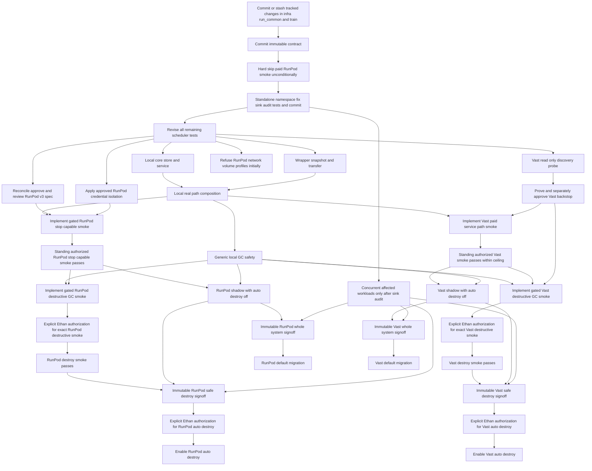

# Job scheduler conformance and migration

## Authority

This document contains proof obligations, acceptance observations, and sequencing only. It does not define scheduler
behavior. Each row points to the controlling clause in the [operative contract](job_scheduler.md). If wording here
appears to conflict with that clause, the operative clause controls. Authority and superseded history are recorded in
the [decision ledger](job_scheduler_decisions.md).

A test authored beside the implementation is not sufficient on its own. Proof must exercise the real writer, parser,
process boundary, SDK, provider response, or filesystem behavior named below. Provider-destructive tests remain
disabled unless the separate authority in [AUTH-001](job_scheduler.md#auth-001) is granted.

## Clause-to-proof matrix

| Clause | Independent proof | Acceptance observation |
|---|---|---|
| [SCHED-001](job_scheduler.md#sched-001) | Start the packaged launchd service and drive real `submit`, `status`, `logs --follow`, and `artifacts` CLI/socket/SQLite paths from a fresh process. Exercise each read view as an agent and attempt agent lifecycle mutation. Attempt a second service writer and cross-UID socket access; independently inspect artifact-root ownership/mode. Exercise all four worked workflows, exact-profile routing with compatible running, stopped, and unavailable inventories, omission of `max_attempts`, three command failures, and reconciliation transition boundaries. | Operators can submit/control; agent views are read-only and agent mutation refuses. One service owns the database and provider mutations; unauthorized peers and a second writer refuse; the artifact root is owner-only. The four CLI operations/workflows behave as specified, default budget is exactly three command executions, reconciliation performs one bounded transition at a time, FIFO/cardinalities hold, and routing never substitutes a profile or provider. |
| [STATE-001](job_scheduler.md#state-001) | Crash-inject before send, after send/before acknowledgement, and after acknowledgement for `CREATE`, `RESUME`, `ATTEMPT START`, `STOP`, and `DESTROY`. Restart from real SQLite each time. Use generic transport errors, confirmed rejection, inventories with same-name resources, nonce/spec mismatches, delayed visibility, and authoritative absence. | Every transition has durable intent, at most one provider call, and explainable recovery. A transport error never becomes confirmed rejection. Ambiguous work quarantines without replacement or retry. Exact nonce/spec reconciliation alone can claim a lost create. Attempt accounting and the permanent-failure backstop outcome match the clause. |
| [EXEC-001](job_scheduler.md#exec-001) | Stage real symlinks, escapes, undeclared files, exact argv/cwd, inherited secrets, and provider-injected named credentials. Issue one attempt, then independently change snapshot bytes, argv, cwd, and cleared environment one at a time and try duplicate issuance of the unchanged identity. Submit paid jobs with missing, zero, negative, nonfinite, and valid positive-finite `max_runtime`. Launch a child that forks descendants, expire it, and restart the service during timeout handling. Inspect the complete remote process tree and captured environment. | Invalid inputs and invalid paid runtimes refuse; snapshot identity is stable and staged bytes verify; every changed identity input and duplicate issuance refuses. The job sees only the declared baseline and allowed additions; provider service credentials never cross into the job; expiry removes every descendant before collection or reuse, including across restart. |
| [EVID-001](job_scheduler.md#evid-001) | Use real result, checkpoint-manifest, transcript/Docent, stdout/stderr, terminal, and partial-output writers. Corrupt, omit, and alter files before collection; restart during hashing, collection, and verification; independently hash collected logs, partials, and outputs; inspect attempted GC targets. | Exit zero cannot succeed with missing or mismatched required evidence. All obtainable terminal/log/failure-partial evidence is checksummed and explicit absences are durable. Independent hashes prove logs, partials, and outputs immutable after verification. Collection restart never reruns compute. Analyzable workloads cannot succeed without local transcript evidence. Checkpoint destination data and nondisposable layers are never removed by scheduler GC. |
| [NS-001](job_scheduler.md#ns-001) | Before concurrent onboarding, inspect the checkpoint launch-ID path in `infra/run_common.py`, the divergent Docent paths in `infra/run_debate.py` and `infra/run_rlvr.py`, and the real `run_eval`, local transcript, artifact, checkpoint, Docent, W&B, declaration, and checkpoint-sync sinks. Then launch concurrently through real RLVR, debate, eval, transcript/Docent, W&B, declaration, and checkpoint paths. Include invalid namespaces, a forced reservation conflict, manual UUID generation, and legacy directories. Assert `run_identity_suffix` bytes before and after. | No affected workload onboards concurrently until all of its sinks are safe. One namespace is resolved before sinks, appears unchanged in every sink, and conflicting targets refuse. Eval reservation is atomic and its file set exact. Legacy paths remain untouched; scientific/protocol identity and W&B naming remain unchanged. |
| [CKPT-001](job_scheduler.md#ckpt-001) | Invoke the real checkpoint synchronizer with absent/malformed destination data and ambient AWS credentials. Exercise an exact durable local target and an S3-compatible test bucket with conditional requests, conflicts, corrupt GETs, listing extras/misses, and a file over 5 GiB. Restart after each sync failure and inspect durable evidence. Scan imports and network calls for Hugging Face. | Ambient credentials never choose a destination. Local exact durability is a no-op. Bucket keys and reservation are namespaced; every accepted object is GET/hash verified and the final listing is exact. Conflict/mismatch/error fails closed, durably preserves sync-failure evidence, and is not retried or adopted; oversize refuses; no Hugging Face path exists. |
| [CKPT-OPEN-001](job_scheduler.md#ckpt-open-001) | Review code and tests for an encoded choice about writer-ready/live-source stabilization, synchronizer coordination/PID/lock publication, or ambiguous partial-prefix continuation. | Implementation remains blocked at this boundary; tests expose the gate and do not silently select a recommendation. |
| [WAND-001](job_scheduler.md#wand-001) | Run against pinned real `wandb==0.28.1`; reject a mismatched runtime before API use and validate the run ID before filesystem/API use. Use two same-UID processes for `flock`, real public Run objects for every state, an offline ambient setting, override attempts through CLI/YAML/env/Config, and interruption at acquisition, state/config access, init, and ownership transfer. Use a two-host barrier so both hosts observe a terminal state before init. | The same-host loser makes no API call; the lock is held through the run and always released. Only the terminal allowlist resumes the exact target; unknown/missing refuses and resumed operation is online. Only the literal CLI path can issue the audited run-bound override, which bypasses only `running`; YAML/env/Config cannot. Namespace and override history change together. The two-host test documents, rather than hides, the residual state-check/init race. |
| [DOC-001](job_scheduler.md#doc-001) | Run the pinned real `docent-python==0.1.77` seam and reject mismatch before client construction. Pass the same `AgentRun` list to collection selection and serialization, assert byte invariance, namespace-bearing name, and exactly one collection per attempt. Cover empty input; ambiguous create POST; redirects; non-2xx responses; duplicate/empty job IDs; and missing, extra, duplicate, malformed, unknown, failed, canceled, pending, running, and completed status rows. Count sends, validate 100-ID slices, interrupt after each possible mutation, and test confirmed and invalid collection IDs. Exercise connect/read timeouts, simulated legitimately slow and multi-GB cases, and a trickling/never-returning server under a real wall clock. Vary main-thread status, live Python threads, `ITIMER_REAL`, and blocked/pending `SIGALRM`, then inspect complete signal restoration. | The collection name contains the namespace, exactly one collection is chosen per attempt, the identical `AgentRun` list crosses the boundary, and serialized bytes do not change. Empty input makes no remote mutation. Each mutation or poll has one send and no redirect/retry/adoption. Before confirmed creation—including ambiguous create—the receipt has `collection_id: null`; every failed/ambiguous/timed-out post-create receipt retains the confirmed ID. Every response is 2xx and polling census/status behavior matches the clause. The five-minute guard preempts stalled calls while preserving the reserve; unsafe signal conditions skip before construction. Local evidence can still succeed and slow uploads may remain permanently ambiguous. |
| [WORK-001](job_scheduler.md#work-001) | Inventory provider resources without enrollment; enroll manual workers with each attestation missing in turn; leave an old watchdog alive and race its accepted stop with handoff. Test a foreign worker and a different effective user. | Observation grants no mutation. Only a fully attested, exclusively dedicated worker becomes controlled. Legacy watchdog ownership is durably disarmed/fenced before admission. Manual and foreign workers never gain auto-destroy eligibility. |
| [LIFE-001](job_scheduler.md#life-001) | Drive running-to-idle-to-stopped retention with paid, ephemeral, and explicit-free profiles. Inventory every storage layer and inject missing evacuation/hash evidence, queued compatible work, unknown attempts, lost acknowledgements, missing scheduler ownership, stale inventory, an unfenced assignment, a never-ready worker with/without a started attempt, and independently managed volumes/snapshots. Compare independent before/after worker and volume inventories, including identity, existence, attachment, size, and configuration. | Empty/retention timers use the correct clocks; finite retention alone never deletes. Reuse precedes stop/GC. Destroy additionally requires durable scheduler-created ownership, fresh exact inventory, verified evidence/no ambiguity, disposable storage, an assignment fence, and authoritative absence; a never-ready worker still needs ownership/no start/disposability. Auto-GC uses finite retention only with every erased layer disposable, otherwise `never`. Ambiguity quarantines; manual/foreign workers remain stable; forbidden external storage/state is not deleted, resized, or detached. Expected content changes have separate path-scoped hash proof. |
| [COST-001](job_scheduler.md#cost-001) | Change price, disk, resources, and capacity between inventory, admission, create/resume, and hot reuse. Return nonfinite, missing, ambiguous, and contradictory provider data. Independently inspect the actual allocation after state changes. | Fresh admission runs before every paid transition and hot reuse; actual allocation is independently checked. All owned resources and unresolved creates count. Missing or ambiguous caps/facts block, and displayed estimates identify uncapped charges without claiming all-in cost. |
| [CRED-001](job_scheduler.md#cred-001) | Start from a cleared inherited environment and a temporary RunPod config containing `apikey`, unrelated keys, duplicate/invalid fields, and hostile shell text. Trace file reads, process environments, argv, SQLite, artifacts, and logs without printing secret values; verify file modes by metadata only. Confirm the scheduler never sources `/Users/ethanelasky/code/debate/.env`, while recording that `scripts/mb_solo_to_docent.py` and `scripts/mb_judge_ablation.py` load that file wholesale. | Only the declared `apikey` is parsed service-side; the file is never sourced or copied. Isolated home and pinned endpoints are used. Secret values never enter job-visible or durable surfaces, and both credential files retain mode `0600`; the repository-local `.env` is not mistaken for Option A. |
| [AUTH-001](job_scheduler.md#auth-001) | Static-scan all command and test entry points, then exercise policy gates with destructive environment variables enabled. Build disabled `RD`/`VD` smokes and prove no provider-destructive call is reachable; separately prove `RDP`/`VDP` cannot cross `RDA`/`VDA`. For authorized nondestructive paid smokes, compute provider-deadline minus create/resume timestamp and record GPU count, estimate, actual cost, and targeted storage identity. After each exact destructive authorization is later obtained, run the provider's destructive-GC smoke through the real service path, independently audit protected identities and evidence, and retain immutable safe-destroy signoff. | Disabled destructive-smoke implementation is possible without execution authority. No destructive call executes before its exact authorization. Nondestructive paid operations execute only within all ceilings and provider gates. A create-carried deadline is at most 30 minutes after `CREATE`; generic resume/hot reuse installs and proves a fresh deadline at most 30 minutes after resumed compute begins. No local timer substitutes and protected targets cannot be formed. The later GC arc is not complete until both separately authorized destructive smokes and signoffs pass; neither signoff authorizes auto-destroy. |
| [RUNPOD-001](job_scheduler.md#runpod-001) | Keep the legacy paid smoke inert, then verify upstream driver provenance/digest and the installed v3 path. Verify that the six answers are reconciled, every remaining non-ratified choice has explicit approval, and the resulting spec has independent review before adapter/lifecycle work. Independently inspect the exact GraphQL request, create-relative deadline arithmetic, authoritative provider state, and a fresh empty v3 journal with no v2 import or historical-digest adoption. The sole bootstrap, if its gate is satisfied, traverses only the reconciled/installed minimal safety seam and records estimate versus actual; it never uses ad hoc GraphQL or direct `runpodctl`. After certification, the rewritten nondestructive smoke must separately traverse CLI/socket/service/SQLite/adapter/transfer/wrapper/artifact root. Inventory container, Pod-volume, and network-volume identity before and after without destructive calls. | No create can bypass the installed seam. Before certification, only the one bounded bootstrap is reachable; afterward only approved nondestructive operations are reachable. `stopAfter` is present on create, at most 30 minutes after that create, and observed provider-side; the journal starts empty, disk caps/residual monthly costs are visible, resume/network-volume/terminate/destroy paths refuse, and ambiguous acknowledgement is reconciled without duplicate mutation. |
| [VAST-001](job_scheduler.md#vast-001) | Exercise read-only discovery and static/dynamic gates with the `VAST_API_KEY` name present but its value redacted. Attempt every paid and destructive entry point without an independently proven bounded provider mechanism. If that mechanism and second approval later exist, the paid smoke must traverse CLI/socket/service/SQLite/adapter/transfer/wrapper/artifact root and independently inventory worker and volume state. | Credential-name presence is observable without exposing a value and lifts no blocker. Discovery works; paid Vast and every destructive path remain blocked before the gate. A worker-local watchdog is not accepted as the independent bound, and unknown storage/lifecycle facts refuse mutation. After the gate, only the approved nondestructive path can run within [AUTH-001](job_scheduler.md#auth-001)'s ceiling. |
| [BREAK-001](job_scheduler.md#break-001) | Pause during local transactions and provider calls; crash before and after the durable fence-state record; restart and contend service/recovery tools on the same lock; inject an accepted-but-unacknowledged mutation; keep SQLite/artifacts readable. | Intake and lifecycle stop in order; lock release occurs only after durable fence state. Restart restores pause/fence state before transitions, only one owner can recover, and ambiguity survives. Read-only views remain available and recovery never claims to undo irreversible provider state. |
| [REPO-001](job_scheduler.md#repo-001) | Build/install the pinned distribution in a clean environment and invoke Debate through the published CLI/protocol only. Inspect repository contents for all three documents, permissions, release pinning, collaboration settings, first pushed test state, and operator-runbook coverage of machine-off behavior, backstop outcomes, watchdog handoff, and accepted irreversible actions. | No Python import/submodule coupling exists. The operative contract, conformance/migration matrix, and decisions/provenance ledger are owned/shared in the scheduler repo; exact release/commit/protocol pins are present, repository is private/unlicensed initially, collaborators are invited, first published commit is green, and the runbook states residual limits. |
| [OPEN-001](job_scheduler.md#open-001) | Scan configuration, CLI help, tests, adapters, and service transitions for every open or blocked path. | Open recommendations and destructive/provider gates remain visibly disabled and cannot be enabled by ambient credentials, test flags, or inferred capability. |

## Mandatory sequencing

Steps 1–5 are a strict prerequisite chain. After step 5, the dependency graph—not numeric order—controls the parallel
workstreams. Every dependency is reviewed against the operative clause, not merely against locally authored tests.

1. Commit or stash the pre-existing dirty `infra/run_common.py` and `infra/train.py` work without mixing it into this
   project.
2. Keep the plan and decisions on an immutable commit for review.
3. Hard-disable the legacy paid RunPod smoke so `RUNPOD_PAID_INTEGRATION=1` cannot create anything.
4. Land the namespace fix as its own commit before scheduler work. Preserve `run_identity_suffix`; record that old
   `docent/<run>/pid-N/` directories and old `checkpoints/{run}/{step}/` keys are orphaned but untouched, and that retired
   Hugging Face repositories remain untouched and unread. Audit the checkpoint launch ID in `infra/run_common.py`, the
   divergent Docent behavior in `infra/run_debate.py` and `infra/run_rlvr.py`, and every eval/local-transcript/artifact/
   checkpoint/Docent/W&B/declaration/checkpoint-sync sink. Do not concurrently onboard an affected workload until all of
   its sinks are safe.
5. Rewrite or delete weak test sketches, then obtain fresh review of the revised test contract. Do not publish the
   independent repository before this gate is green.
6. Implement the local core/service and wrapper/transfer tracks in parallel, then compose them through the real local
   path and restart/fence smoke. Read-only provider discovery and credential/cost policy work may also proceed without
   crossing provider mutation gates.
7. In parallel after step 5, reconcile the six ratified RunPod answers into the v3 seam, obtain approval for every
   remaining non-ratified choice, independently review the resulting spec, and replace/pin the driver. Initial
   stop-capable non-network-volume adapter/lifecycle implementation also depends on the real local composition from
   step 6. The sole bounded bootstrap is unavailable until every prerequisite in
   [RUNPOD-001](job_scheduler.md#runpod-001) holds. Resume and all terminate/destroy paths stay closed.
8. Prove and separately approve Vast's independent bounded backstop before implementing or running its paid service
   path. Read-only Vast discovery may precede that proof.
9. Implement generic local GC gates. Destructive RunPod and Vast smoke implementations remain disabled until Ethan
   authorizes each exact execution. After those authorizations, both destructive smokes and immutable safe-destroy
   signoffs remain required for the later GC migration arc; passing/signing off either still does not authorize
   auto-destroy.
10. Run provider shadow jobs with auto-destroy off, clear concurrent namespace use, and obtain immutable whole-system
    signoff before migrating a provider/profile family. After destructive signoff, return to Ethan for a separate
    provider-specific auto-destroy decision.

At every phase/milestone, run a smoke and use fresh correctness/spec-fidelity, safety/scientific-semantics, test-oracle,
and intent reviewers. After the final milestone, use a fresh whole-system wave against an immutable operative-contract
commit, again including intent rather than only literal wording. Confirmed findings are fixed and the affected wave
repeats until clean.

## Migration dependency graph

## Sequencing and migration acceptance

- Each milestone leaves a durable record of the immutable contract commit, implementation commit, exact test command,
  independent observation, reviewer identities/lenses, and unresolved findings.
- The namespace commit is independently reversible at the code level but does not migrate old sink paths; its orphan
  consequences are recorded before scheduler commits begin.
- Packaging and repository transfer are verified from a clean clone. No history-rewrite ceremony is introduced, no
  Debate artifact is deleted, and the scheduler repository is not published with a deliberately red first commit.
- Paid RunPod proof records the create timestamp, create-carried provider deadline and its at-most-30-minute arithmetic,
  pre-run estimate, actual GPU count, storage allocation, and actual cost. Paid Vast and destructive execution nodes
  remain disabled before their gates regardless of credential presence.
- Every provider smoke uses the real service path. Direct adapter, CLI, fake, or synthetic binding tests can diagnose a
  seam but cannot alone satisfy acceptance.
- V0 is not complete until both the paid RunPod and paid Vast nondestructive service-path smokes succeed after their
  respective gates. A currently blocked gate leaves completion pending; it does not waive that provider from scope.
- The later destructive-GC arc is not complete until separately authorized `RDP` and `VDP` executions pass through the
  real service path and each receives immutable safe-destroy signoff. Those future requirements do not grant current
  execution authority, and signoff does not grant auto-destroy authority.
- Final acceptance requires all non-open matrix rows to pass, all open rows to remain closed, all required Mermaid
  before/after diagrams to agree with the implementation, and the whole-system reviewer wave to be clean.
