# Where RLVR wall-clock goes

Measured on `codecontests_rlvr_olmo31_32b_smoke10` — Olmo-3.1-32B, 8xH200,
batch 8 x group 8 = 64 rollouts/step, `response_length: 8192`.
Verifier timings re-measured locally by replaying all 640 completions.

**171 s per train-only step**, against MATH's ~48 s/step. The gap is model size
(32B vs 7B) multiplied by tokens generated (`response_length` 8192 vs 2000).

```mermaid
flowchart TD
    subgraph STEP["for step in range(cfg.steps) — infra/train.py:100"]
        S1["1 · sync_sampler()<br/>train.py:101<br/>LoRA → vLLM · not measured"]
        subgraph RO["2 · env.rollout() — train.py:102"]
            G["generation (vLLM)<br/>envs/base.py:149 policy.predict<br/>median 2663 tok · p90 8192<br/>24% hit the 8192 cap<br/><b>dominant cost</b>"]
            V["verifier (subprocess)<br/>envs/base.py:162 → codecontests.py:143<br/>607/640 finish, median 0.415 s<br/>20/640 hit the 30 s timeout<br/><b>~30 s/step = 18%</b>"]
            D["on_rollout → rollouts/step-N.jsonl<br/>train.py:103 · negligible"]
        end
        P["3 · grpo_pack — train.py:110<br/>CPU · negligible"]
        K["4 · apply_kl_penalty — train.py:122 → rl/kl.py:54<br/>backend.ref_logprobs(datums)<br/><b>a full extra forward pass every step</b><br/>serves kl_coef 0.02 · UNMEASURED"]
        F["5 · forward_backward + optim_step<br/>train.py:133-135 · UNMEASURED"]
        E["6 · evaluate (if step %% eval_every == 0)<br/>train.py:136 → train.py:87<br/>4.7 s per eval sample<br/>eval_n 256 → ~20 min per eval<br/><b>6.7 h = 58% of a 100-step run</b><br/>redundant with the offline CCO pass"]
        SV["7 · save — train.py:155 save('final') always · 3.1 GB"]
        S1 --> RO --> P --> K --> F --> E --> SV
    end
```



## Measured vs residual

| phase | per step | how it was measured |
|---|---|---|
| verifier | **30 s** (18%) | replayed all 640 completions locally |
| eval at `eval_n 32` | **151 s** | `step_seconds` delta on eval steps |
| one-off init | **403 s** | step 0 minus mean eval step |
| generation + KL + fwd/bwd | **~141 s** | **residual — not attributed** |

`train.py:150` records only `step_seconds`. Splitting that residual needs phase
timers around each call (~10 lines).

## Why CodeContests is ~3.5x MATH's step

Configs are identical on `batch_size`, `group_size`, `eval_every`, `eval_n`,
`ppo_epochs`, `kl_coef`. The differences:

| | MATH rlvr | CodeContests 32B |
|---|---|---|
| model | Olmo-3-**7B** | Olmo-3.1-**32B** |
| `response_length` | 2000 | **8192** |
| `prompt_length` | 1024 | 4096 |
| `n_gpus` | 1 | 8 |

4.6x params x 4.1x token budget over 8x the GPUs ≈ 2.4x on paper; measured 3.5x.
The extra comes from the model actually filling the budget: **median 2663 tokens,
24% running to the 8192 cap, and 72% of each completion being prose before the
code block.** For reference, cached 122B/35B-class completions on these same
problems had median 505 tokens — this model is ~5x more verbose than the task
needs.

## Levers — 100 steps at $36.72/h

| change | run time | cost |
|---|---|---|
| as configured (`eval_n 256`, `eval_every 5`) | 11.6 h | **$425** |
| drop in-run eval (offline CCO pass instead) | 4.9 h | **$179** |
| + `timeout_seconds` 30 → 5 | 4.2 h | **$154** |
| + `response_length` 8192 → 2048 | not yet measured | — |

Verifier **concurrency is not a lever**: 8 vs 64 workers measured 30.1 s vs
30.2 s, because wallclock is set by the single slowest program, not throughput.
`timeout_seconds` is the only thing that moves it.

## Bug found while measuring

`infra/backend/verl.py:263`

```python
raw_reason = str(out.stop_reason or "stop")
```

vLLM puts `"stop"`/`"length"` in **`finish_reason`**. `stop_reason` is the matched
stop *string*, and is `None` for both natural EOS and length truncation — so
`or "stop"` labels **everything** `"stop"`.

All 640 completions report `stop` while **24% sit exactly at the 8192 cap**.
Those are truncated, usually mid-program, and are trained on as if they
finished. It also hides truncation from `fidelity_ok()` (`backend/base.py:70`),
which is supposed to drop unusable samples.
