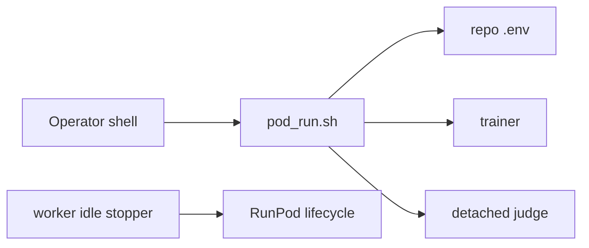
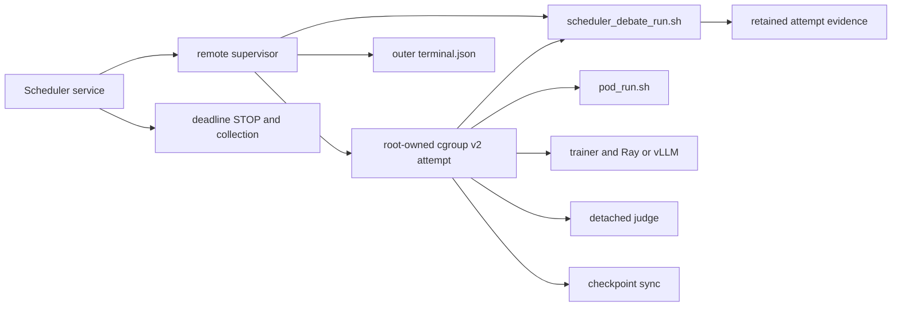

# Scheduler-owned RunPod debate workload

This document describes Debate's workload half of the scheduler-owned RunPod
path. The job scheduler remains the only component allowed to create, stop, or
otherwise control a RunPod worker.

## Ownership boundary

Before this integration, `pod_run.sh` assumed `/root/debate`, read the
repository's `.env`, launched a detached judge, and relied on the worker-local
idle stopper. Those choices fit a manual Pod but not a scheduler-owned worker:



The scheduler path has two supervisors with intentionally different authority:



The outer scheduler supervisor owns START authorization, the compute deadline,
the authoritative outer `terminal.json`, collection, and lifecycle. The inner
Debate supervisor owns only one frozen workload invocation and its retained
evidence. It writes `workload-terminal.json`, never `terminal.json`.

## Fixed launch

`scripts/scheduler_debate_run.sh` accepts no arguments. It always launches:

```text
bash scripts/pod_run.sh debate mathl5_qwen35_pc_debate_cispo_verl
```

The wrapper cannot append `--load`, `--start-step`, `--wandb-resume`, or any
other runner argument. It fixes `CONFIG=configs/math_pc_debate.yaml`,
`POD_IDLE_STOP=0`, and `DEBATE_SCHEDULER_MODE=1`. Scheduler mode makes
`pod_run.sh` derive the frozen repository root from its own location and skip
the repository `.env` and editable install entirely. It uses only the
root-owned image interpreter at
`/opt/job-scheduler/debate-runtime/v1/python/bin/python3.12`; an ambient
`PY`/`PYBIN`, a shared `/workspace` environment, and START-time dependency
repair are forbidden. The frozen repository remains importable from the
launch cwd. Provider-template credentials may remain in the process
environment, but their values are not serialized into handshake, terminal,
census, checkpoint, or manifest evidence.

The scheduler supplies and freezes these non-secret fields before START:

- `DEBATE_LAUNCH_NAMESPACE`
- `DEBATE_ARTIFACT_ROOT` (an existing scheduler-owned retained-volume root)
- `DEBATE_CHECKPOINT_DESTINATION_FILE=/proc/self/fd/10`
- `DEBATE_ATTEMPT_IDENTITY_SHA256` and `DEBATE_SNAPSHOT_SHA256`, each in
  canonical `sha256:<64 lowercase hex>` form
- `DEBATE_DEADLINE_EPOCH`
- provider-injected `RUNPOD_POD_ID`

The attempt id and exact existing
`<artifact-root>/<namespace>/scheduler-output` workload-output path are read
only from sealed descriptor 9; there is no duplicate environment override for
either value.
The sealed proof retains raw 64-hex digest fields; Debate strips the validated
environment prefix only when comparing those fields.

The checkpoint destination is canonical JSON on root-created descriptor 10,
also mode `0400` with write/grow/shrink/seal seals. Its environment value is
fixed to `/proc/self/fd/10`; no retained pathname or ambient JSON can override
it. The JSON contains destination coordinates only, never credentials. The
supervisor preserves FD 10 only across its exact workload and sync process
tree, and receipts bind the validated content digest rather than the procfs
path.

The staged repository, artifact root, checkpoint directory, and local
checkpoint destination must live below `/workspace`. The installed remote
wrapper pre-creates the exact attempt and workload-output roots; the Debate
wrapper adopts only paths bound by the sealed proof and exclusively claims its
output leaf. An existing checkpoint leaf or Debate claim is a collision.

## Process containment and shutdown

The installed root remote wrapper creates and owns the attempt cgroup, then
drops the repository workload to dedicated uid/gid `10001` with no
supplementary groups, no capabilities, and `no_new_privs`. It passes a
root-owned, mode-`0400`, fully sealed memfd on descriptor 9. The canonical
`runpod-remote.containment-proof/v1` document binds the worker, attempt,
namespace, deadline, snapshot, exact cgroup, retained paths, uid/gid, and
installed-wrapper release digest. The Debate wrapper fails closed unless the
proof, process credentials, `/proc` security state, and inherited cgroup
membership all match exactly. It never creates, attaches to, removes, or
writes a cgroup control file.

The proof frontier runs under root-owned `/usr/bin/python3 -I -S`; it does not
load the writable training virtual environment or its site customization until
after containment has been verified. The installed wrapper must also supply a
sanitized process environment so shell or dynamic-loader startup hooks cannot
run ahead of this frontier.

The inner supervisor becomes a Linux child subreaper, blocks each direct child
behind a pipe, verifies that it inherited the proved attempt cgroup before
releasing it, and samples kernel process identities. That cgroup contains the
trainer, detached judge, Ray/vLLM children, and both continuous and final
checkpoint synchronizers.

On normal trainer exit or a propagated `TERM`, `INT`, or `HUP`, the supervisor:

1. stops the continuous synchronizer;
2. sends `SIGTERM` to every cgroup member and waits;
3. sends `SIGKILL` to remaining same-uid members if the tree does not drain;
4. reaps adopted orphans and refuses a clean census if an observed identity
   survived outside the otherwise descendant-free cgroup;
5. performs one bounded final checkpoint-sync pass; and
6. hashes the quiescent evidence and checkpoint trees.

The scheduler's outer deadline and root-owned cgroup census remain
authoritative. If the inner wrapper is itself lost, the outer supervisor
records that fact and uses `cgroup.kill` on the containing attempt tree; the
inner wrapper never fabricates the outer terminal record.

## Retained evidence layout

For namespace `<ns>`, Debate writes below
`<DEBATE_ARTIFACT_ROOT>/<ns>/`:

```text
training-metrics/events.jsonl
docent/<safe-run>/step-*.jsonl
transcripts/<safe-run>/*-step-*.jsonl
scheduler-output/
  .debate-wrapper-claim-v1
  stdout
  stderr
  pod-run/judge_server.log
  checkpoint-sync-continuous.stdout
  checkpoint-sync-continuous.stderr
  checkpoint-sync-final.stdout
  checkpoint-sync-final.stderr
  ckpt-sync-state/*
  provider-handshake.json
  process-census.json
  checkpoint-sync-receipt.json
  checkpoint-manifest.json
  workload-terminal.json
  evidence-manifest.json
```

`checkpoint-manifest.json` hash-lists the exact
`/workspace/checkpoints/mathl5_qwen35_pc_debate_cispo_verl/<ns>/` tree and binds it to
the SHA-256 of the scheduler-owned destination JSON. The final evidence
manifest hash-lists every regular file in the attempt tree except itself and
refuses symlinks or hard links. A zero trainer exit is not wrapper success
unless local metrics, Docent, transcripts, a nonempty checkpoint manifest, a
qualified final sync, and a clean process census are all present.
